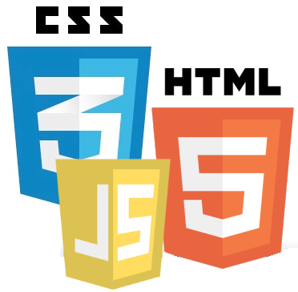
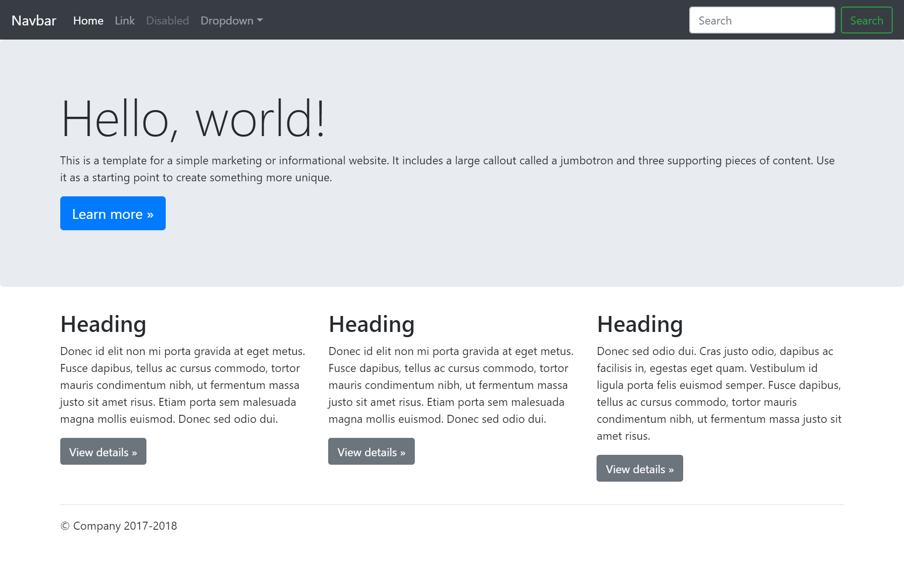
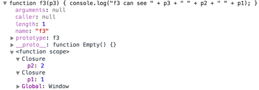

# <br>Zero to Hero

#### From blank page to deployed web application


# About you?


<!-- .element: class="center nopdf" -->


### What is your current *perception* of Web development?

Personal interest:

1. Web apps? It's **for junior developers and kids**, but real software engineers have better things to do.
2. Web apps? I am not a **graphics designer…** what am I doing here?
3. The Web is where some of the **most exciting technologies** are emerging.
4. When I grow up, I want to be a **front-end engineer**.


### What is your current *perception* of Web development?

Scope:

1. Web development is **purely about building user interfaces**. It's about HTML and CSS pages.
2. Web development is about building **complete applications**, including a user interface.
3. Is there **any kind of application** that does not rely on the Web, in one way or another? Mobile apps, interactive apps, business apps: all of this is built on the Web!


# Introduction


## The Web as an Application Platform


## Some Trends

SPA
Real-time
Tooling 


Automated Development Workflows


## Languages, Platforms, Communities

Client



Server


## Languages, Platforms, Communities

others

or 

Server also JS


# Goals


# Planning


## Web Development

* **HTML** for content
* **CSS** for styling
* **JavaScript** for logic


# <br/>HTML

## Hyper Text Markup Language


### HTML
```xml
<!DOCTYPE html>
<html>
  <head>
    <title>Document Title</title>
  </head>
  <body>
    <h1>Main heading in my document</h1>
    <p>Look Ma, I am coding <strong>HTML</strong>.</p>
  
    <!-- This is a comment -->
    <h2>Sub heading</h2>  
    <p>Some more text</p>
  </body>
</html>
```


<!-- .element: class="pageborder"-->

<!-- .element: class="center"-->


```xml

```
<!-- .element: class="nodpf jsbin-embed" data-href="http://jsbin.com/bokize/2/edit?html,output" data-height="500px" -->


### HTML: Elements

| Element     | Description
|-------------|------------
| `<!DOCTYPE html>` | Document type must be the very first thing in your HTML document
| `<html>`    | Root of an HTML document 
| &nbsp;&nbsp;&nbsp;&nbsp;`<head>`    | Metadata section of the document
| &nbsp;&nbsp;&nbsp;&nbsp;&nbsp;&nbsp;&nbsp;&nbsp;`<title>`   | Defines the title of the document (only text)
| &nbsp;&nbsp;&nbsp;&nbsp;`<body>`    | Contains the content of the document
| `<!--  -->` | Comment everything between < and >
| `<h1>,<h2>,<h3>,<h4>` | Heading most important to least
| `<p>` | A paragraph of text
| `<strong>` | Give text strong importance, displayed in bold


### HTML: Attributes

Elements can have attributes **`name="value"`**

| Attribute   | Description
|-------------|------------
| `< ... id="" ... >` | All element can have an id, must be unique in the page!
| `< ... class="" ... >` | All element can have a list of classes (used for CSS)
| `` | Image from `src` with `alt` description
| `<a href="">` | Anchor, hyperlink to a target destination

```xml
<div id="page2">
  <p>A <span class="fun">funny</span> dog:
     </p>
  <p>go to <a href="page3.html">page 3</a></p>
</div>
```

Ids and classes are used by css and javascript to reference specific indvidual or groups of elements.

<!-- .element: class="small" -->


### HTML: More Elements

| Element     | Description
|-------------|------------
| `<div>` | A generic container for elements
| `<nav>` | Represents a section of a page that links to other pages or parts
| `<section>` | A thematic grouping of content
| `<header>` | A page header container for logo, nav, search
| `<footer>` | A page or section footer container
| `<pre>` | Preformatted text, whitespace are displayed as typed
| `<ul>, <ol>` | Unordered list and ordered list
| `<li>` | List item inside a ul or ol
| `<span>` | A generic inline container


### HTML: Tables

```xml
<!DOCTYPE html>
<table>
  <caption>Caption of the table (optional)</caption>
  <thead>
    <tr>
      <th>Column A</th> <th>Column B</th> <th>Column C</th>
    </tr>
  </thead>
  <tbody>
    <tr>
      <td>1</td> <td>2</td> <td>3</td>
    </tr>
    <tr>
      <td>4</td> <td colspan="2" rowspan="2">5</td>
    </tr>
    <tr>
      <td>6</td>
    </tr>
  </tbody>
</table>
```


<!-- .element: class="top right pageborder" -->


```xml

```
<!-- .element: class="nopdf jsbin-embed" data-href="http://jsbin.com/cadoya/1/edit?html,output" data-height="600px" -->


### HTML: Forms

```xml
<form>
  <!-- two ways to associate labels -->
  <p><label for="n">Name: </label>
  <input id="n" name="name"
         type="text" placeholder="name"/></p>
  
  <p><label>Password: <input type="password" /></label></p>
  
  <p><input type="checkbox" name="on" value="1"/>on
  <!-- radio groups need same name -->
  <input type="radio" name="r" value="1" checked/>1
  <input type="radio" name="r" value="2"/>2</p>
  
  <p><textarea name="multiline"></textarea></p>
  
  <p><select name="choice">
    <option value="v1">Value 1</option>
    <option value="v2" selected>Value 2</option>
    <option value="v3">Value 3</option>
    </select></p>
  
  <p><button>Hello</button>
     <input type="submit" /></p>
</form>
```


<!-- .element: class="top right pageborder" -->


```xml

```
<!-- .element: class="nopdf jsbin-embed" data-href="http://jsbin.com/jivune/1/edit?html,output" data-height="600px" -->


### HTML: inline elements

An inline element occupies only the space bounded by the tags that define the inline element.

* may contain only data and other inline elements.
* do not begin with new line.
 
> strong, a, img, span, button, input, label, select, textarea


### HTML: block-level elements

A block-level element occupies the entire space of its parent element (container), thereby creating a "block."
 
* block-level elements begin on new lines.
 
> div, ul, form, h1, h2, header, nav, pre, p


### HTML5: content categories

In HTML5, this binary distinction of **block-level** vs. **inline** elements is is replaced with a more complex set of content categories


<!-- .element: class="w-60" -->

<!-- .element: class="center" -->
 
**block-level** ≈ flow content, 
**inline** ≈ phrasing content

<!-- .element: class="small" -->
 
https://developer.mozilla.org/fr/docs/Web/HTML/Cat%C3%A9gorie_de_contenu

<!-- .element: class="credits" -->


### HTML: including CSS and JavaScript

```xml
<!DOCTYPE html>
<html>
  <head>
    <meta charset="utf-8">
    <title>External files</title>
    <link href="css/style.css" rel="stylesheet">
  </head>
  <body>
    ...
    <script src="http://code.jquery.com/jquery.js"></script>
    <script src="js/myscript.js"></script>
  </body>
</html>
```

Later listings take precedence.

Script tags at the end in order to not block page loading.


# <br/>CSS

## Cascading Style Sheets


### CSS: Selectors

tag, id, class, 

body {width: 500px;}
.tag-class {
    padding: 20px 40px;
    width: auto;
}
#tag-id {
    height: 100px;
    float: left;
}
Notice that "#" delimites an id and "." a class.

child, direct child >,  next tag +
attr value
pseudoclass
:hover
:nth-child(N)


*	selects all elements
aa *	selects all elements within the aa tag.
aa bb	selects all bb elements within the aa tag.
aa, bb	selects all aa and bb classes, it's just a list.
aa.classname	selects all aa tags with the class classname.
aa#idname	selects the aa tag with the id idname.
a:link	selects the a tag if it's a normal hyperlink.
a:visited	selects the a tag if it's a visited hyperlink.
a:hover	selects the a tag if the mouse hovers over it.
a:active	selects the a tag if user is clicking on it.
aa > bb	selects the bb tag if it's a direct child of aa.
aa + bb	selects the bb tag if it's immediately preceded by aa.
aa[attr="value"]	selects the aa tag with a attr="value" attribute.


### CSS: Cascading Rules


### CSS: box-model


margin
border
padding
width

center block element

box-sizing: content-box;
box-sizing: border-box;

Collapsing margins
depending on setting a border or padding - your margins are likely collapsing or put apart. Normally, margins are merged together. The bottom and top margin

position absolute, relative
float: left, right


### CSS: Media Queries

Let the presentation of content be **tailored** to a specific range of output devices **without having to change the content** itself.

> `@media` **some rule** `[and|or]` **some other rule**
> { **CSS for only this selection** }
 
**rules:** min-width, max-width, min-device-width, max-device-width, orientation: [landscape | portrait], ...

https://developer.mozilla.org/fr/docs/Web/CSS/Media_queries


### CSS: Media Queries Bootstrap3 breakpoints
```css
/* Custom, iPhone Retina */ 
@media only screen and (min-width : 320px) {

}
/* Extra Small Devices, Phones */ 
@media only screen and (min-width : 480px) {

}
/* Small Devices, Tablets */
@media only screen and (min-width : 768px) {

}
/* Medium Devices, Desktops */
@media only screen and (min-width : 992px) {

}
/* Large Devices, Wide Screens */
@media only screen and (min-width : 1200px) {

}
```


#### Media Queries Examples


http://mediaqueri.es/spa/
http://mediaqueri.es/int/

<!-- .element: class="credits" -->


```xml
<div id="box1">Box 1</div><div id="box2">Box 2</div><div id="box3">Box 3</div>
```

```css
*{ box-sizing: border-box; }
body{ font-family: sans-serif; font-size: 20px; }
/* default mobile first */
#box1{ background-color: #3D9970; }
#box2{ background-color: #FF4136; }
#box3{ background-color: #FFDC00; }
#box1, #box2, #box3{ padding: 1em; }
/* first breakpoint */
@media only screen and (min-width : 600px) {
  #box1, #box2, #box3{
    float:left;
    width: 50%;
    text-align: center;
    border: 1em solid #fff;
  }
}
/* second breakpoint */
@media only screen and (min-width : 992px) {
  #box1, #box2, #box3{
    width: 33%;
    text-align: right;
  }
}
```


<!-- .element: class="center" -->


```css

```
<!-- .element: class="nopdf jsbin-embed" data-href="http://jsbin.com/sedene/1/edit?css,output" data-height="600px" -->


### References

* http://caniuse.com/
* https://developer.mozilla.org/fr/docs/Web/HTML/Element
* https://developer.mozilla.org/fr/docs/Web/Guide/HTML/Formulaires/Les_blocs_de_formulaires_natifs
* http://tympanus.net/codrops/css_reference/
* https://developer.mozilla.org/fr/docs/Web/CSS/Reference
* http://www.w3.org/Style/css3-selectors-updates/WD-css3-selectors-20010126.fr.html
* http://codingdomain.com/webdevelopment/css/crash-course/
* http://css.sutterlity.fr/
* https://developer.mozilla.org/fr/docs/CSS/Premiers_pas


<!-- .element: class="background top right w-33" -->


## Assignment 1

Show your HTML/CSS skills by creating a Curriculum vitae webpage.


<!-- .element: class="w-30 float-right" style="transform: scaleX(-1);" -->

*- What tools do you use?*

*- What are all the tasks involved?*


## Debriefing Assignment 1

Tools:

* Text editor
* Web browser
* Server?
* Image editor


## Debriefing Assignment 1

Tasks:

* Create content
* Edit Layout
* Download eventual external dependency
* Repetitive tasks edit<->reload


# CSS Frameworks

<br/>

* don't reinvent the wheel
* use best practices
* get reusable components
* design oriented


### [Bootstrap](http://getbootstrap.com/)


<!-- .element: class="top right" -->

One framework, every device

**CSS**

Global CSS settings, fundamental HTML elements styled and enhanced with extensible classes, and an advanced grid system.
<!-- .element: class="smaller" -->

**Components**

Over a dozen reusable components built to provide iconography, dropdowns, input groups, navigation, alerts, and much more.
<!-- .element: class="smaller" -->

**Javascript**

Bring Bootstrap's components to life with over a dozen custom jQuery plugins. Easily include them all, or one by one.
<!-- .element: class="smaller" -->





```xml
<!DOCTYPE html>
<html>
  <head>
    <meta charset="utf-8">
    <!-- Bootstrap core CSS -->    
    <link href="//maxcdn.bootstrapcdn.com/bootstrap/3.3.2/css/bootstrap.min.css" rel="stylesheet" type="text/css" />
    <title>Jumbotron Template for Bootstrap</title>
  </head>
  <body>
    <nav class="navbar navbar-inverse navbar-fixed-top">
      <div class="container">
        <div class="navbar-header">
          <button type="button" class="navbar-toggle collapsed" data-toggle="collapse" data-target="#navbar" aria-expanded="false" aria-controls="navbar">
            <span class="sr-only">Toggle navigation</span>
            <span class="icon-bar"></span>
            <span class="icon-bar"></span>
            <span class="icon-bar"></span>
          </button>
          <a class="navbar-brand" href="#">Project name</a>
        </div>
        <div id="navbar" class="navbar-collapse collapse">
          <form class="navbar-form navbar-right">
            <div class="form-group">
              <input type="text" placeholder="Email" class="form-control">
            </div>
            <div class="form-group">
              <input type="password" placeholder="Password" class="form-control">
            </div>
            <button type="submit" class="btn btn-success">Sign in</button>
          </form>
        </div><!--/.navbar-collapse -->
      </div>
    </nav>

    <!-- Main jumbotron for a primary marketing message or call to action -->
    <div class="jumbotron">
      <div class="container">
        <h1>Hello, world!</h1>
        <p>This is a template for a simple marketing or informational website. It includes a large callout called a jumbotron and three supporting pieces of content. Use it as a starting point to create something more unique.</p>
        <p><a class="btn btn-primary btn-lg" href="#" role="button">Learn more &raquo;</a></p>
      </div>
    </div>
    
    <div class="container">
      <!-- Example row of columns -->
      <div class="row">
        <div class="col-md-4">
          <h2>Heading</h2>
          <p>Donec id elit non mi porta gravida at eget metus. Fusce dapibus, tellus ac cursus commodo, tortor mauris condimentum nibh, ut fermentum massa justo sit amet risus. Etiam porta sem malesuada magna mollis euismod. Donec sed odio dui. </p>
          <p><a class="btn btn-default" href="#" role="button">View details &raquo;</a></p>
        </div>
        <div class="col-md-4">
          <h2>Heading</h2>
          <p>Donec id elit non mi porta gravida at eget metus. Fusce dapibus, tellus ac cursus commodo, tortor mauris condimentum nibh, ut fermentum massa justo sit amet risus. Etiam porta sem malesuada magna mollis euismod. Donec sed odio dui. </p>
          <p><a class="btn btn-default" href="#" role="button">View details &raquo;</a></p>
       </div>
        <div class="col-md-4">
          <h2>Heading</h2>
          <p>Donec sed odio dui. Cras justo odio, dapibus ac facilisis in, egestas eget quam. Vestibulum id ligula porta felis euismod semper. Fusce dapibus, tellus ac cursus commodo, tortor mauris condimentum nibh, ut fermentum massa justo sit amet risus.</p>
          <p><a class="btn btn-default" href="#" role="button">View details &raquo;</a></p>
        </div>
      </div>
    </div>
    <hr>

    <footer>
      <p>&copy; Company 2014</p>
    </footer>
        
    <!-- JavaScript part to make navbar-toggle work -->
    <script src="//code.jquery.com/jquery.min.js"></script>
    <script src="//maxcdn.bootstrapcdn.com/bootstrap/3.3.2/js/bootstrap.min.js"></script>
  </body>
</html>
```
<!-- .element: class="jsbin-embed" data-href="http://jsbin.com/lelopa/1/edit?html,output" data-height="600px" -->


# Tooling

notepad++? <-> webstorm
online editors
chrome dev tools


### Preprocessors

Preprocessor is a program that processes its input data to produce output that is used as input to another program

**CSS preprocessor:** Less, Sass, Stylus, ...

**JS preprocessor:** CoffeeScript, TypeScript, ECMAScript 6 (Traceur and Babel), ...

**HTML preprocessor:** Jade, Haml, Handlebars, ...

**Script loader:** Require, Webpack, ...

**Test framework:** Jasmine, Mocha, Qunit, ...


```

```
<!-- .element: class="nopdf jsbin-embed" data-href="http://jsbin.com/mumavu/9/edit?html,css,js" data-height="600px" -->


### Yeoman

Yeoman is a combination of tools, which allows to you to setup a complete,
automated, efficient and reliable development workflow.


<!-- .element: class="center" -->

It is composed of three tools: yo, bower and grunt (or gulp).


 <!-- .element: class="float-right w-15" -->
**Yo** is a tool for generating project skeletons (scaffolding). You can create and
share your skeletons. Yo *generators* are npm modules and you can find one
for most popular web frameworks.
http://yeoman.io/

 <!-- .element: class="float-right w-15" -->
**Bower** is a tool for managing *web dependencies*. Not only JavaScript
modules, but also CSS files, images, etc.
http://bower.io/

 <!-- .element: class="float-right w-15" -->
**Grunt** is a task runner. It is the tool that drives your *automated process*, by
executing a series of tasks. There are lots of grunt plugins provided by the
community for all aspects of your project.
http://gruntjs.com/


## Node.js & npm

 <!-- .element: class="float-right w-15" -->
**Node.js** is a platform built on Chrome's JavaScript runtime for easily building fast, scalable network applications.
https://nodejs.org/

*It allows to run JavaScript outside of the browser*

 <!-- .element: class="float-right w-15" -->
**npm** is a package manager for JavaScript bundled with Node.js
https://www.npmjs.com/


## Lab 1: MonCV

Creating a Curriculum vitae webpage, using Boostrap CSS and development tools.


<!-- .element: class="w-30" -->


### Step 0: Install development environment

Download and install [Node.js](https://nodejs.org/) to get npm.

Use npm to install yeoman, bower and grunt

```sh
$ npm install -g yo bower grunt-cli
```

Use npm to install the desired yeoman generator

```sh
$ npm install -g generator-webapp
```

https://github.com/yeoman/generator-webapp

<!-- .element: class="credits" -->

*We are using the -g (--global flag) to install in the global shared space accessible to all projects.*
<!-- .element: class="small" -->


### Step 1: Create a new project

Create project folder

```sh
$ mkdir monCV
$ cd monCV
```

Use yeoman generator to scaffold a new application

```sh
$ yo webapp
```


<!-- .element: class="w-66" -->

<!-- .element: class="center" -->


### Step 2: Review the Yeoman-generated app

package.json
bower.json


### Step 3: Preview your app in the browser


Start the server

Stop the server

edit with livereload


### Step 3: Use Bower to install packages


bower install bootswatch --save
https://bootswatch.com/

```sh
$ npm install && bower install
```


# Assignment 2

Recreate your CV by redowing lab1


# lab continued with want some better interaction


###  <!-- .element: class="w-40" -->

jQuery is a **fast, small**, and feature-rich JavaScript
library. It makes things like HTML **document traversal** 
and **manipulation, event handling, animation**, 
and **Ajax** much simpler with an easy-touse
API that works **across a multitude of browsers**.


### jQuery Selecting Elements

**Selecting Elements by ID**

```javascript
$('#myId'); // IDs must be unique per page.
```

**Selecting Elements by Class Name**

```javascript
$('.myClass');
```

**Selecting Elements by Attributes**

```javascript
$('input[name="first_name"]'); // this can be very slow in older browsers
```

**Selecting Elements by Compound CSS Selector**

```javascript
$('#myId ul.people li');
```

http://api.jquery.com/

<!-- .element: class="credits" -->


# Lab continued
bower install jquery-smooth-scroll

--> auto ajouté (rev-dep)

```javascript
$('a').smoothScroll();
```

--> jquery why 
--> jshint..

```javascript
$(document).ready(function(){
  'use strict';
  
});
```


## dev tools dom + console

 using console /dev tools dom inspector


 
# New problems

Problème gestion de version
commenter des vieux bouts de code...
-> gestion version


# what is git


http://rogerdudler.github.io/git-guide/

http://git-scm.com/book/en/v2/Getting-Started-About-Version-Control

http://git-scm.com/book/en/v2/Git-Basics-Recording-Changes-to-the-Repository

http://onlywei.github.io/explain-git-with-d3/#freeplay

http://marklodato.github.io/visual-git-guide/index-fr.html

http://pcottle.github.io/learnGitBranching/

git init
git add 
git commit
git push origin 
.gitignore


### Markdown Basics

[Markdown](http://daringfireball.net/projects/markdown/syntax) allows you to write using an easy-to-**read**, easy-to-**write** plain **text format**, which then converts to valid HTML.

```markdown
# The largest heading (an <h1> tag)
## The second largest heading (an <h2> tag)

> Blockquotes

Text styling *italic* and **bold**

Links (<a href="url">title</a>)
[title](url)

Images ()

```


### Markdown List and Table

```markdown
Unordered lists
* Item
* Item

- Item
- Item

Ordered lists
1. Item 1
2. Item 2
3. Item 3

some: `c0de`

| Name | Description          |
| ------------- | ----------- |
| Help      | Display the help window.|
| Close     | Closes a window     |
```
<!-- .element: class="float-left w-50" -->

* Item
* Item

<br/>

1. Item 1
2. Item 2

&nbsp;&nbsp;some: `c0de`

| Name | Description          |
| ------------- | ----------- |
| Help      | Display the help window.|
| Close     | Closes a window     |


<iframe data-src="http://dillinger.io/" class="nopdf" style="width:100%;height:100%"></iframe>

http://dillinger.io/

<!-- .element: class="credits" -->


# deploy to github pages


git remote add origin git@github.com:bfritscher/test-lab.git
git push origin master:gh-pages --set-upstream

http://bfritscher.github.io/test-lab/

change template? redo


grunt
grunt serve:dist

CNAME?


# JavaScript


<!-- .element: class="w-50" -->

<!-- .element: class="center" -->


### What is your current perception of JavaScript?

Scope:

1. It's a "toy" language for creating animations on web pages, but I would not use it for anything "serious".
2. It's a very powerful language. It is essential on the client side, but it is also really interesting on the server side.


### What is your current perception of JavaScript?

Personal taste:

1. I hate it.
2. I am not a big fan.
3. It's kind of interesting.
4. I love it.
5. I don't care.


### What is your current perception of JavaScript?

Relationship to Java:

1. It's Java, with a few syntactic differences.
2. It has nothing to do with Java, except for some common syntax.


### What is your current perception of JavaScript?

Current knowledge:

* **Novice:** I may have hacked a few scripts on web pages, but mostly by copy-pasting examples and without fully understanding the language (what is a prototype?).
* **Intermediate:** I have used JavaScript quite a bit. I can describe the object-oriented model, I understand what a constructor is and how it works. I have quite a bit of experience with JQuery and other libraries. I am always working with a debugger.
* **Expert:** closures and modules have no secret for me, I have read "JavaScript: the good parts". I have designed my development workflow with yeoman, grunt, bower and a few other tools. I know who Paul Irish is.

<!-- .element: class="small" -->


Douglas Crockford: JavaScript: The Good Parts
https://www.youtube.com/watch?v=_DKkVvOt6dk

<iframe width="640" height="480" src="https://www.youtube.com/embed/_DKkVvOt6dk?rel=0&amp;showinfo=0" frameborder="0" allowfullscreen></iframe>


# JavaScript


<!-- .element: class="w-40" -->

<!-- .element: class="center" -->

### JavaScript is built on some very good ideas and a few very bad ones.

* Language of the web browser
* One of the most popular programming languages
* One of the most despised programming languages
* It is possible to get work done with it without knowing much about the language
* Programming is difficult business. It should never be undertaken in ignorance.


**JavaScript is an important language** because it is
the language of the web browser. Its association with
the browser makes it one of the most popular
programming languages in the world. **At the same
time, it is one of the most despised programming
languages in the world**. [...]

<!-- .element: class="small" -->

Most people in that situation **don’t even bother to
learn JavaScript first**, and then they are surprised
when JavaScript turns out to have significant
differences from the some other language they would
rather be using, and that those differences matter.

<!-- .element: class="small" -->

The amazing thing about JavaScript is that it is possible
to get work done with it without knowing much about
the language, or even knowing much about
programming. It is a language with enormous
expressive power. It is even better when you know what
you’re doing. **Programming is difficult business. It
should never be undertaken in ignorance.**

<!-- .element: class="small" -->

JavaScript: The Goods Parts -- Douglas Crockford


## JavaScript 101 (Part 1)

* Types
* Scopes
* Objects
* Prototypal inheritance
* Functions
* Constructors
* Arrays


### Types

JavaScript defines **6 types**:

* number
* boolean
* string
* object
* undefined
* null

<!-- .element: class="w-40 float-left" -->

```javascript
var aNumber = 3.12;
var aBoolean = true;
var aString = 'John Smith';
var anObject = { aProperty: null };
typeof aNumber === 'number';
typeof aBoolean === 'boolean';
typeof aString === 'string';
typeof anObject === 'object';
typeof anObject.aProperty === 'object';
typeof anObject.foobar === 'undefined';
// null is a type but
typeof null === 'object';
```
<!-- .element: class="w-50 float-left" -->

JavaScript is a dynamic language: when you declare a variable, you don't specify a type (and the type can change over time).
<!-- .element: class="small clear" -->


### Scopes

There are 2 scopes for variables:

* the (evil) global scope
* the function scope

A variable declared within a
function is **not accessible**
outside this function.<br/><br/>
Unless using **strict mode**, it
is not mandatory to declare
variables (beware of typos…)<br/><br/>
Two scripts loaded from the
same HTML page share the
same global scope (beware of
**conflicts**…)<br/><br/>
There is **no block scope**.

<!-- .element: class="w-40 float-right smaller" -->

```javascript
var aVariableInGlobalScope;

function myFunction() {
  var aVariableInFunctionScope;
  anotherVariableInGlobalScope;
}

function myFunction2() {
  //no block scope!
  for(i=0; i<10; i++){
    //i is in global scope!
  }
  for(var j=0; j<10; j++){
    //j is in function scope!
  }
}
```
<!-- .element: class="w-50 float-left" -->


### Exploring scopes

```javascript
var aGlobalVar = 'hello';
var anotherGlobalVar = 'world';
function myFunction() {
    aGlobalVar = 'yo';
    var anotherGlobalVar = 'yeep';
    var localVar = 'local';
    iAmNotALocalVariable = 'iAmGlobal';
}
console.log('1. aGlobalVar: ' + aGlobalVar);
console.log('2. anotherGlobalVar: ' + anotherGlobalVar);

myFunction();
console.log('3. aGlobalVar: ' + aGlobalVar);
console.log('4. anotherGlobalVar: ' + anotherGlobalVar);
console.log('5. iAmNotALocalVariable: ' + iAmNotALocalVariable);
console.log('6. localVar: ' + localVar);
```
<!-- .element: class="jsbin-embed" data-href="http://jsbin.com/toluqe/1/edit?js,console" data-height="500px" -->


### Objects are dynamic bags of properties

There are different ways to
**access properties** of an
object.<br/><br/>
JavaScript is **dynamic**: it is
possible to **add** and **remove**
properties to an object at any
time.<br/><br/>
Every object has a different list
of properties (**no class**).

<!-- .element: class="w-40 float-right small" -->

```javascript
// create an object
var person = {
    firstName: 'John',
    lastName: 'Smith'
};

// dynamically add properties
person.gender = 'male';
person['zip'] = 2000;

// remove a property
delete person.zip;

// check existence of a property
person.hasOwnProperty('gender');

// enumerate properties
for (var key in person) {
    console.log(key + ' : ' + person[key]);
}
```
<!-- .element: class="w-50 float-left" -->


### Exploring objects

```javascript
// create an object
var person = {
    firstName: 'John',
    lastName: 'Smith'
};

// dynamically add properties
person.gender = 'male';
person['zip'] = 2000;

// remove a property
delete person.zip;

// check existence of a property
person.hasOwnProperty('gender');

// enumerate properties
for (var key in person) {
    console.log(key + ' : ' + person[key]);
}
```
<!-- .element: class="jsbin-embed nodpf" data-href="http://jsbin.com/yecuxe/2/edit?js,console" data-height="500px" -->


### Creating objects

JavaScript has **no support for classes** (before ES6)

There are 3 ways to create objects:

**`class`** is a reserved word in
JavaScript, but it is not used
in the current version of the
language (reserved for the
future ES6).<br/><br/>
A **constructor** is function like
any other (capitalized is a
coding convention).<br/><br/>
It is the use of the **new**
keyword that triggers the
object creation process.

<!-- .element: class="w-40 float-right smaller" -->

```javascript
//create an object with a literal
var person = {
  firstName: 'John',
  lastName: 'Smith'
};

// create an object with a prototype
var child = Object.create(person);

// create an object with a constructor
var child = new Person('John', 'Smith');
```
<!-- .element: class="w-50 float-left" -->


### Every object inherits from a prototype object

```javascript
var person = {
    firstName: 'John',
    lastName: 'Smith'
};
// person's prototype is Object.prototype

var father = {};
var child = Object.create(father);
// child's prototype is father


function Person(fn, ln) {
    this.firstName = fn;
    this.lastName = ln;
}
var john = new Person('John', 'Doe');
// john's prototype is Person.prototype
```


```javascript
var person = {
    firstName: 'John',
    lastName: 'Smith'
};
// person's prototype is Object.prototype
console.log(Object.getPrototypeOf(person) === Object.prototype);

var father = {};
var child = Object.create(father);
// child's prototype is father
console.log(Object.getPrototypeOf(child) === father);

function Person(fn, ln) {
    this.firstName = fn;
    this.lastName = ln;
}
var john = new Person('John', 'Doe');
// john's prototype is Person.prototype
console.log(Object.getPrototypeOf(john) === Person.prototype);
```
<!-- .element: class="jsbin-embed nodpf" data-href="http://jsbin.com/mevuja/1/edit?js,console" data-height="500px" -->


### Every object inherits from a prototype object

<!-- TODO: maybe drawing -->

Every object inherits from a prototype object.
**It inherits and can override its properties**, including its methods.

Objects created with object literals inherit from **Object.prototype**.

When you access the property of an object,
JavaScript **looks up the prototype chain**
until it finds an ancestor that has a value for
this property.


### Class-like data structure

**badGreet** is a property that
will be replicated for every
object created with the
Person constructor:<br/>
 - poor memory management<br/>
 - not possible to alter
behavior of all instances at
once<br/><br/>
**greet** is a property that will
be shared by all instances
(because it will be looked up
along the object inheritance
chain).<br/><br/>
**privateVar** is not accessible
outside of the constructor.<br/><br/>
**fistName** is publicly accessible (no encapsulation).

<!-- .element: class="w-40 float-right smaller" -->

```javascript
function Person(fn, ln) {
    var privateVar;
    this.firstName = fn;
    this.lastName = ln;
    this.badGreet = function () {
      console.log('Hi ' + this.firstName);
    };
}

Person.prototype.greet = function () {
    console.log('Hey ' + this.firstName);
};

var p1 = new Person('John', 'Smith');

p1.badGreet();
p1.greet();
```
<!-- .element: class="w-50 float-left" -->


### Exploring function constructor

```javascript
function Person(fn, ln) {
    var privateVar;
    this.firstName = fn;
    this.lastName = ln;
    this.badGreet = function () {
      console.log('Hi ' + this.firstName);
    };
}

Person.prototype.greet = function () {
    console.log('Hey ' + this.firstName);
};

var p1 = new Person('John', 'Smith');

p1.badGreet();
p1.greet();
```
<!-- .element: class="jsbin-embed nodpf" data-href="http://jsbin.com/zezeya/1/edit?js,console" data-height="500px" -->


### Arrays are objects

```javascript
var fruits = ['apple', 'pear'];
console.log(Object.getPrototypeOf(fruits)); //[]
console.log(typeof fruits); //object

// add elements to an array
fruits.push('banana');

// check if an array contains an element
var inArray = fruits.indexOf('banana') > -1;

// remove 1 element from array
var removed = fruits.splice(fruits.indexOf('pear'), 1);

//iterate over an array
for (var i = 0; i < fruits.length; i++) {
    console.log('fruits[' + i + '] = ' + fruits[i]);
}
```
<!-- .element: class="jsbin-embed nodpf" data-href="http://jsbin.com/qakame/1/edit?js,console" data-height="500px" -->


### Arrays the functional way

```javascript
var fruits = ['abricot', 'ananas', 'strawberry', 'orange'];

var transformedFruits = fruits.map(function (fruit) {
    return fruit.toUpperCase();
});

transformedFruits.forEach(function (fruit) {
    console.log(fruit);
});

var count = fruits.reduce(function (val, fruit) {
    console.log('reducer invoked with ' + val);
    return val + 1;
}, 0);
console.log('There are ' + count + ' fruits in the array');

var aFruits = fruits.filter(function (fruit) {
    return fruit.charAt(0) === 'a';
});
aFruits.forEach(function (fruit) {
    console.log(fruit);
});
```
<!-- .element: class="jsbin-embed nodpf" data-href="http://jsbin.com/zumaci/1/edit?js,console" data-height="500px" -->


https://www.destroyallsoftware.com/talks/wat

http://stackoverflow.com/questions/9032856/what-is-the-explanation-for-these-bizarre-javascript-behaviours-mentioned-in-the


# task JS

 bower install Chart.js --save
  some jQuery
 build a progressbar replacement as chart.

 
 


# JavaScript 101 (Part 2)

* Functions are objects
* Closures
* Module patterns
* this


### Functions are objects

```javascript
function aFunc(){ return true; } // no semicolon

// anonymous function
var f = function(i){ return i; }; // semicolon since assignment

var g = function g(i){
  if(i > 100){
    return i;
  }
  return g(i+1); // recursive call
};
var h = function(aFunctionObj){
  // 3 ways to call a function
  console.log(aFunctionObj(0));
  console.log(aFunctionObj.apply(this, [0]));
  console.log(aFunctionObj.call(this, 0));
};

h(f);
h(g);
```
http://jsbin.com/qonahi/1/edit


### Functions can be nested

An **object** is created for every function.

Each function has access to variables defined in the **parent** functions (an in the **global scope**).

```javascript
function f1(p1){
  console.log('f1 can see ' + p1);
  function f2(p2){
    console.log('f2 can see ' + p2 + ' ' + p1);
    function f3(p3){
      console.log('f3 can see ' + p3 + ' ' + p2 + ' ' + p1);
    }
    f3(3);
  }
  f2(2);
}
f1(1);
```


### Closures

A closure is formed when a nested function accesses a **free variable**

<!-- .element: class="w-40" -->

* In a function, a **free variable** is a variable that is neither a local variable, nor a parameter of the function.
* A **closure** is the combination of a code block (the function code) and saved parent scopes.

<!-- .element: class="small" -->


```javascript
function f1(p1){
  console.log('f1 can see ' + p1);
  function f2(p2){
    console.log('f2 can see ' + p2 + ' ' + p1);
    function f3(p3){
      console.log('f3 can see ' + p3 + ' ' + p2 + ' ' + p1);
    }
    f3(3);
  }
  f2(2);
}
f1(1);
```


<!-- .element: class="top right" -->


### Module patterns

Patterns are applied to create modules

When `privateFunction1` accesses `aPrivateVar`, a **closure** is formed.<br/><br/>
`privateFunction1` is **available even after** the immediately invoked function has returned.<br/><br/>
`privateFunction1` and `privateFunction2` share the same parent scope.

<!-- .element: class="w-33 float-right smaller" -->

```javascript
var myModule = (function(){

    var aPrivateVar = 'World';
    var privateFunction1 = function(){
        console.log('Hello ' + aPrivateVar);
    };
    var privateFunction2 = function(){};
    
    // Make some elements public
    return {
      publicFunction: privateFunction1
    };
})(); // The function is immediately invoked

myModule.publicFunction();
```
<!-- .element: class="w-66 float-left" -->


<!-- .element: class="top right" -->


### this

* How the function is called: determines the `this` value
* It is dynamic, which means the value could change
* You can change the `this` context through `.call()`, `.apply()` and `.bind()`

```javascript
// let's assume .elem is <div class="elem"></div>
var element = document.querySelector('.elem');

// our function
var someFunc = function () {
  console.log(this);
};

// when clicked, `this` will become the element
element.addEventListener('click', someFunc); // <div>

// if we just invoke the function, `this` becomes the window object
someFunc(); // [object Window]
```


### Saving this scope

```javascript
var obj = {};
obj.myMethod = function () {
  console.log(this); // this = obj
    setTimeout(function () {
        console.log(this); // window object :O!!!
    }, 100);
};
obj.myMethod();
```

```javascript
var obj = {};
obj.myMethod = function () {

  var that = this; //saving this scope
  
  console.log(this); // this = obj
    setTimeout(function () {
        console.log(that); // that (this) = obj
    }, 100);
};
obj.myMethod();
```

http://toddmotto.com/understanding-the-this-keyword-in-javascript/

<!-- .element: class="credits" -->


# javascript lab?

debugging
ide setup

Browsers and Developers Tools
https://developer.chrome.com/devtools

JSLint capabilities

https://developer.mozilla.org/fr/docs/Web/JavaScript/Une_r%C3%A9introduction_%C3%A0_JavaScript

https://developer.mozilla.org/fr/docs/Web/JavaScript/Guide


https://developer.mozilla.org/en-US/Learn/Getting_started_with_the_web/JavaScript_basics
http://sutterlity.gitbooks.io/apprendre-jquery/content/rappel_javascript.html