643-1-1 Projet de technologies WEB de présentation
<!-- .element style="font-size:0.7em;margin:4em 0;" -->

# Zero to Hero


<!-- .element style="position:absolute; top:0; left:0;width:40%;" class="nopdf" -->


<!-- .element style="position:absolute; top:0; right:0;width:10%;" class="nopdf" -->

[Boris.Fritscher@he-arc.ch](mailto:Boris.Fritscher@he-arc.ch)
<!-- .element style="position:absolute; bottom:20px; left:0;" class="nopdf" -->

#### Part 2: Build and deploy a Single Page Application

#### Angular.js


# Multi Page App (classic)<br/>vs Single Page Application (SPA)


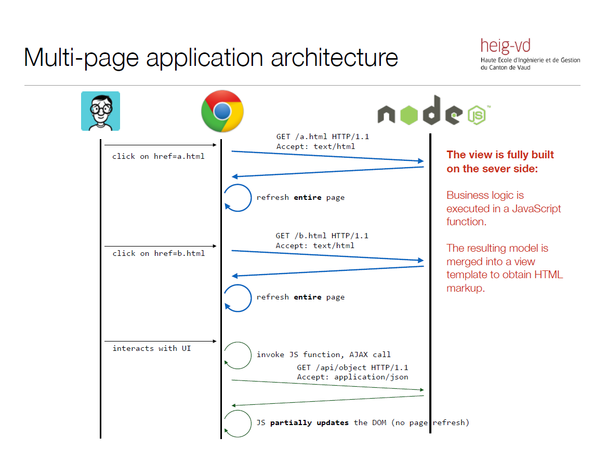


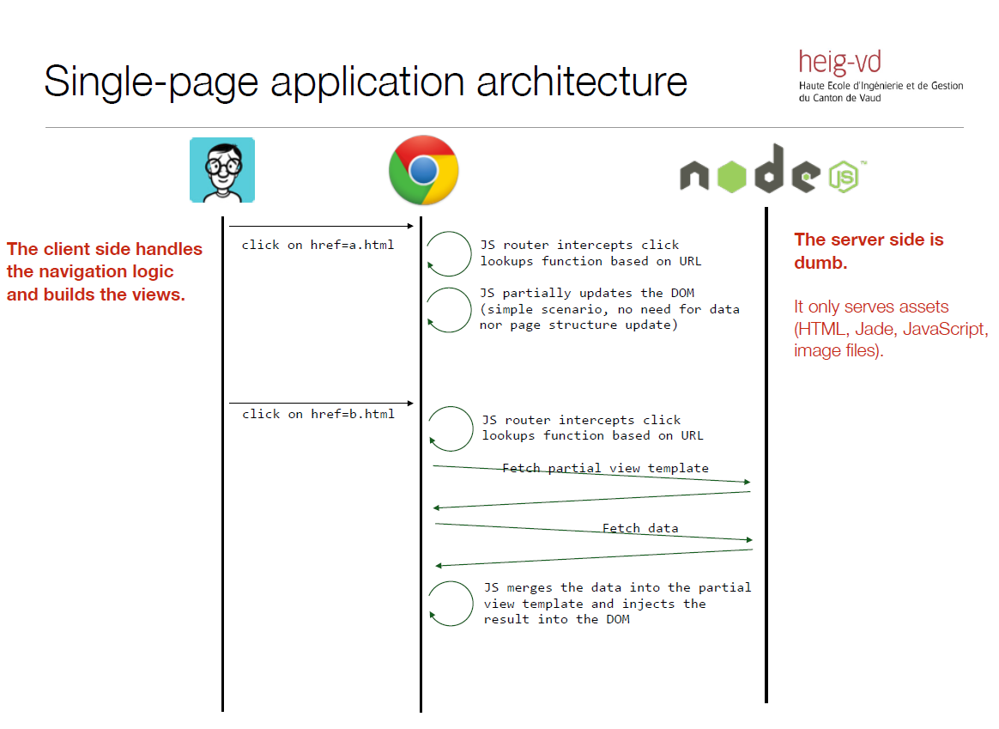


There is a big trend towards “single-page applications”, where some of the
responsibilities are moved from the server to the client side.

* The client initially fetches a single “shell” page, which provides a rendering
context and loads application modules (scripts, markup partials, stylesheets, etc.).
* When the user clicks on hyperlinks, the browser does not (immediately) send an
HTTP request to fetch a new page. Instead, the event is caught and processed by
a JavaScript router on the client side.
* Routing is done on the client side. The JavaScript router (typically provided by
an application framework) looks at the target URL and decides which JavaScript
function needs to be invoked. This function can update the DOM, sometimes in
drastic manners (giving the impression that we move from an “Customers List”
page to a “Customer Details” page).

<!--- .element: class="small" -->


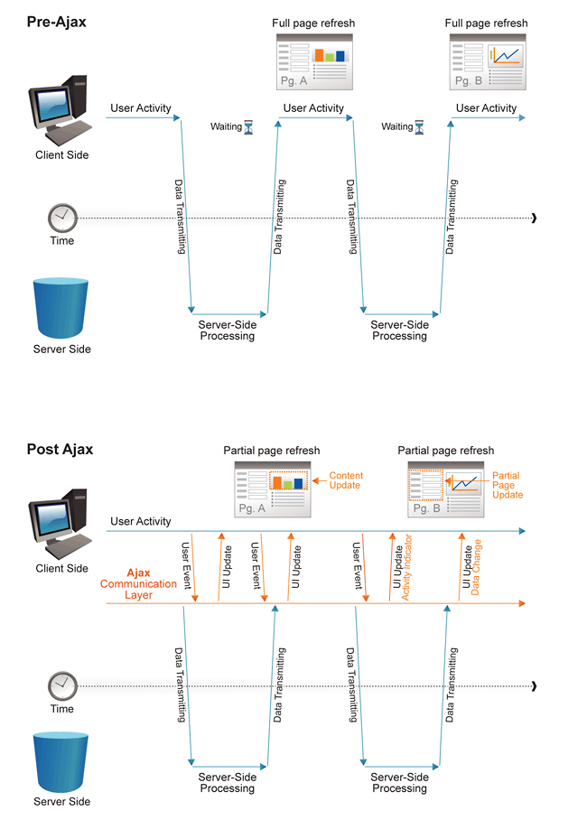
http://www.websiteoptimization.com/secrets/ajax/8-1-ajax-pattern.html
<!--- .element: class="credits" -->


# Paper to WWW


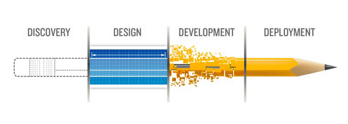

<!-- .element class="center" -->


Note:

Mobile application developement can also be done wiht HTML/CSS/JavaScript, with this kind of application and then be packaged into a native app with a webview.


# Objectifs

* Learn SPA with AngularJS
* Only focus on frontent-app
* Learn by Example: Movie Collection App


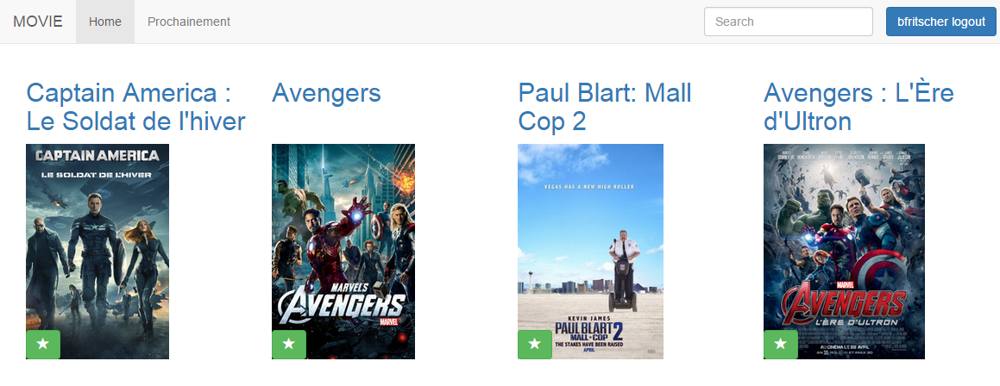
<!-- .element: class="w-40" -->

<!-- .element: class="w-40" -->


# Why AngularJS


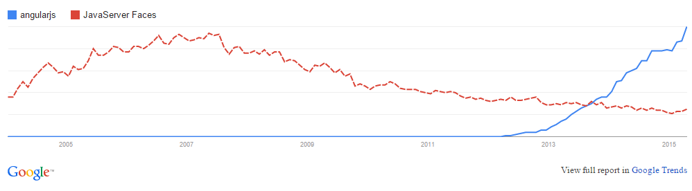

Note:
- address many of the challenges encountered in developing SPA
- large acceptation
- decouple DOM manipulation from application logic
- decouple the client side of an application from the server side
- declarative programming for user interface
- imperative programming for application business logic


# Angular Basics

MVC: http://mattiash.github.io/angular-presentation/presentation.html#1

Scope: http://www.slideshare.net/vinnylinck/google-developers-group-porto-alegre-angularjs (slide 12)

Tool: https://chrome.google.com/webstore/detail/angularjs-batarang-stable/niopocochgahfkiccpjmmpchncjoapek


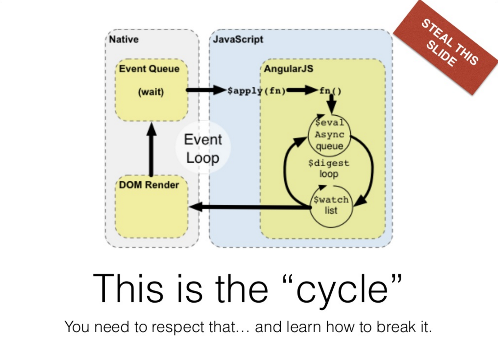


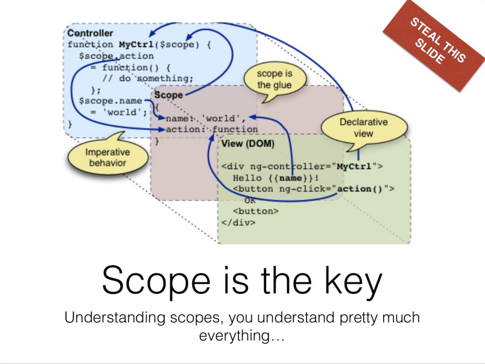


### Resources

### https://docs.angularjs.org/guide

### https://docs.angularjs.org/api

* http://openclassrooms.com/courses/developpez-vos-applications-web-avec-angularjs
* https://www.youtube.com/watch?v=aBE0St5yI7U&list=PLjwdMgw5TTLUDlJyx4yIPQjoI-w-7Zs1r
* http://openclassrooms.com/courses/validation-de-formulaire-simplifiee-avec-angularjs
* http://www.slideshare.net/vinnylinck/google-developers-group-porto-alegre-angularjs

<!-- .element: class="smaller" -->


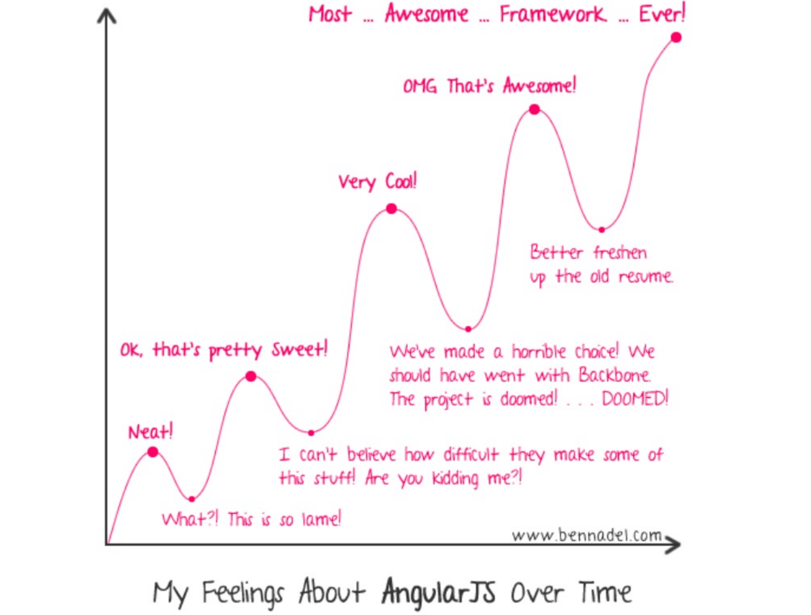


## Javascript libraries

*How do you pick a generator for your project?*

You probably have an idea of the framework(s) you want to use on the server
and or client side (express, angular, backbone, etc.). You will use this as a first
filter.
<!-- .element class="small" -->


* Some of the generators are supported by the Yeoman Team. That is probably a
good indication about the quality and support over time (evolution).

* Developers who use generators can “star” those they like. Sorting by
popularity is also an interesting indication. If the community is big, you can
expect issues to be reported and fixed, to see new features, etc.

<!-- .element class="small" -->


* After you have identified promising candidates, you need to get a first
impression. Generate and build a project with each candidate. Look at their
Github repository. Do you like what you see? Do you like the documentation?

* Often, you will need to choose between “lightweight” and very “rich”
generators. Lightweight generators are easier to learn and give you more control
(but more work). Rich generators do a lot of things out-of-the-box but can be
intimidating at first (learning curve to understand the skeleton).

<!-- .element class="small" -->


## Exercice setup:

```sh
yo angular

     _-----_
    |       |    .--------------------------.
    |--(o)--|    |    Welcome to Yeoman,    |
   `---------´   |   ladies and gentlemen!  |
    ( _´U`_ )    '--------------------------'
    /___A___\
     |  ~  |
   __'.___.'__
 ´   `  |° ´ Y `

? Would you like to use Sass (with Compass)? (Y/n) No
? Would you like to include Bootstrap? (Y/n) Yes
? Which modules would you like to include?
 (*) angular-animate.js
 ( ) angular-aria.js
 ( ) angular-cookies.js
 ( ) angular-resource.js
 (*) angular-messages.js
 (*) angular-route.js
 (*) angular-sanitize.js
 (*) angular-touch.js
```


Explore folder

Launch server
```sh
grunt serve
```

Let's use Chrome DevTools as IDE

* add folder to workspace
* map to file system resource
* Focus on MainCtrl + view/main.html
* styles/main.css
* cleanup main.css, index.html add title


### Concepts

| Concept              | Description                                                              |
|----------------------|--------------------------------------------------------------------------|
| Model                | the data shown to the user in the view and with which the user interacts |
| View                 | what the user sees (the DOM)                                             |
| Template             | HTML with additional markup                                              |
| Directives           | extend HTML with custom attributes and elements                          |
| Controller           | the business logic behind views                                          |
| Data Binding         | sync data between the model and the view                                 |
| Scope                | context where the model is stored so that controllers, directives and expressions can access it |
| Expressions          | access variables and functions from the scope                            |
| Filter               | formats the value of an expression for display to the user               |
| Module               | a container for the different parts of an app including controllers, services, filters, directives which configures the Injector |
| Dependency Injection | Creates and wires objects and functions                                  |
| Service              | reusable business logic independent of views                             |

https://docs.angularjs.org/guide/concepts

<!-- .element: class="credits" -->


### Some Directives

ng-app
ng-model
ng-bind
ng-repeat
$index
ng-hide
ng-show
//event
ng-click
ng-controller
//binding

controller $scope


### Expression
{{}}
expression


### Filter

```
$filter
  limitTo
  filter
  orderBy
  uppercase
```


### Exercice: Step1

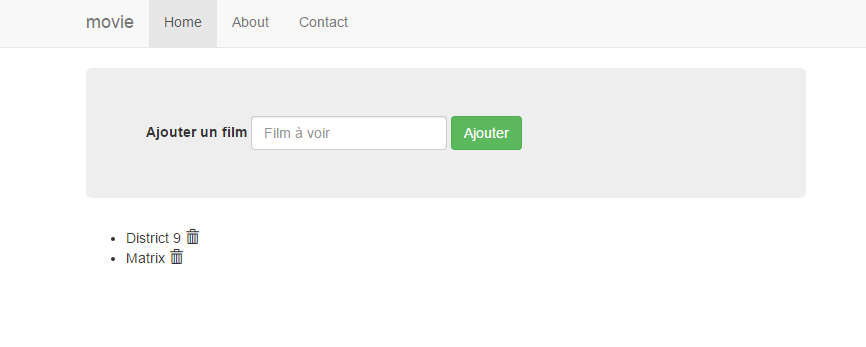

- Create a form to add a new movie to a list of movies
- Display the list of movies
- Be able to delete a movie from the list


# Theory

### JSON
http://json.org/


### localstorage

show chrome resource tab


### Router
plusieurs controlleur
services
di injection
router
$routeParams


### More Directives
ng-href
ng-src
ng-class
ng-style


## Exercice:
transform your app to use a service as storage for the movies and helps persiste the into local storage. A movie is now more than a title it is an object which has two properties a title and a comment
- create a service (factory) moviedb
which has  2 private helper
loadLocalStorage to help restore the movies array from storage (json->array)
saveLocalStorage to help to save the movies array to storage array->json
4 public api methods
getMovies returns a array of movies
addMovie: takes a movie object and adds it to the internal movies array and also perssits to localstorage
removeMovie: removes the given movie from the list and perssistent storage
emptyMovie: return as movie object which has two empty properties title, comment;

- create a controller movie and view and map it to the /movie/:id url
it will display a movie at index id in the movies array
use a filter to display the title in uppercase

- make title in the main.html page clickable to lead to your new movie detail page

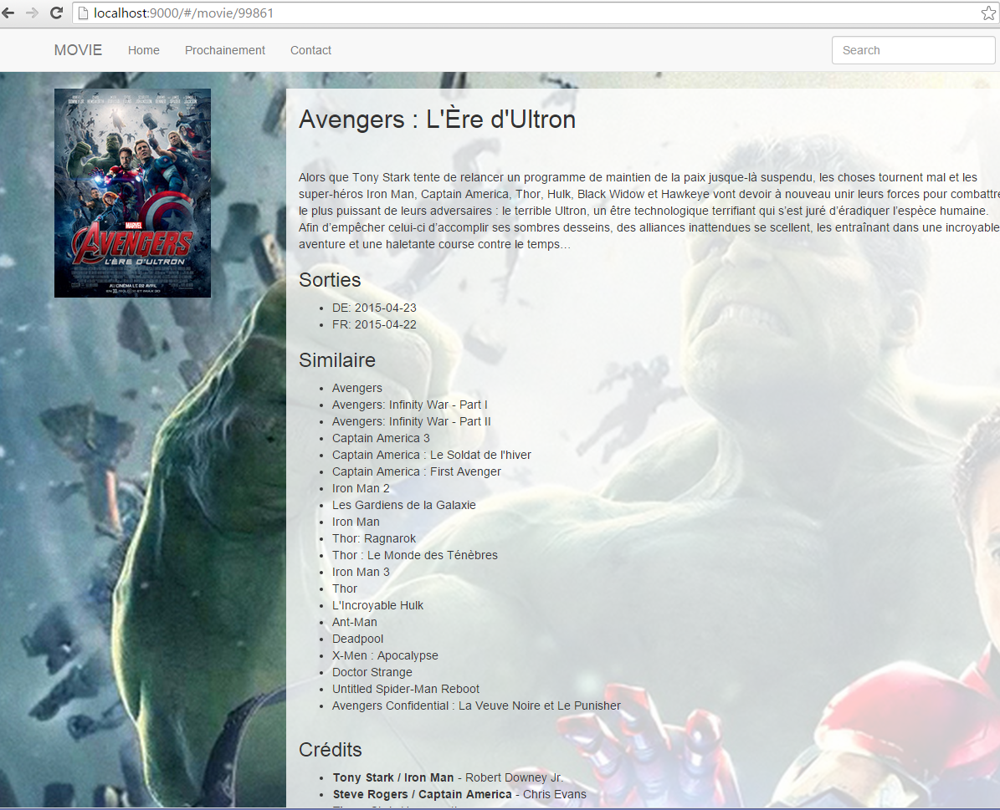


## Theory
Postman

constante
$rootScope
$http
$location

$watch && $watchArray
promise
listenning to events
custom $fitler function


# Asynchronous programming techniques


We have already seen that JavaScript relies on asynchronous
programming:

* The JS engine is single-threaded. For this reason, IO operations have to be non-blocking.
* An event loop is used both in the browser and on the server (node.js):
  * As the program executes, events are added to a queue. Every event has an associate callback function.
  * A dispatcher takes the next event in the queue and invokes the callback function (on the single thread).
  * When the callback function returns, the dispatcher takes the next event in the queue, and continues forever (it’s an event loop).


### Callback

```javascript
setTimeout( function() {
    console.log("the callback has been invoked");
}, 2000);
```

An event will be added to the queue in 2000 ms. In other
words, the function passed as the first argument will be invoked
in 2 seconds or more (the thread might be busy when the event
is posted...).

```javascript
$(document).mousemove( function(event) {
    $("span").text(event.pageX + ", " + event.pageY);
});
```

An event will be added to the queue whenever the mouse
moves. In each case, the callback function has access to the
event attributes (coordinates, key states, etc.).


```javascript
$.get( "ajax/test.html", function( data ) {
    $( ".result" ).html( data );
    alert( "Load was performed." );
});
```

An event will be added when the AJAX request has been
processed, i.e. when a response has been received. The
callback function has access to the payload.


## Beyond simple callbacks...

* The principle of passing a callback function when invoking
an asynchronous operation is pretty straightforward.

* Things get more tricky as soon as you want to coordinate
multiple tasks. Consider this simple example...

Do this first...

... when done, do this.


### A first attempt...

```javascript
var milkAvailable = false;

function milkCow() {
  console.log("Starting to milk cow...");
  setTimeout(function() {
    console.log("Milk is available.");
    milkAvailable = true;
  },  2000);
}

milkCow();
console.log("Can I drink my milk? (" + milkAvailable + ")");
```

FAIL
<!-- .element: class="fragment error" -->


### Fixing the issue with a callback...

```javascript
var milkAvailable = false;

function milkCow(done) {
  console.log("Starting to milk cow...");
  setTimeout(function() {
    console.log("Milk is available.");
    milkAvailable = true;
    done();
  }, 2000);
}

milkCow( function() {
  console.log("Can I drink my milk? (" + milkAvailable + ")");   
});
```

SUCCESS
<!-- .element: class="fragment success" -->


### Beyond simple callbacks...

* Ok... but what happens when I have more than 2 tasks that I want to execute in sequence?

* Let’s say we want to have the sequence B, C, D, X, Y, Z, E, F, where X, Y and Z are asynchronous tasks.

```javascript
function f() {
  syncB();
  syncC();
  syncD();
  asyncX();
  asyncY();
  asyncZ();
  syncE();
  syncF();
}
```

<!-- .element: class="float-left w-40" -->

```
B  result  available
C  result  available
D  result  available
E  result  available
Z  result  available
Y  result  available
F  result  available
X  result  available
```
<!-- .element: class="fragment float-right w-40" -->


### Sequence with callbacks

```javascript
function f() {
  syncB();
  syncC();
  syncD();
  asyncX(function() {
    asyncY(function() {
      asyncZ(function() {
        syncE();
        syncF();
      });
    });
  });
}
```
<!-- .element: class="float-left w-40" -->


```
B  result  available
C  result  available
D  result  available
X  result  available
Y  result  available
Z  result  available
E  result  available
F  result  available
```
<!-- .element: class="fragment float-right w-40" -->


But welcome to the **"callback hell"** aka **"callback pyramid"**

<!-- .element: class="clear fragment" -->


### Callback parallel tasks
* Now, let's imagine that we have 3 asynchronous tasks. We want to invoke them in parallel and wait until all of them complete.
* Typical use case: you want to send several AJAX requests (to get different data models) and update your DOM once you have received all responses.

<!-- .element: class="small" -->

```javascript
function f( done ) {
 async1( function( r1 ) {
    reportResult( r1 );
  });
  async2( function( r2 ) {
    reportResult(r2);
  });
  async3( function( r3 ) {
    reportResult( r3 );
  })
  done();
}
```

<!-- .element: class="" -->

Double fail: not only is done() invoked to early, but also there is no result to send back...

<!-- .element: class="fragment error" -->


### Callback parallel tasks with counter

```javascript
function f( done ) {
  <span class="fragment highlight-current-red" data-fragment-index="1">var numberOfPendingTasks = 3;</span>
  var results = [];
  <span class="fragment highlight-current-red" data-fragment-index="2">
  function reportResult( result ) {
    result.push( result );
    numberOfPendingTasks ‐= 1;
    if ( numberOfPendingTasks === 0 ) {
      done( null, results );
    }
  }
  </span><span class="fragment highlight-current-red" data-fragment-index="3">
  async1( function( r1 ) {
    reportResult( r1 );
  });
  async2( function( r2 ) {
    reportResult( r2 );
  });
  async3( function( r3 ) {
    reportResult( r3 );
  });</span>
}
```

<!-- .element: class="parse-fragment float-left w-50" -->

When this reaches 0, I know that all the tasks have completed. I can
invoke the "done" callback function that I received from the client. I
can pass the array of results to the function.

<!-- .element: class="smaller float-right w-40" -->

When a task completes, it invokes this function and passes its result.
The result is added to the array and the number of pending tasks is
decremented.

<!-- .element: class="smaller float-right w-40"  -->

The three tasks are asynchronous, so they pass their own callback
functions and receive a result when the operation completes.

<!-- .element: class="smaller float-right w-40"  -->


# Async libs to the rescue: Promise


A **promise** must be in **one of three states**: *pending*, *fulfilled*, or *rejected*.

When *pending*, a promise:
  - may transition to either the *fulfilled* or *rejected* state.

When *fulfilled*, a promise:
  - **must not transition** to any other state.
  - must have a **value**, which must not change.

When *rejected*, a promise:
  - **must not transition** to any other state.
  - must have a **reason**, which must not change.

https://github.com/promises-aplus/promises-spec

<!-- .element: class="credits" -->


**A promise must provide a then method to access its current or eventual value or reason.**
A promise's `then` method accepts two arguments:
- `promise.then( onFullfilled,  onRejected )`
- If `onFulfilled` is a function:
  - it must be called after promise is *fulfilled*, with promise's value as its first argument.
  - it must not be called before promise is *fulfilled*.
  - it must not be called more than once.

- If `onRejected` is a function,
  - it must be called after promise is *rejected*, with promise's reason as its first argument.
  - it must not be called before promise is *rejected*.
  - it must not be called more than once

<!-- .element: class="small" -->

https://github.com/promises-aplus/promises-spec

<!-- .element: class="credits" -->


**then must return a promise.**

`promise2  = promise1.then(onFulfilled, onRejected);`

- If either onFulfilled or onRejected returns a value x, run the Promise Resolution Procedure Resolve(promise2, x).
- If either onFulfilled or onRejected throws an exception e, promise2 must be rejected with e as the reason.
- If onFulfilled is not a function and promise1 is fulfilled, promise2 must be fulfilled with the same value as promise1.
- If onRejected is not a function and promise1 is rejected, promise2 must be rejected with the same reason as promise1.

<!-- .element: class="small" -->

https://github.com/promises-aplus/promises-spec

<!-- .element: class="credits" -->


### Deferred objects in JQuery

"a **promise** represents a value that is not yet known, a **deferred** represents work that is not yet finished"

http://blog.mediumequalsmessage.com/promise-deferred-objects-in-javascript-pt1-theory-and-semantics

<!-- .element: class="credits" -->

```javascript
var d1 = new $.Deferred();
var d2 = new $.Deferred();
$.when( d1, d2 ).done(function ( v1, v2 ) {
  console.log( v1 ); // "Fish"
  console.log( v2 ); // "Pizza"
});
d1.resolve( "Fish" );
d2.resolve( "Pizza" );
```


### $q promise service

```javascript
function asyncGreet(name) {
  // perform some asynchronous operation,
  // resolve or reject the promise when appropriate.
  return $q(function(resolve, reject) {
    setTimeout(function() {
      if (okToGreet(name)) {
        resolve('Hello, ' + name + '!');
      } else {
        reject('Greeting ' + name + ' is not allowed.');
      }
    }, 1000);
  });
}

var promise = asyncGreet('Robin Hood');
promise.then(function(greeting) {
  alert('Success: ' + greeting);
}, function(reason) {
  alert('Failed: ' + reason);
});
```

https://docs.angularjs.org/api/ng/service/$q

<!-- .element: class="credits" -->


# api

https://chrome.google.com/webstore/detail/postman-rest-client-packa/fhbjgbiflinjbdggehcddcbncdddomop

https://www.getpostman.com/docs/introduction


## exercice

For now we leave the first page as is and extend the app to display movies from an external web service

add the following to the moviedb service
internal varialbles

```javascript
var apiUrl = 'http://api.themoviedb.org/3/'; //proxy
var baseUrl = 'http://image.tmdb.org/t/p/';
```

getMovie retunrs a promise http of a movie (http://apiUrlEndpoint/movie/id?api_key=apiKey&append_to_response=similar,releases,credits&language=fr)
getMovieResults retrieve movie results array
searchMovies:http://apiUrlEndpoint/search/movie?api_key=apiKey&language=fr&query=movie_name updates internal movieResults array
upcomingMovies: http://apiUrlEndpoint/movie/upcoming?api_key=apiKey&language=fr updates internal movieResults array

<!-- .element: class="smaller" -->


```css
body {
  padding: 0;
  background-repeat: no-repeat;
  background-size: cover;
}
.movie{
  margin-bottom: 2em;
}
.movie h2{
  height: 66px;
}
.movie .poster{
  background-repeat: no-repeat;
  background-size: contain;
  background-position: 0 50%;
  height: 250px;
}
.box{
  background-color: rgba(255,255,255,0.8);
}
```


display the results with a new controller upcoming url and view results
iterate over moviedb.getMovieResults()
create a link for each movie with class movie and col-sm-3 point to the movie page with id from the movie result
title of the movie as h2
for the poster image use a div with background-image
<div class="poster" ng-style="{'background-image': (m|toBackgroundCSS) }"></div>

create the toBackgroundCSS filter
this is a function which get a movie object and returns either the css url to the placeholder picture or to the poster
url(images/noposter.jpg)
url( baseUrlofmoviedb/w185/movie_poster_path_property)


alter moviectrl to get the movie from the net by id
explore data structure of the movie json
alter the movie.html view
to display the poster (same code as before)
to display the title
the overview
iterate over the data of these three array
releases
similar movies
credits of cast


notice that there are two many release countries
filter them down to only display fr,de,ch
by creating a filter function in the scope of moviectrl validCountry


## adding search
create a controller search and map it to search with the
we can reuse the result view of upcoming for the research

to start the research and handle the right navmenu highlight lets create a new controllerfor the whole app
add it to the body
add a serach bar to the menu and when it changes get the field value and trigger the search on moviedb


## highlight path and more nice
in the app controller we can listen to the $locationChangeSuccess event and if the path is not /search empty the search field
set a new variable on this controller scope with the current path
use this to add the active class on the link menu which is the current active one


## finally use a nice backdrop image
add a background-image to the body with a variable on the app scope.
set this variable in the moviectrl (hint: since its a child scope it can see its parent ;-) )
don't forget to reset the backdrop when path changes.


## theory

utilisation d'autres directives

show carousel
http://vasyabigi.github.io/angular-slick/

```sh
bower install angular-slick --save
```

add 'slick' to movieApp

```html
<div class="col-sm-10 col-sm-offset-1">
    <slick dots="true" infinite="false" slides-to-show="3" slides-to-scroll="3" responsive="breakpoints"  init-onload="true" class="slider multiple-items" data="movie.similar.results">
        <div ng-repeat="r in movie.similar.results"><div class="poster" ng-style="{'background-image': (r|toBackgroundCSS) }"></div></div>
    </slick>
</div>
```


## ng-animate?


## exercice

try to make the country as flags with ng-flags use master.

```sh
bower install ng-flags#master --save
```

https://github.com/asafdav/ng-flags

```sh
bower install world-flags-sprite --save
```


## make magic

add class slide to ng-view

and this css

```css
.slide.ng-enter,
.slide.ng-leave {
    -webkit-transition: all 1s ease;
    transition: all 1s ease;
    position: absolute;
    width: 100%;
}
.slide.ng-enter {
    left: 100%;
}
.slide.ng-enter-active {
    left: 0;
}
.slide.ng-leave {
    left: 0;
}
.slide.ng-leave-active {
    left: -100%;
}
```


## Theory

formulaire et validation
ngMessages

créer ses directives


## Exercice

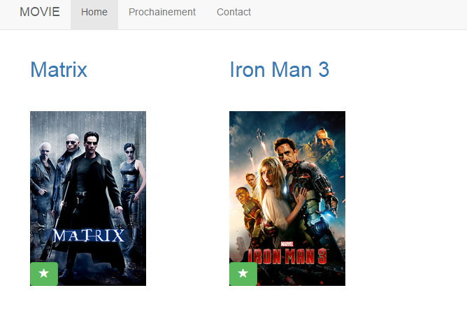

Lets fix our data and make poster more reusable with a custom directive


## Step1 replace poster

```html
<div class="poster" ng-style="{\'background-image\': (movie|toBackgroundCSS) }"></div>
```
with `<poster movie="m"></poster>`
in results and movie

use a scope for omovie


## step2 add fuctionnality

add a star button to the poster directive template and handle the click function inside the directives link function
change moviedb to store a movie object with the needed information, id, title, poster_path
create a isMovieFavorite
modify addMovie/removeMovie to use object instead of array to make lookup by id easyer... (or loop array ...)
cleanup unused functions  emptyMovie, getMovies

to reuse results.html in main we can create afunction that links movieResults with movies
favoriteMovies


## firebase

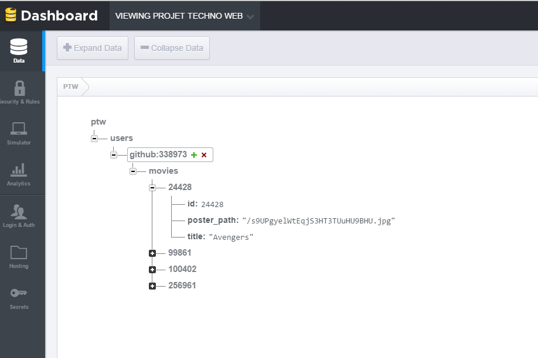


https://www.firebase.com/docs/web/libraries/angular/quickstart.html

```sh
bower install angularfire --save
```

```javascript
{
    "rules": {
       "users": {
      "$uid": {
        // grants write access to the owner of this user account whose uid must exactly match the key ($uid)
        ".write": "auth !== null && auth.uid === $uid",
        ".read": "auth !== null && auth.uid === $uid"
        }
      }
    }
}
```

add login/logout button based on login state

add 3 methods to moviedb
$firebaseAuth, $firebaseObject

```javascript
    var ref = new Firebase('https://ptw.firebaseio.com');
    var authObj = $firebaseAuth(ref);
    var authData = null;

    function getFirebaseData(){
        console.log('Logged in as:', authData.uid);
        //could do some merge with localStorage...
        movies = $firebaseObject(new Firebase('https://ptw.firebaseio.com/users/' + authData.uid + '/movies'));
    }

    function login(manualLogin){
        authData = authObj.$getAuth();
        if (authData) {
            getFirebaseData();
            return;
        }
        console.log('Logged out');
        if(manualLogin){
            authObj.$authWithOAuthPopup('github')
            .then(function(auth) {
                authData = auth;
                getFirebaseData();
            }).catch(function(error) {
                console.error('Authentication failed:', error);
            });
        }
    }
    login();

    function isLoggedIn(){
        return authData;
    }

    function logout(){
        authObj.$unauth();
        authData = null;
    }

    function saveLocalStorage(){
      localStorage.setItem('movies', angular.toJson(movies));
      if(authData){
        movies.$save();
      }
    }

    if(savedMovies && Object.keys(movies).length === 0){
```


## After deploy

A/B testing on similar list

theory

ng-wat 5

https://www.youtube.com/watch?v=M_Wp-2XA9ZU

virutal page views
event


## Exercice

http://luisfarzati.github.io/angulartics/
https://github.com/GoAugust/angular-google-experiments

```sh
bower install angulartics --save
```

```javascript
'angulartics', 'angulartics.google.analytics'
// Google Analytics example
ga('send', 'pageview'); // <---- delete this line!
```

```sh
bower install angular-google-experiments --save
```

```javascript
googleExperiments
 .config(function(googleExperimentsProvider) {
        googleExperimentsProvider.configure({
            experimentId: 'your-experiment-id-goes-here'
        });
    })
```

```html
<div variation="0">Original</div>
<div variation="1">Variation #1</div>
```
