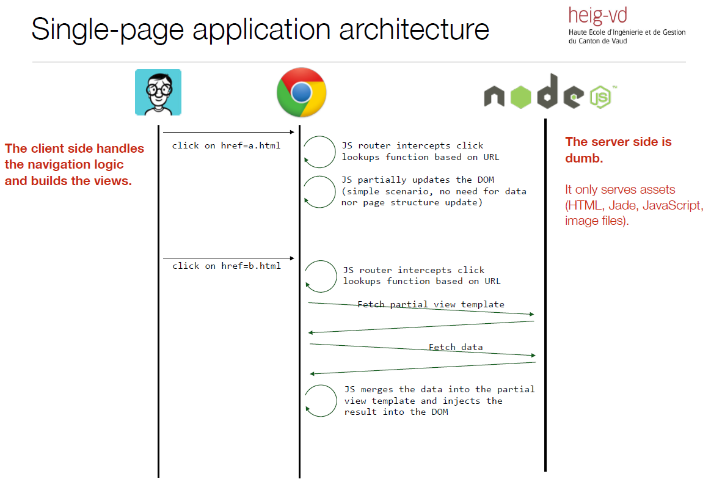
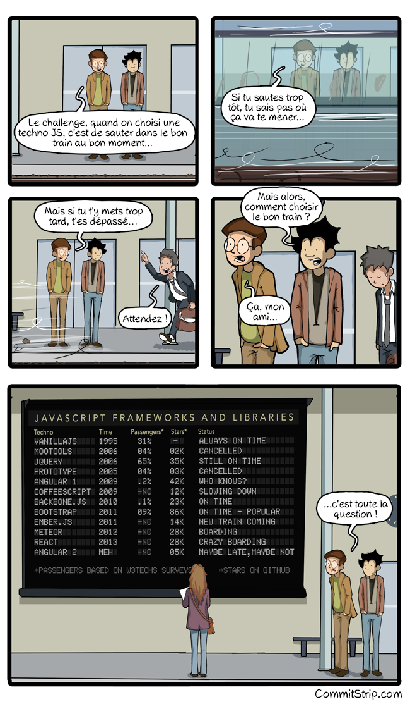
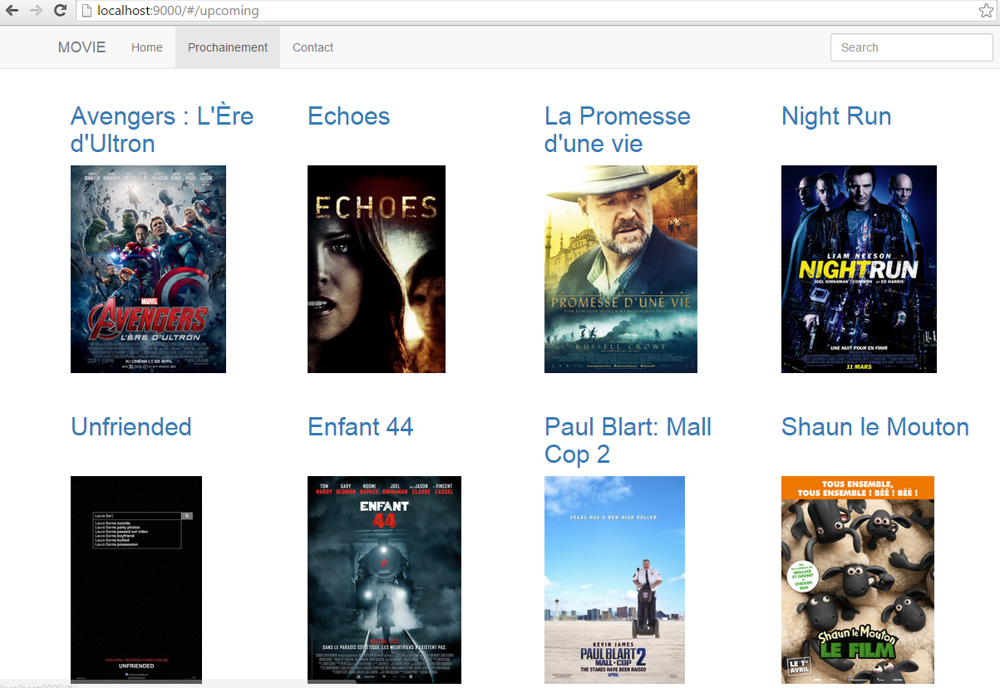

643-1-1 Projet de technologies WEB de présentation
<!-- .element style="font-size:0.7em;margin:4em 0;" -->

# Zero to Hero


<!-- .element style="position:absolute; top:0; left:0;width:40%;" class="nopdf" -->


<!-- .element style="position:absolute; top:0; right:0;width:10%;" class="nopdf" -->

[Boris.Fritscher@he-arc.ch](mailto:Boris.Fritscher@he-arc.ch)
<!-- .element style="position:absolute; bottom:20px; left:0;" class="nopdf" -->

#### Part 2: Build and deploy a Single Page Application

#### Angular.js


# Multi Page App (classic)<br/>vs Single Page Application (SPA)





There is a big trend towards “single-page applications”, where some of the
responsibilities are moved from the server to the client side.

* The client initially fetches a single “shell” page, which provides a rendering
context and loads application modules (scripts, markup partials, stylesheets, etc.).
* When the user clicks on hyperlinks, the browser does not (immediately) send an
HTTP request to fetch a new page. Instead, the event is caught and processed by
a JavaScript router on the client side.
* Routing is done on the client side. The JavaScript router (typically provided by
an application framework) looks at the target URL and decides which JavaScript
function needs to be invoked. This function can update the DOM, sometimes in
drastic manners (giving the impression that we move from an “Customers List”
page to a “Customer Details” page).

<!--- .element: class="small" -->


http://www.websiteoptimization.com/secrets/ajax/8-1-ajax-pattern.html
<!--- .element: class="credits" -->


# Paper to WWW


<!-- .element class="center" -->


Note:

Mobile application developement can also be done wiht HTML/CSS/JavaScript, with this kind of application and then be packaged into a native app with a webview.


# Objectifs

* Learn SPA with AngularJS
* Only focus on frontent-app
* Learn by Example: Movie Collection App


<!-- .element: class="w-40" -->

<!-- .element: class="w-40" -->


# Why AngularJS


Note:
- address many of the challenges encountered in developing SPA
- large acceptation
- decouple DOM manipulation from application logic
- decouple the client side of an application from the server side
- declarative programming for user interface
- imperative programming for application business logic


THE DZONE GUIDE TO THE JAVA ECOSYSTEM, 2015



<!-- .element: class="w-50"-->


# Angular Basics

MVC: http://mattiash.github.io/angular-presentation/presentation.html#1

Scope: http://www.slideshare.net/vinnylinck/google-developers-group-porto-alegre-angularjs (slide 12)

Tool: https://chrome.google.com/webstore/detail/angularjs-batarang-stable/niopocochgahfkiccpjmmpchncjoapek


### Resources

### https://docs.angularjs.org/guide

### https://docs.angularjs.org/api

* http://openclassrooms.com/courses/developpez-vos-applications-web-avec-angularjs
* https://www.youtube.com/watch?v=aBE0St5yI7U&list=PLjwdMgw5TTLUDlJyx4yIPQjoI-w-7Zs1r
* http://openclassrooms.com/courses/validation-de-formulaire-simplifiee-avec-angularjs
* http://www.slideshare.net/vinnylinck/google-developers-group-porto-alegre-angularjs

<!-- .element: class="smaller" -->


## Javascript libraries

*How do you pick a generator for your project?*

You probably have an idea of the framework(s) you want to use on the server
and or client side (express, angular, backbone, etc.). You will use this as a first
filter.
<!-- .element class="small" -->


* Some of the generators are supported by the Yeoman Team. That is probably a
good indication about the quality and support over time (evolution).

* Developers who use generators can “star” those they like. Sorting by
popularity is also an interesting indication. If the community is big, you can
expect issues to be reported and fixed, to see new features, etc.

<!-- .element class="small" -->


* After you have identified promising candidates, you need to get a first
impression. Generate and build a project with each candidate. Look at their
Github repository. Do you like what you see? Do you like the documentation?

* Often, you will need to choose between “lightweight” and very “rich”
generators. Lightweight generators are easier to learn and give you more control
(but more work). Rich generators do a lot of things out-of-the-box but can be
intimidating at first (learning curve to understand the skeleton).

<!-- .element class="small" -->


## Exercice setup:

```sh
yo angular

     _-----_
    |       |    .--------------------------.
    |--(o)--|    |    Welcome to Yeoman,    |
   `---------´   |   ladies and gentlemen!  |
    ( _´U`_ )    '--------------------------'
    /___A___\
     |  ~  |
   __'.___.'__
 ´   `  |° ´ Y `

? Would you like to use Sass (with Compass)? (Y/n) No
? Would you like to include Bootstrap? (Y/n) Yes
? Which modules would you like to include?
 (*) angular-animate.js
 ( ) angular-aria.js
 ( ) angular-cookies.js
 ( ) angular-resource.js
 (*) angular-messages.js
 (*) angular-route.js
 (*) angular-sanitize.js
 (*) angular-touch.js
```


Explore folder

Launch server
```sh
grunt serve
```

Let's use Chrome DevTools as IDE

* add folder to workspace
* map to file system resource
* Focus on MainCtrl + view/main.html
* styles/main.css
* cleanup main.css, index.html add title


| Angular Concepts     | Description                                                              |
|----------------------|--------------------------------------------------------------------------|
| Model                | the data shown to the user in the view and with which the user interacts |
| View                 | what the user sees (the DOM)                                             |
| Template             | HTML with additional markup                                              |
| Directives           | extend HTML with custom attributes and elements                          |
| Controller           | the business logic behind views                                          |
| Data Binding         | sync data between the model and the view                                 |
| Scope                | context where the model is stored so that controllers, directives and expressions can access it |
| Expressions          | access variables and functions from the scope                            |
| Filter               | formats the value of an expression for display to the user               |
| Module               | a container for the different parts of an app including controllers, services, filters, directives which configures the Injector |
| Dependency Injection | Creates and wires objects and functions                                  |
| Provider             | Providers are objects that provide (create) instances of services and expose configuration APIs |
| Service              | reusable business logic independent of views                             |

https://docs.angularjs.org/guide/concepts

<!-- .element: class="credits" -->


### Angular Expressions

Angular expressions are JavaScript-like code snippets that are usually placed in bindings such as `{{ expression }}`.

For example, these are valid expressions in Angular:

 - `1 + 2`
 - `a + b`
 - `user.name`
 - `items[index]`

https://docs.angularjs.org/guide/expression

<!-- .element: class="credits" -->


### Some Directives

| Directive         | Description |
|-------------------|-------------|
| ng-app            | auto-bootstrap an AngularJS application. The ngApp directive designates the root element of the application and is typically placed near the root element of the page. |
| ng-model          | binds an input, select, textarea (or custom form control) to a property on the scope. |
| ng-bind           |  replace the text content of the specified HTML element with the value of a given expression, and to update the text content on changes. |
| ng-hide / ng-show | shows or hides the given HTML element based on the expression provided to the directive's attribute. |
| ng-repeat         | instantiates a template once per item from a collection. Each template instance gets its own scope, where the given loop variable is set to the current collection item, and *$index* is set to the item index or key. |
| ng-click          | allows to specify custom behavior when an element is clicked. |
| ng-controller     | attaches a controller class to the view. This is a key aspect of how angular supports the principles behind the Model-View-Controller design pattern. |

https://docs.angularjs.org/api

<!-- .element: class="credits" -->


### Controller

A *Controller* is defined by a JavaScript constructor **function** that is used to augment the Angular Scope.
A new child **scope** will be created and made available as an injectable parameter to the Controller's constructor function as **$scope**.

Use controllers to:

- Set up the initial state of the $scope object.
- Add behavior to the $scope object.

Do **not** use controllers to: Manipulate DOM, Format input, Filter output, Share code or state across controllers


### Controller Example

```javascript
var myApp = angular.module('myApp', []);

myApp.controller('GreetingController', function( $scope ) {
  $scope.greeting = 'Hola!';
  $scope.double = function( value ) { return value * 2; };
});
```

controllerAs instance version
```javascript
var myApp = angular.module('myApp', []);

myApp.controller('GreetingController', function( ) {
  var ctrl = this;
  ctrl.greeting = 'Hola!';
  ctrl.double = function( value ) { return value * 2; };
});
```

https://docs.angularjs.org/guide/controller

<!-- .element: class="credits" -->


### Filters

A filter formats the value of an expression for display to the user.

```
{{ expression | filter1:argument1:argument2:... | filter2 | ... }}
```

| Filter | Description |
|--------|-------------|
| uppercase | Converts string to uppercase. |
| limitTo:*limit* | Creates a new array or string containing only a specified number of elements. |
| orderBy:*expression* | Orders a specified array by the expression predicate (string, array or function). |
| filter:*expression* | Selects a subset of items from array and returns it as a new array (string, object or function(value, index, array)). |

https://docs.angularjs.org/api/ng/filter

<!-- .element: class="credits" -->


### Exercice: Step 1


- Create a form to add a new movie to a list of movies
- Display the list of movies
- Be able to delete a movie from the list


### JSON

JavaScript Object Notation is a lightweight data-interchange format. It is easy for *humans* to **read and write**. It is easy for *machines* to **parse and generate**. It is based on a subset of the JavaScript Programming Language

```javascript
{
  "key_string": "hello",
  "key_number": 3,
  "key_array": ["some text", 34]
  "key_object": {
    "other_key": "value"
    "key_boolean": true,
    "null possible": null
  }

}
```
http://json.org/


### JSON API in JavaScript

|                                   |                                                              |
|-----------------------------------|--------------------------------------------------------------|
| JSON.stringify( *object* )        | create a JSON_string                                         |
| JSON.parse( *JSON_string* )       | create an object from a string                               |
| angular.toJson( *object* )        | create a JSON_string (removing angular's internal variables) |
| angular.fromJson( *JSON_string* ) | create an object from a string                               |

```javascript
//optional formatter and indentation spacing for pretty-print
JSON.stringify( {hello: {text: 'world'}}, null, 2 )
//results in the following string
'{
  "hello": {
    "text": "world"
  }
}'
```


### localStorage

Interface of the Web Storage API provides access to storage for a particular domain.

|                                    |                                                                                        |
|------------------------------------|----------------------------------------------------------------------------------------|
| localStorage.length                | Returns an integer representing the number of data items stored in the Storage object. |
| localStorage.key( number )         | will return the name of the nth key in the storage.                                    |
| localStorage.getItem( key )        | will return that key's value.                                                          |
| localStorage.setItem( key, value ) | will add that key to the storage, or update that key's value if it already exists.     |
| localStorage.removeItem( key )     | will remove that key from the storage.                                                 |
| localStorage.clear()               | will empty all keys out of the storage.                                                |

*localStorage content can be viewed in chrome developer tools resource tab*

<!-- .element: class="small" -->

https://developer.mozilla.org/en-US/docs/Web/API/Storage

<!-- .element: class="credits" -->


### Multiples Views and Router

A SPA has to support multiple virtual views to simulate pages. This can be achieved with routes with http fragment.

Application routes in Angular are declared via the `$routeProvider`, which is the *provider* of the `$route` *service*.

This service makes it easy to wire together controllers, view templates, and the current URL location in the browser

https://docs.angularjs.org/tutorial/step_07

<!-- .element: class="credits" -->


### Dependency Injection

Dependency Injection (DI) is a software design pattern that deals with how components get hold of their dependencies.

When the application bootstraps, Angular creates an injector that will be used to find and inject all of the services that are required by your app.

Providers are objects that provide (create) instances of services and expose configuration APIs.

In case of the $route service, the $routeProvider exposes APIs that allow you to define routes for your application.

https://docs.angularjs.org/guide/di

<!-- .element: class="credits" -->


### $routeProvider

```javascript
app.config( function( $routeProvider ) {
    $routeProvider.
      when('/phones', {
        templateUrl: 'views/phone-list.html',
        controller: 'PhoneListCtrl'
      }).
      when('/phones/:phoneId', {
        templateUrl: 'views/phone-detail.html',
        controller: 'PhoneDetailCtrl'
      }).
      otherwise({
        redirectTo: '/phones'
      });
});
```

The $routeParams service allows you to retrieve the current set of route parameters.

```javascript
app.controller( 'PhoneDetailCtrl', function( $scope, $routeParams ) {
    $scopre.phoneId = $routeParams.phoneId;
});
```


### Template

The $route and $routeParams service are usually used in conjunction with the ngView directive.

The role of the ng-view directive is to include the view template for the current route into the layout template.

```html
<!-- index.html -->
<html ng-app="app">
  ...
  <body>
    <ng-view></ng-view>
  </body>
</html>
```

```html
<!-- views/phone-detail.html -->
<div>View content phone {{phoneId}}</div>
```


### More Directives

Using Angular markup like `{{hash}}` in an href or src attribute will make the link go to the wrong URL if Angular has not replaced the `{{hash}}` markup with its value.

| Directive         | Description |
|-------------------|-------------|
| ng-href           | solves the wrong href problem. |
| ng-src            | solves the wrong src problem. |
| ng-class          | allows to dynamically set CSS classes on an HTML element by databinding an expression that represents all classes to be added. The result of the evaluation can be a string representing space delimited class names, an array, or a map of class names to boolean values.|
| ng-style          | allows to set CSS style on an HTML element conditionally. Expression which evals to an object whose keys are CSS style names and values are corresponding values for those CSS keys. |

https://docs.angularjs.org/api

<!-- .element: class="credits" -->


### Exercice: localStorage and routes

Transform your app to use a service as storage for the movies and helps persiste the into local storage.
A movie is now more than a title it is an object which has two properties a title and a comment.

- create a moviedb service (factory)
- create a controller and a view to display a movie
- modify the frontpage


### create a moviedb service (factory)

  - which has 2 private helper methods
    - `loadLocalStorage`: to help restore the movies array from storage (json->array)
    - `saveLocalStorage`: to help to save the movies array to storage array->json
  - 4 public api methods
    - `getMovies`: returns a array of movies
    - `addMovie`: takes a movie object and adds it to the internal movies array and also perssits to localstorage
    - `removeMovie`: removes the given movie from the list and perssistent storage
    - `emptyMovie`: return as movie object which has two empty properties title, comment;


### create a controller and a view to display a movie

  - map it to the /movie/:id url
  - it will display a movie at index id in the movies array
  - use a filter to display the title in uppercase

TODO: screenshot?


### modify the frontpage

- make title in the main.html page clickable to lead to your new movie detail page


# Asynchronous programming techniques


We have already seen that JavaScript relies on asynchronous
programming:

* The JS engine is single-threaded. For this reason, IO operations have to be non-blocking.
* An event loop is used both in the browser and on the server (node.js):
  * As the program executes, events are added to a queue. Every event has an associate callback function.
  * A dispatcher takes the next event in the queue and invokes the callback function (on the single thread).
  * When the callback function returns, the dispatcher takes the next event in the queue, and continues forever (it’s an event loop).


### Callback

```javascript
setTimeout( function() {
    console.log("the callback has been invoked");
}, 2000);
```

An event will be added to the queue in 2000 ms. In other
words, the function passed as the first argument will be invoked
in 2 seconds or more (the thread might be busy when the event
is posted...).

```javascript
$(document).mousemove( function(event) {
    $("span").text(event.pageX + ", " + event.pageY);
});
```

An event will be added to the queue whenever the mouse
moves. In each case, the callback function has access to the
event attributes (coordinates, key states, etc.).


```javascript
$.get( "ajax/test.html", function( data ) {
    $( ".result" ).html( data );
    alert( "Load was performed." );
});
```

An event will be added when the AJAX request has been
processed, i.e. when a response has been received. The
callback function has access to the payload.


## Beyond simple callbacks...

* The principle of passing a callback function when invoking
an asynchronous operation is pretty straightforward.

* Things get more tricky as soon as you want to coordinate
multiple tasks. Consider this simple example...

Do this first...

... when done, do this.


### A first attempt...

```javascript
var milkAvailable = false;

function milkCow() {
  console.log("Starting to milk cow...");
  setTimeout(function() {
    console.log("Milk is available.");
    milkAvailable = true;
  },  2000);
}

milkCow();
console.log("Can I drink my milk? (" + milkAvailable + ")");
```

FAIL
<!-- .element: class="fragment error" -->


### Fixing the issue with a callback...

```javascript
var milkAvailable = false;

function milkCow(done) {
  console.log("Starting to milk cow...");
  setTimeout(function() {
    console.log("Milk is available.");
    milkAvailable = true;
    done();
  }, 2000);
}

milkCow( function() {
  console.log("Can I drink my milk? (" + milkAvailable + ")");   
});
```

SUCCESS
<!-- .element: class="fragment success" -->


### Beyond simple callbacks...

* Ok... but what happens when I have more than 2 tasks that I want to execute in sequence?

* Let’s say we want to have the sequence B, C, D, X, Y, Z, E, F, where X, Y and Z are asynchronous tasks.

```javascript
function f() {
  syncB();
  syncC();
  syncD();
  asyncX();
  asyncY();
  asyncZ();
  syncE();
  syncF();
}
```

<!-- .element: class="float-left w-40" -->

```
B  result  available
C  result  available
D  result  available
E  result  available
Z  result  available
Y  result  available
F  result  available
X  result  available
```
<!-- .element: class="fragment float-right w-40" -->


### Sequence with callbacks

```javascript
function f() {
  syncB();
  syncC();
  syncD();
  asyncX(function() {
    asyncY(function() {
      asyncZ(function() {
        syncE();
        syncF();
      });
    });
  });
}
```
<!-- .element: class="float-left w-40" -->


```
B  result  available
C  result  available
D  result  available
X  result  available
Y  result  available
Z  result  available
E  result  available
F  result  available
```
<!-- .element: class="fragment float-right w-40" -->


But welcome to the **"callback hell"** aka **"callback pyramid"**

<!-- .element: class="clear fragment" -->


### Callback parallel tasks
* Now, let's imagine that we have 3 asynchronous tasks. We want to invoke them in parallel and wait until all of them complete.
* Typical use case: you want to send several AJAX requests (to get different data models) and update your DOM once you have received all responses.

<!-- .element: class="small" -->

```javascript
function f( done ) {
 async1( function( r1 ) {
    reportResult( r1 );
  });
  async2( function( r2 ) {
    reportResult(r2);
  });
  async3( function( r3 ) {
    reportResult( r3 );
  })
  done();
}
```

<!-- .element: class="" -->

Double fail: not only is done() invoked to early, but also there is no result to send back...

<!-- .element: class="fragment error" -->


### Callback parallel tasks with counter

```javascript
function f( done ) {
  <span class="fragment highlight-current-red" data-fragment-index="1">var numberOfPendingTasks = 3;</span>
  var results = [];
  <span class="fragment highlight-current-red" data-fragment-index="2">
  function reportResult( result ) {
    result.push( result );
    numberOfPendingTasks ‐= 1;
    if ( numberOfPendingTasks === 0 ) {
      done( null, results );
    }
  }
  </span><span class="fragment highlight-current-red" data-fragment-index="3">
  async1( function( r1 ) {
    reportResult( r1 );
  });
  async2( function( r2 ) {
    reportResult( r2 );
  });
  async3( function( r3 ) {
    reportResult( r3 );
  });</span>
}
```

<!-- .element: class="parse-fragment float-left w-50" -->

When this reaches 0, I know that all the tasks have completed. I can
invoke the "done" callback function that I received from the client. I
can pass the array of results to the function.

<!-- .element: class="smaller float-right w-40" -->

When a task completes, it invokes this function and passes its result.
The result is added to the array and the number of pending tasks is
decremented.

<!-- .element: class="smaller float-right w-40"  -->

The three tasks are asynchronous, so they pass their own callback
functions and receive a result when the operation completes.

<!-- .element: class="smaller float-right w-40"  -->


# Async libs to the rescue: Promise


A **promise** must be in **one of three states**: *pending*, *fulfilled*, or *rejected*.

When *pending*, a promise:
  - may transition to either the *fulfilled* or *rejected* state.

When *fulfilled*, a promise:
  - **must not transition** to any other state.
  - must have a **value**, which must not change.

When *rejected*, a promise:
  - **must not transition** to any other state.
  - must have a **reason**, which must not change.

https://github.com/promises-aplus/promises-spec

<!-- .element: class="credits" -->


**A promise must provide a then method to access its current or eventual value or reason.**
A promise's `then` method accepts two arguments:
- `promise.then( onFullfilled,  onRejected )`
- If `onFulfilled` is a function:
  - it must be called after promise is *fulfilled*, with promise's value as its first argument.
  - it must not be called before promise is *fulfilled*.
  - it must not be called more than once.

- If `onRejected` is a function,
  - it must be called after promise is *rejected*, with promise's reason as its first argument.
  - it must not be called before promise is *rejected*.
  - it must not be called more than once

<!-- .element: class="small" -->

https://github.com/promises-aplus/promises-spec

<!-- .element: class="credits" -->


**then must return a promise.**

`promise2  = promise1.then(onFulfilled, onRejected);`

- If either onFulfilled or onRejected returns a value x, run the Promise Resolution Procedure Resolve(promise2, x).
- If either onFulfilled or onRejected throws an exception e, promise2 must be rejected with e as the reason.
- If onFulfilled is not a function and promise1 is fulfilled, promise2 must be fulfilled with the same value as promise1.
- If onRejected is not a function and promise1 is rejected, promise2 must be rejected with the same reason as promise1.

<!-- .element: class="small" -->

https://github.com/promises-aplus/promises-spec

<!-- .element: class="credits" -->


### Deferred objects in JQuery

"a **promise** represents a value that is not yet known, a **deferred** represents work that is not yet finished"

http://blog.mediumequalsmessage.com/promise-deferred-objects-in-javascript-pt1-theory-and-semantics

<!-- .element: class="credits" -->

```javascript
var d1 = new $.Deferred();
var d2 = new $.Deferred();
$.when( d1, d2 ).done(function ( v1, v2 ) {
  console.log( v1 ); // "Fish"
  console.log( v2 ); // "Pizza"
});
d1.resolve( "Fish" );
d2.resolve( "Pizza" );
```


### $q promise service

```javascript
function asyncGreet(name) {
  // perform some asynchronous operation,
  // resolve or reject the promise when appropriate.
  return $q(function(resolve, reject) {
    setTimeout(function() {
      if (okToGreet(name)) {
        resolve('Hello, ' + name + '!');
      } else {
        reject('Greeting ' + name + ' is not allowed.');
      }
    }, 1000);
  });
}

var promise = asyncGreet('Robin Hood');
promise.then(function(greeting) {
  alert('Success: ' + greeting);
}, function(reason) {
  alert('Failed: ' + reason);
});
```

https://docs.angularjs.org/api/ng/service/$q

<!-- .element: class="credits" -->


## API and remote data


[POSTMAN](https://chrome.google.com/webstore/detail/postman-rest-client-packa/fhbjgbiflinjbdggehcddcbncdddomop) a tool to test apis

https://www.getpostman.com/docs/introduction


### Services

|            |                     |
|------------|---------------------|
| $rootScope | Every application has a single root scope. All other scopes are descendant scopes of the root scope. Scopes provide separation between the model and the view, via a mechanism for watching the model for changes. |
| $http      | is a core Angular service that facilitates communication with the remote HTTP servers via the browser's XMLHttpRequest object. |
| $location  | parses the URL in the browser address bar (based on the window.location) and makes the URL available to your application. |


### Constante

Since simple values, like URL prefixes, don't have dependencies or configuration, it's often handy to make them available in both the configuration and run phases. This is what the Constant is for.

```javascript
myApp.constant('planetName', 'Greasy Giant');

myApp.controller('DemoCtrl', function DemoCtrl( $scope, planetName ) {
    $scopre.planetName = planetName;
});

```

https://docs.angularjs.org/guide/providers#constant-recipe

<!-- .element: class="credits" -->


### Scope characteristics

Scopes provide APIs (`$watch`) to observe model mutations.

```javascript
$watch(watchExpression, listener, [objectEquality]);
```

Scopes provide APIs (`$apply`) to propagate any model changes through the system into the view from outside of the "Angular realm" (controllers, services, Angular event handlers).

https://docs.angularjs.org/api/ng/type/$rootScope.Scope

<!-- .element: class="credits" -->


### Custom filters

`{{"hello"|reverse:true}}` ===  OLLEH

```javascript
angular.module('myReverseFilterApp', [])
.filter('reverse', function() {
  return function(input, uppercase) {
    input = input || '';
    var out = "";
    for (var i = 0; i < input.length; i++) {
      out = input.charAt(i) + out;
    }
    // conditional based on optional argument
    if (uppercase) {
      out = out.toUpperCase();
    }
    return out;
  };
});
```

https://docs.angularjs.org/guide/filter
<!-- .element: class="credits" -->


## Exercice real data

For now we leave the first page as is and extend the app to display movies from an external web service

Add the following to the moviedb service or even better make them constants.

```javascript
var apiUrl = 'http://api.themoviedb.org/3/'; //proxy
var baseUrl = 'http://image.tmdb.org/t/p/';
```

- `getMovie()` returns a promise http of a movie (http://apiUrlEndpoint/movie/id?api_key=apiKey&append_to_response=similar,releases,credits&language=fr)
- `getMovieResults()` retrieve movie results array
- `searchMovies()`  http://apiUrlEndpoint/search/movie?api_key=apiKey&language=fr&query=movie_name updates internal movieResults array
- `upcomingMovies()` http://apiUrlEndpoint/movie/upcoming?api_key=apiKey&language=fr updates internal movieResults array

<!-- .element: class="smaller" -->


### Extensions explore API
- alter moviectrl to get the movie from the net by id
- explore data structure of the movie json
- alter the movie.html view
  - to display the poster (same code as before)
  - to display the title
  - the overview
  - iterate over the data of these three array
    - releases
    - similar movies
    - credits of cast


notice that there are too many release countries filter them down to only display **fr, de, ch**
by creating a filter filter with a filter function in the scope of moviectrl.


### Suggested CSS

```css
body {
  padding: 0;
  background-repeat: no-repeat;
  background-size: cover;
}
.movie{
  margin-bottom: 2em;
}
.movie h2{
  height: 66px;
}
.movie .poster{
  background-repeat: no-repeat;
  background-size: contain;
  background-position: 0 50%;
  height: 250px;
}
.box{
  background-color: rgba(255,255,255,0.8);
}
```


### Extensions images

- display the results with a new controller upcoming url and view results
- iterate over moviedb.getMovieResults()
- create a link for each movie with class movie and col-sm-3 point to the movie page with id from the movie result
- title of the movie as h2
- for the poster image use a div with background-image
```html
<div class="poster" ng-style="{'background-image': (m|toBackgroundCSS) }"></div>
```

- create the toBackgroundCSS filter:
  - this is a function which get a movie object and returns either the css url to the placeholder picture or to the poster
  - url(images/noposter.jpg)
  - url( baseUrlofmoviedb/w185/movie_poster_path_property)

<!-- .element: class="small" -->





## Third-Party directives

Use a third-party directive to display a carousel

http://vasyabigi.github.io/angular-slick/

```sh
bower install angular-slick --save
```

add 'slick' to movieApp

```html
<div class="col-sm-10 col-sm-offset-1">
    <slick dots="true" infinite="false" slides-to-show="3" slides-to-scroll="3" responsive="breakpoints"  init-onload="true" class="slider multiple-items" data="movie.similar.results">
        <div ng-repeat="r in movie.similar.results"><div class="poster" ng-style="{'background-image': (r|toBackgroundCSS) }"></div></div>
    </slick>
</div>
```


## Exercice

Dsiplay the countries with flags using the ng-flags directive. Use the master version.

```sh
bower install ng-flags#master --save
```

https://github.com/asafdav/ng-flags

```sh
bower install world-flags-sprite --save
```


### Make magic animations

ng-animate provides animation defined in css

- add class slide to ng-view

```css
.slide.ng-enter,
.slide.ng-leave {
    -webkit-transition: all 1s ease;
    transition: all 1s ease;
    position: absolute;
    width: 100%;
}
.slide.ng-enter {
    left: 100%;
}
.slide.ng-enter-active {
    left: 0;
}
.slide.ng-leave {
    left: 0;
}
.slide.ng-leave-active {
    left: -100%;
}
```


# Other additions

- Adding search
- Highlight current path / virtual subpage
- Nice backdrop image


## Adding search

- create a controller search and map it to search
- we can reuse the result view of upcoming for the search
- to start the research and handle the right navmenu highlight lets create a new controllerfor the whole app add it to the body
- add a serach bar to the menu and when it changes get the field value and trigger the search on moviedb


## Highlight current path / virtual subpage

- in the app controller we can listen to the $locationChangeSuccess event and if the path is not /search empty the search field
- set a new variable on this controller scope with the current path
- use this to add the active class on the link menu which is the current active one


## Nice backdrop image

- add a background-image to the body with a variable on the app scope.
- set this variable in the moviectrl (hint: since its a child scope it can see its parent ;-) )
- don't forget to reset the backdrop when path changes.


## Custom Directives

Advanced level!

https://docs.angularjs.org/guide/directive


## Exercice


Lets fix our data and make poster more reusable with a custom directive


## Step 1: Replace poster

```html
<div class="poster" ng-style="{\'background-image\': (movie|toBackgroundCSS) }"></div>
```
- with `<poster movie="m"></poster>`
- in results and movie
- use a scope for movie


## Step 2: add fuctionnality

- add a star button to the poster directive template and handle the click function inside the directives link function
- change `moviedb` to store a movie object with the needed information, id, title, poster_path
- create a `isMovieFavorite`
- modify `addMovie/removeMovie` to use object instead of array to make lookup by id easyer... (or loop array ...)
- cleanup unused functions `emptyMovie`, `getMovies`

to reuse results.html in main we can create a function that links `movieResults` with `favoriteMovies`


#### ng-wat

<iframe width="853" height="480" src="https://www.youtube.com/embed/M_Wp-2XA9ZU?rel=0&start=300" frameborder="0" allowfullscreen></iframe>

[ng-wat - Shai Reznik](https://youtu.be/M_Wp-2XA9ZU?t=5m)


### Firebase: Persistance and Sync as a Service


### Install firebase


```sh
bower install angularfire --save
```
Add firebase to dependencies:
```javascript
var app = angular.module("sampleApp", ["firebase"]);
```


### Documentation

https://www.firebase.com/docs/web/libraries/angular/quickstart.html

https://www.firebase.com/docs/web/libraries/angular/api.html


### Setup user security

```javascript
{
    "rules": {
       "users": {
      "$uid": {
        // grants write access to the owner of this user account whose uid must exactly match the key ($uid)
        ".write": "auth !== null && auth.uid === $uid",
        ".read": "auth !== null && auth.uid === $uid"
        }
      }
    }
}
```

https://www.firebase.com/docs/security/quickstart.html


### Exercice

- add login/logout button based on login state
- add methods to moviedb and use these services: $firebaseAuth, $firebaseObject

```javascript
    var ref = new Firebase('https://ptw.firebaseio.com');
    var authObj = $firebaseAuth(ref);
    var authData = null;

    function getFirebaseData(){
        console.log('Logged in as:', authData.uid);
        //could do some merge with localStorage...
        movies = $firebaseObject(new Firebase('https://ptw.firebaseio.com/users/' + authData.uid + '/movies'));
    }

    function login(manualLogin){
        authData = authObj.$getAuth();
        if (authData) {
            getFirebaseData();
            return;
        }
        console.log('Logged out');
        if(manualLogin){
            authObj.$authWithOAuthPopup('github')
            .then(function(auth) {
                authData = auth;
                getFirebaseData();
            }).catch(function(error) {
                console.error('Authentication failed:', error);
            });
        }
    }
    login();

    function isLoggedIn(){
        return authData;
    }

    function logout(){
        authObj.$unauth();
        authData = null;
    }

    function saveLocalStorage(){
      localStorage.setItem('movies', angular.toJson(movies));
      if(authData){
        movies.$save();
      }
    }

    if(savedMovies && Object.keys(movies).length === 0){
```


## After deploy

- Analytics & SPA
  - Virutal page views
  - Events
- A/B testing your site!


## Exercice

```sh
bower install angulartics --save
```

```javascript
'angulartics', 'angulartics.google.analytics'
// Google Analytics example
ga('send', 'pageview'); // <---- delete this line!
```

```sh
bower install angular-google-experiments --save
```

```javascript
googleExperiments
 .config(function(googleExperimentsProvider) {
        googleExperimentsProvider.configure({
            experimentId: 'your-experiment-id-goes-here'
        });
    })
```

```html
<div variation="0">Original</div>
<div variation="1">Variation #1</div>
```

http://luisfarzati.github.io/angulartics/

<!-- .element: class="credits" -->

https://github.com/GoAugust/angular-google-experiments

<!-- .element: class="credits" -->