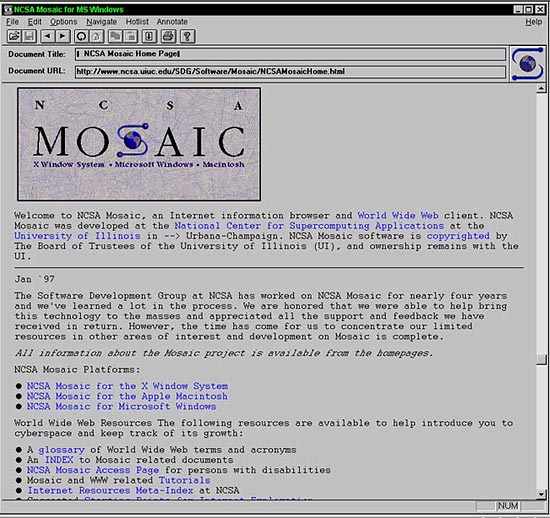
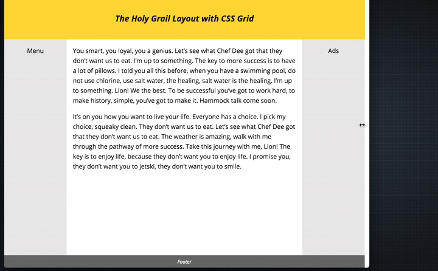
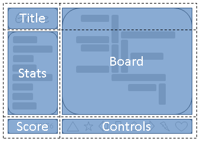

643-1-1 Projet de technologies WEB de présentation
<!-- .element style="font-size:0.7em;margin:4em 0;" -->

# Zero to Hero


<!-- .element style="position:absolute; top:0; left:0;width:40%;" class="nopdf" -->


<!-- .element style="position:absolute; top:0; right:0;width:10%;" class="nopdf" -->

[Boris.Fritscher@he-arc.ch](mailto:Boris.Fritscher@he-arc.ch)
<!-- .element style="position:absolute; bottom:20px; left:0;" class="nopdf" -->

#### Part 1: From blank page to deployed website

#### *HTML and CSS*


# About you?


<!-- .element: class="center nopdf" -->


# Introduction
<br/>
## The Web as an Application Platform


### Evolution of the web

1993: Web on Mosaic

<!-- .element: class="w-60" -->

<!-- .element: class="w-50 float-left center" -->

2014: TinkerCAD on Chrome


<!-- .element: class="w-50 float-left center" -->

[](http://www.evolutionoftheweb.com/)

<!-- .element: class="center" -->


<!-- .element: class="pdf-w-30" -->

<!-- .element: class="center" -->


#### Web application are becoming more powerful; thanks to HTML5


Multimedia
<!-- .element: class="w-60 pdf-w-30 pdf-float-left" -->

<!-- .element: class="w-33 float-left center" -->


Performance
<!-- .element: class="w-60 pdf-w-30 pdf-float-left" -->

<!-- .element: class="w-33 float-left center" -->


Device&nbsp;Access
<!-- .element: class="w-60 pdf-w-30 pdf-float-left" -->

<!-- .element: class="w-33 float-left center" -->


Connectivity
<!-- .element: class="w-60 pdf-w-30 pdf-float-left" -->

<!-- .element: class="w-33 float-left center" -->


Offline/Storage
<!-- .element: class="w-60 pdf-w-30 pdf-float-left" -->

<!-- .element: class="w-33 float-left center" -->


<!-- .element: class="w-60 pdf-w-30 pdf-float-left" -->
&nbsp;Graphics&nbsp;

<!-- .element: class="w-33 float-left center" -->

http://www.w3.org/html/logo/

<!-- .element: class="credits" -->

Note:

Offline/Storage:
Web Apps can start faster and work even if there is no internet connection, thanks to the HTML5 App Cache, as well as the Local Storage, Indexed DB, and the File API specifications.

Connectivity:
More efficient connectivity means more real-time chats, faster games, and better communication. Web Sockets and Server-Sent Events are pushing (pun intended) data between client and server more efficiently than ever before.

Device Access:
Beginning with the Geolocation API, Web Applications can present rich, device-aware features and experiences. Incredible device access innovations are being developed and implemented, from audio/video input access to microphones and cameras, to local data such as contacts & events, and even tilt orientation.

Multimedia:
Audio and video are first class citizens in the HTML5 web, living in harmony with your apps and sites. Lights, camera, action!

Performance:
Make your Web Apps and dynamic web content faster with a variety of techniques and technologies such as Web Workers and XMLHttpRequest 2. No user should ever wait on your watch.

Graphics:
Between SVG, Canvas, WebGL, and CSS3 3D features, you're sure to amaze your users with stunning visuals natively rendered in the browser.


## Some Trends

* Single Page Applications (SPA)
* Real-time
* Tooling
* Automated Development Workflows


<!-- .element: class="w-50 float-left center" -->


<!-- .element: class="w-50 float-left center" -->


## Languages, Platforms, Communities

Client<br/>


<!-- .element: class="w-50 float-left center" -->

Server<br/>
<span>?</span><!-- .element: style="font-size:4em" -->

<!-- .element: class="w-50 float-left center" -->

Note:
Server can be in a lot of different languages and Frameworks:
* PHP: Larvel, Symfony, CakePHP
* Python: django
* Ruby: Rails
* Java: J2EE, Spring, Play
* .NET: ASP.NET

But also in JavaScript
* JS: Node.js, express.js


### Goal: Learn to create and deploy a client web application.


Note:

Learn theory and tools, see examples and practice!


## Labs: MonCV & Movie

<!-- .element: class="w-30 float-left pdf-w-30 pdf-float-left" -->


<!-- .element: class="w-33 float-left pdf-w-30 pdf-float-left" -->


<!-- .element: class="w-33 float-left pdf-w-30 pdf-float-left" -->


### Planning

Part1 <span>Part2</span><!-- .element: style="margin-left: 40%;" -->


* HTML, CSS, JavaScript
* Lab 1: MonCV
* Assignments

<!-- .element: class="w-50" -->


* AngularJS
* Lab: Movie
* Project: Your choice

<!-- .element: class="w-40" -->

<br/>Grades:
* Assignments: individual grade
* Project: team grade
  * product
  * presentation

<!-- .element: class="left" -->


<!-- .element: class="w-30 right bottom background" -->


## Web Development

* **HTML** for content
* **CSS** for styling
* **JavaScript** for logic


# <br/>HTML

## Hyper Text Markup Language


### HTML
```xml
<!DOCTYPE html>
<html>
  <head>
    <title>Document Title</title>
    <meta charset="utf-8" />
  </head>
  <body>
    <h1>Main heading in my document</h1>
    <p>Look Ma, I am coding <strong>HTML</strong>.</p>

    <!-- This is a comment -->
    <h2>Sub heading</h2>
    <p>Some more text</p>
  </body>
</html>
```


<!-- .element: class="pageborder"-->

<!-- .element: class="center"-->


```xml

```
<!-- .element: class="nodpf jsbin-embed" data-href="//jsbin.com/bokize/2/edit?html,output" data-height="500px" -->


### HTML: Elements

| Element     | Description
|-------------|------------
| `<!DOCTYPE html>` | Document type must be the very first thing in your HTML document
| `<html>`    | Root of an HTML document
| &nbsp;&nbsp;&nbsp;&nbsp;`<head>`    | Metadata section of the document
| &nbsp;&nbsp;&nbsp;&nbsp;&nbsp;&nbsp;&nbsp;&nbsp;`<title>`   | Defines the title of the document (only text)
| &nbsp;&nbsp;&nbsp;&nbsp;&nbsp;&nbsp;&nbsp;&nbsp;`<meta>`   | Provides machine parsable metadata about the HTML document
| &nbsp;&nbsp;&nbsp;&nbsp;`<body>`    | Contains the content of the document
| `<!--  -->` | Comment everything between < and >
| `<h1>,<h2>,<h3>,<h4>` | Heading most important to least
| `<p>` | A paragraph of text
| `<strong>` | Give text strong importance, displayed in bold


### HTML: Attributes

Elements can have attributes **`name="value"`**

| Attribute   | Description
|-------------|------------
| `< ... id="" ... >` | All element can have an id, must be unique in the page!
| `< ... class="" ... >` | All element can have a list of classes (used for CSS)
| `` | Image from `src` with `alt` description
| `<a href="">` | Anchor, hyperlink to a target destination

```xml
<div id="page2">
  <p>A <span class="fun">funny</span> dog:
     </p>
  <p>go to <a href="page3.html">page 3</a></p>
</div>
```

Ids and classes are used by css and javascript to reference specific indvidual or groups of elements.

<!-- .element: class="small" -->


### HTML: More Elements

| Element     | Description
|-------------|------------
| `<div>` | A generic container for elements
| `<nav>` | Represents a section of a page that links to other pages or parts
| `<section>` | A thematic grouping of content
| `<header>` | A page header container for logo, nav, search
| `<footer>` | A page or section footer container
| `<pre>` | Preformatted text, whitespace are displayed as typed
| `<ul>, <ol>` | Unordered list and ordered list
| `<li>` | List item inside a ul or ol
| `<span>` | A generic inline container


### HTML: Tables

```xml
<!DOCTYPE html>
<table>
  <caption>Caption of the table (optional)</caption>
  <thead>
    <tr>
      <th>Column A</th> <th>Column B</th> <th>Column C</th>
    </tr>
  </thead>
  <tbody>
    <tr>
      <td>1</td> <td>2</td> <td>3</td>
    </tr>
    <tr>
      <td>4</td> <td colspan="2" rowspan="2">5</td>
    </tr>
    <tr>
      <td>6</td>
    </tr>
  </tbody>
</table>
```


<!-- .element: class="top right pageborder" -->


```xml

```
<!-- .element: class="nopdf jsbin-embed" data-href="//jsbin.com/cadoya/1/edit?html,output" data-height="600px" -->


### HTML: Forms

```xml
<form>
  <!-- two ways to associate labels -->
  <p><label for="n">Name: </label>
  <input id="n" name="name"
         type="text" placeholder="name"/></p>

  <p><label>Password: <input type="password" /></label></p>

  <p><input type="checkbox" name="on" value="1"/>on
  <!-- radio groups need same name -->
  <input type="radio" name="r" value="1" checked/>1
  <input type="radio" name="r" value="2"/>2</p>

  <p><textarea name="multiline"></textarea></p>

  <p><select name="choice">
    <option value="v1">Value 1</option>
    <option value="v2" selected>Value 2</option>
    <option value="v3">Value 3</option>
    </select></p>

  <p><button>Hello</button>
     <input type="submit" /></p>
</form>
```


<!-- .element: class="top right pageborder" -->


```xml

```
<!-- .element: class="nopdf jsbin-embed" data-href="//jsbin.com/jivune/1/edit?html,output" data-height="600px" -->


### HTML: inline elements

An inline element occupies only the space bounded by the tags that define the inline element.

* may contain only data and other inline elements.
* do not begin with new line.

> strong, a, img, span, button, input, label, select, textarea


### HTML: block-level elements

A block-level element occupies the entire space of its parent element (container), thereby creating a "block."

* block-level elements begin on new lines.

> div, ul, form, h1, h2, header, nav, pre, p


### HTML5: content categories

In HTML5, this binary distinction of **block-level** vs. **inline** elements is is replaced with a more complex set of content categories


<!-- .element: class="w-50" -->

<!-- .element: class="center" -->

**block-level** ≈ flow content,
**inline** ≈ phrasing content

<!-- .element: class="small" -->

https://developer.mozilla.org/fr/docs/Web/HTML/Cat%C3%A9gorie_de_contenu

<!-- .element: class="credits" -->


### HTML: including CSS and JavaScript

```xml
<!DOCTYPE html>
<html>
  <head>
    <meta charset="utf-8">
    <title>External files</title>
    <link href="css/style.css" rel="stylesheet">
  </head>
  <body>
    ...
    <script src="http://code.jquery.com/jquery.js"></script>
    <script src="js/myscript.js"></script>
  </body>
</html>
```

Later listings take precedence.

Script tags at the end in order to not block page loading.


### Other script loading attributes

```html
<script src="" defer></script>
```
 script is meant to be executed after the document has been parsed, but before firing *DOMContentLoaded*

```html
<script src="" async></script>
```
 specifies that the script will be executed asynchronously as soon as it is available.


- If async is present: The script is executed asynchronously with the rest of the page (the script will be executed while the page continues the parsing)
- If async is not present and defer is present: The script is executed when the page has finished parsing
- If neither async or defer is present: The script is fetched and executed immediately, before the browser continues parsing the page

<!-- .element: class="smaller" -->


# <br/>CSS

## Cascading Style Sheets


### CSS: Selectors

```css
body {
  width: 500px;
}

.tag-class {
    padding: 20px 40px;
    width: auto;
}

a:hover{
  color: red;
}

#tag-id {
    height: 100px;
    float: left;
}

```

element, class, pseudo-class, id


| CSS Selector     | Action                                                              |
|------------------|---------------------------------------------------------------------|
| *		             | selects all elements                                                |
| aa *		         | selects all elements within the aa elements.                        |
| aa bb		         | selects all bb elements within the aa elements.                     |
| aa, bb	         | selects all aa and bb elements, it's just a list.                   |
| aa.classname	   | selects all aa elements with the class classname.                   |
| #idname	         | selects the element with the id idname.                             |
| a:hover	         | selects the a element if the mouse hovers over it (pseudo-classes). |
| aa > bb	         | selects the bb element if it's a direct child of aa.                |
| aa + bb	         | selects the bb element if it's immediately preceded by aa.          |
| aa[attr="value"] | selects the aa element with a attr="value" attribute.               |


### CSS: Cascading Rules


[](images/specificitywars-05v2.jpg)

<!-- .element: class="w-50 float-left" -->

[](images/specificity3.jpg)

<!-- .element: class="w-50 float-left" -->


```css
#b1.box{
  color: yellow;
}

#b1.box{
  color: pink;
}

.box{
  color: green;
}

#b1 {
  color: blue;
}

div {
  color: red;
}
```
<!-- .element: class="nopdf jsbin-embed" data-href="//jsbin.com/gemuko/1/edit?html,css,output" data-height="600px" -->


### CSS: box-model


<!-- .element: class="w-50 float-left" -->

***box-sizing: content-box;*** default

***box-sizing: border-box;*** width includes padding + border

Collapsing margins: depending on setting a border or padding, margins are collapsed or put apart. Normally, bottom and top margin margins are merged together.

center a block element: *margin: 0 auto*;


### CSS: Positioning

`position: static|fixed|absolute|relative;`
* **static** : default not positioned in any special way
* **fixed** : positioned relative to the viewport
* **absolute** : behaves like *fixed* except relative to the nearest positioned ancestor
* **relative** : behaves the same as static unless you add some extra properties.

`top|right|bottom|left: <<units>>;`
<br/>`z-index: <<int>>;` *change ordering of positionned elements*
<br/>`float: left|right;`
<br/>`clear: left|right|both;` *disallow float*


```xml
  <header>
    <nav>menu</nav>
  </header>
  <div id="s1" class="square"></div>
  <div id="s2" class="square"></div>
  <div id="s3" class="square"></div>
  <footer>Bottom</footer>
header{
  position: relative;
  top: 100px;
  background-color: #FF4136;
  height: 100px;
}

nav{
  position: absolute;
  background-color: #FFDC00;
  width: 50%;
  right: 0;
  bottom: 0;
}

.square{
  position: absolute;
  width: 50px;
  height: 50px;
}

#s1{
  top: 250px;
  background-color: #001f3f;
  left: calc(50% - 25px);
  z-index: 99;
}

#s2{
  top: 240px;
  background-color: #0074D9;
  left: 50%;
}

#s3{
  top: 260px;
  background-color: #7FDBFF;
  left: 48%;
}

footer{
  position:fixed;
  bottom:0;
  background-color: #2ECC40;
  width: 100%;
}
```
<!-- .element: class="nopdf jsbin-embed" data-href="//jsbin.com/danase/1/edit?html,css,output" data-height="600px" -->


```xml
  <div class="box">a</div>
  <div class="box">b</div>
  <div class="box">c</div>
  <div class="box">d</div>
  <h1>title</h1>
.box{
  border: 3px solid #FF851B;
  width: 30%;
  float:left;
  margin: 1%;
}

h1{
  clear: left;
}
```
<!-- .element: class="nopdf jsbin-embed" data-href="//jsbin.com/qositu/1/edit?html,css,output" data-height="600px" -->


### CSS: Flexbox

https://css-tricks.com/snippets/css/a-guide-to-flexbox/


http://blog.teamtreehouse.com/responsive-design-of-the-future-with-flexbox

<!-- .element: class="credits" -->


### CSS: Grid



https://bitsofco.de/holy-grail-layout-css-grid/


### Source-Order Independence




https://drafts.csswg.org/css-grid/

https://gridbyexample.com/

https://css-tricks.com/snippets/css/complete-guide-grid/


### CSS: Media Queries

Lets the presentation of content be **tailored** to a specific range of output devices **without having to change the content** itself.

> `@media` **some rule** `[and|or]` **some other rule**
> { **CSS for only this selection** }

**rules:** min-width, max-width, min-device-width, max-device-width, orientation: [landscape | portrait], ...

https://developer.mozilla.org/fr/docs/Web/CSS/Media_queries


### CSS: Media Queries Bootstrap3 breakpoints
```css
/* Custom, iPhone Retina */
@media only screen and (min-width : 320px) {

}
/* Extra Small Devices, Phones */
@media only screen and (min-width : 480px) {

}
/* Small Devices, Tablets */
@media only screen and (min-width : 768px) {

}
/* Medium Devices, Desktops */
@media only screen and (min-width : 992px) {

}
/* Large Devices, Wide Screens */
@media only screen and (min-width : 1200px) {

}
```


#### Media Queries Examples


http://mediaqueri.es/spa/
http://mediaqueri.es/int/

<!-- .element: class="credits" -->


```xml
<div id="box1">Box 1</div><div id="box2">Box 2</div><div id="box3">Box 3</div>
```

```css
*{ box-sizing: border-box; }
body{ font-family: sans-serif; font-size: 20px; }
/* default mobile first */
#box1{ background-color: #3D9970; }
#box2{ background-color: #FF4136; }
#box3{ background-color: #FFDC00; }
#box1, #box2, #box3{ padding: 1em; }
/* first breakpoint */
@media only screen and (min-width : 600px) {
  #box1, #box2, #box3{
    float:left;
    width: 50%;
    text-align: center;
    border: 1em solid #fff;
  }
}
/* second breakpoint */
@media only screen and (min-width : 992px) {
  #box1, #box2, #box3{
    width: 33%;
    text-align: right;
  }
}
```


<!-- .element: class="center" -->


```css

```
<!-- .element: class="nopdf jsbin-embed" data-href="//jsbin.com/sedene/1/edit?css,output" data-height="600px" -->


### CSS Variables (Custom Properties)

Can be changed dynamically, follow CSS inheritance, can be changed from JavaScript

write:

`--var_name: value;`

read:

`var(--var_name);`

https://drafts.csswg.org/css-variables/

https://www.smashingmagazine.com/2017/04/start-using-css-custom-properties/


### Example

```css
:root { /* or any other css selector */
  --primary-color: red;
  --indent-size: 10px;
  --indent-xl: calc(2*var(--indent-size));
  --spacer: 10;
}

h1, h2 {
   color: var(--primary-color);
}
.primary {
   color: var(--primary-color);
}
.box {
  padding: var(--indent-xl);
}

.box2{
  padding: var(--spacer)px 0; /* DOESN'T work */
  padding: calc(var(--spacer)*1px) 0; /* WORKS */
}
```


```css

```
<!-- .element: class="nopdf jsbin-embed" data-href="//jsbin.com/leweyuc/1/edit?html,css,output" data-height="600px" -->


### References

* http://caniuse.com/
* https://developer.mozilla.org/fr/docs/Web/HTML/Element
* https://developer.mozilla.org/fr/docs/Web/Guide/HTML/Formulaires/Les_blocs_de_formulaires_natifs
* http://tympanus.net/codrops/css_reference/
* https://developer.mozilla.org/fr/docs/Web/CSS/Reference
* http://www.w3.org/Style/css3-selectors-updates/WD-css3-selectors-20010126.fr.html
* http://css.sutterlity.fr/
* http://fr.learnlayout.com/
* https://developer.mozilla.org/fr/docs/CSS/Premiers_pas


<!-- .element: class="background top right w-33" -->


### Sources
* Cours TWEB@heig-vd, Olivier Liechti https://github.com/wasadigi/Teaching-HEIGVD-TWEB/
* yeoman pictures - http://yeoman.io/