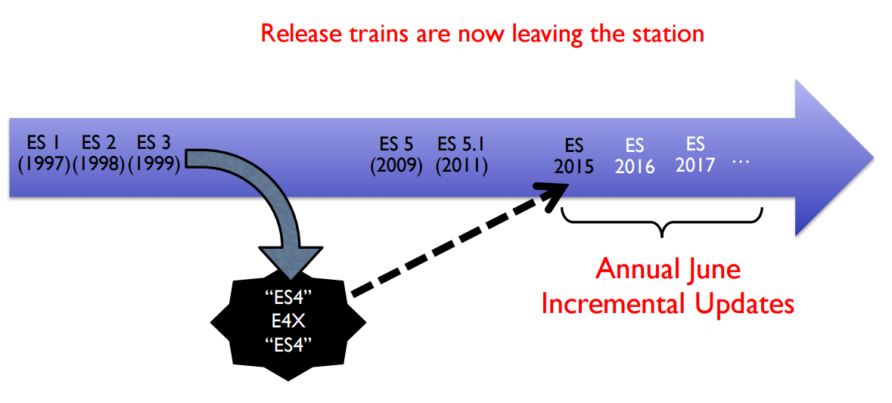
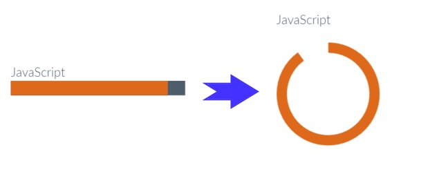
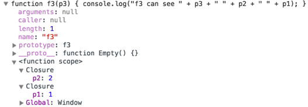
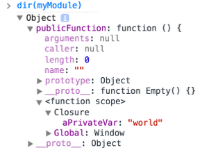

643-1-1 Projet de technologies WEB de présentation
<!-- .element style="font-size:0.7em;margin:4em 0;" -->

# Zero to Hero


<!-- .element style="position:absolute; top:0; left:0;width:40%;" class="nopdf" -->


<!-- .element style="position:absolute; top:0; right:0;width:10%;" class="nopdf" -->

[Boris.Fritscher@he-arc.ch](mailto:Boris.Fritscher@he-arc.ch)
<!-- .element style="position:absolute; bottom:20px; left:0;" class="nopdf" -->

#### Part 1: From blank page to deployed website

#### *JavaScript*


# JavaScript


<!-- .element: class="w-50" -->

<!-- .element: class="center pdf-w-30" -->


### What is your current perception of JavaScript?

Scope:


<!-- .element: class="float-left w-15"  style="margin-right: 2em;" -->

1. It's a "toy" language for creating animations on web pages, but I would not use it for anything "serious".
2. It's a very powerful language. It is essential on the client side, but it is also really interesting on the server side.

<!-- .element: class="float-left w-70 small" -->


### What is your current perception of JavaScript?

Personal taste:


<!-- .element: class="float-left w-15"  style="margin-right: 2em;" -->

1. I hate it.
2. I am not a big fan.
3. It's kind of interesting.
4. I love it.
5. I don't care.

<!-- .element: class="float-left w-70 small" -->


### What is your current perception of JavaScript?

Relationship to Java:


<!-- .element: class="float-left w-15"  style="margin-right: 2em;" -->

1. It's Java, with a few syntactic differences.
2. It has nothing to do with Java, except for some common syntax.

<!-- .element: class="float-left w-70 small" -->


### What is your current perception of JavaScript?

Current knowledge:


<!-- .element: class="float-left w-15"  style="margin-right: 2em;" -->

1. **Novice:** I may have hacked a few scripts on web pages, but mostly by copy-pasting examples and without fully understanding the language (what is a prototype?).
2. **Intermediate:** I have used JavaScript quite a bit. I can describe the object-oriented model, I understand what a constructor is and how it works. I have quite a bit of experience with JQuery and other libraries. I am always working with a debugger.
3. **Expert:** closures and modules have no secret for me, I have read "JavaScript: the good parts". I have designed my development workflow with yeoman, grunt, bower and a few other tools. I know who Paul Irish is.

<!-- .element: class="float-left w-70 smaller" -->


## The ECMAScript Standard Timeline



http://wirfs-brock.com/allen/talks/forwardjs2016.pdf

<!-- .element: class="credits" -->


#JavaScript Basics

* Variables / Constants
* Types
* Operators
* Array
* Condition
* Loop
* Function
* Object


### Variables / Constants / Comments

```es6
// This is a single line comment

// block variables use let over var!
let bar;
bar = 'hello';
let baz = 'world';

// variables before ES2015
// scope is only at the function level
var foo;

// constants
const cannotBeReassigned = 'The One';

/*
  This is a multi-line comment. It can go on
  for several lines, like this.
 */
```


### Types

JavaScript defines **6 types**:

* number
* boolean
* string
* object
* undefined
* null

<!-- .element: class="w-40 float-left" -->

```es6
let aNumber = 3.12;
let aBoolean = true;
let aString = 'John Smith';
let anObject = { aProperty: null };
typeof aNumber === 'number';
typeof aBoolean === 'boolean';
typeof aString === 'string';
typeof anObject === 'object';
typeof anObject.aProperty === 'object';
typeof anObject.foobar === 'undefined';
// null is a type but
typeof null === 'object';
```
<!-- .element: class="w-50 float-left" -->

JavaScript is a dynamic language: when you declare a variable, you don't specify a type (and the type can change over time).
<!-- .element: class="small clear" -->


### Operators

| Operator | Example |
|----------| --------|
| + | |
| - | |
| == | 3 == var3 <br> "3" == var3 <br> 3 == '3' |
| != | |
| === | |
| !== | |


### Template Strings

New in ES2015 in addition to '', "", there are ``.

```es6
// Basic literal string creation
const s1 = `This is a pretty little template string.`;

// Multiline strings
const s2 = `In ES5 this is
 not legal.`;

// Interpolate variable bindings
let name = "Bob", time = "today";
const s3 = `Hello ${name}, how are you ${time}?`;
```


### Array

```es6
let myArray = [ 'a', 'b', 'c' ];
let firstItem = myArray[ 0 ];
let secondItem = myArray[ 1 ]; // access the item at index 1
let arrayLength = myArray.length;
```


### Condition

```es6
if ( notANumber ) {
  // this code will not run!
  console.log( 'notANumber was truthy' );
} else if (notANumber > 0) {
  console.log( 'notANumber > 0' );
} else {
  // this code will run
  console.log( 'notANumber was falsy and <= 0' );
}
```


### Loop

```es6
let i = 0;
for (i; i < myArray.length; i = i + 1) {
  console.log( 'item at index ' + i + ' is ' + myArray[ i ] );
}
```

```es6
let i = 0;
while (i < myArray.length) {
  console.log( 'item at index ' + i + ' is ' + myArray[ i ] );
  i++;
}
```

```es6
for (let value of array) {
  // do something with value
}
```

```es6
for (let property in object) {
  // do something with object property
}
```


### Functions

```es6
function cornify( unicorns /* integer */, rainbows /* integer */ ) {

}

const addTwoNumbers = function(a, b) {
  return a + b;
};
```


### Arrow functions

```es6
const hello = () => {
  return 'world';
}

// Parentheses are optional when there's only one parameter name:
(singleParam) => { statements }
singleParam => { statements }
```

An arrow function does not create its own this context, so this has its original meaning from the enclosing context. => this behaves more like you might think

https://developer.mozilla.org/fr/docs/Web/JavaScript/Reference/Fonctions/Fonctions_fl%C3%A9ch%C3%A9es

<!-- .element: class="credits" -->


### Objects

```es6
var obj = {
  property1: 'some text',
  age: 3
}
```

More on this later...


###  <!-- .element: class="w-40" -->

<!-- .element: class="pdf-w-30" -->

jQuery is a **fast, small**, and feature-rich JavaScript
library. It makes things like HTML **document traversal**
and **manipulation, event handling, animation**,
and **Ajax** much simpler with an easy-touse
API that works **across a multitude of browsers**.


### jQuery Selecting Elements

**Selecting Elements by ID**

```es6
$('#myId'); // IDs must be unique per page.
```

**Selecting Elements by Class Name**

```es6
$('.myClass');
```

**Selecting Elements by Attributes**

```es6
$('input[name="first_name"]'); // this can be very slow in older browsers
```

**Selecting Elements by Compound CSS Selector**

```es6
$('#myId ul.people li');
```

http://api.jquery.com/

<!-- .element: class="credits" -->


```html

```
<!-- .element: class="nopdf jsbin-embed" data-href="//jsbin.com/falune/1/edit?html,css,js,output" data-height="600px" -->


### References

* http://jqfundamentals.com/chapter/javascript-basics
* http://sutterlity.gitbooks.io/apprendre-jquery/content/


Douglas Crockford: JavaScript: The Good Parts
https://www.youtube.com/watch?v=_DKkVvOt6dk

<iframe width="640" height="480" src="https://www.youtube.com/embed/_DKkVvOt6dk?rel=0&amp;showinfo=0" frameborder="0" allowfullscreen></iframe>


# JavaScript


<!-- .element: class="w-40" -->

<!-- .element: class="center" -->

### JavaScript is built on some very good ideas and a few very bad ones.

* Language of the web browser
* One of the most popular programming languages
* One of the most despised programming languages
* It is possible to get work done with it without knowing much about the language
* Programming is difficult business. It should never be undertaken in ignorance.


**JavaScript is an important language** because it is
the language of the web browser. Its association with
the browser makes it one of the most popular
programming languages in the world. **At the same
time, it is one of the most despised programming
languages in the world**. [...]

<!-- .element: class="small" -->

Most people in that situation **don’t even bother to
learn JavaScript first**, and then they are surprised
when JavaScript turns out to have significant
differences from the some other language they would
rather be using, and that those differences matter.

<!-- .element: class="small" -->

The amazing thing about JavaScript is that it is possible
to get work done with it without knowing much about
the language, or even knowing much about
programming. It is a language with enormous
expressive power. It is even better when you know what
you’re doing. **Programming is difficult business. It
should never be undertaken in ignorance.**

<!-- .element: class="small" -->

JavaScript: The Good Parts -- Douglas Crockford


## JavaScript 101 (Part 1)

* Types
* Conditions
* Loops
* Functions
* Scopes
* Objects
* Prototypal inheritance
* More on functions
* Constructors
* Arrays


### Types

JavaScript defines **6 types**:

* number
* boolean
* string
* object
* undefined
* null

<!-- .element: class="w-40 float-left" -->

```es6
let aNumber = 3.12;
let aBoolean = true;
let aString = 'John Smith';
let anObject = { aProperty: null };
typeof aNumber === 'number';
typeof aBoolean === 'boolean';
typeof aString === 'string';
typeof anObject === 'object';
typeof anObject.aProperty === 'object';
typeof anObject.foobar === 'undefined';
// null is a type but
typeof null === 'object';
```
<!-- .element: class="w-50 float-left" -->

JavaScript is a dynamic language: when you declare a variable, you don't specify a type (and the type can change over time).
<!-- .element: class="small clear" -->


### Conditions

```es6
let name = "kittens";
if (name === "puppies") {
  name += "!";
} else if (name === "kittens") {
  name += "!!";
} else {
  name = "!" + name;
}

name === "kittens!!"
```


### Loop

```es6
for (const i = 0; i < 5; i++) {
  // Will execute 5 times
}

while ( true ) {
  // an infinite loop!
}
```


### Functions

```es6
function add(x, y) {
  const total = x + y;
  return total;
}

add(); // NaN
// You can't perform addition on undefined

add(2, 3, 4); // 5
// added the first two; 4 was ignored
```


### Scopes before ECMAScript 2015

There are 2 scopes for variables:

* the (evil) global scope
* the function scope

A variable declared within a
function is **not accessible**
outside this function.<br/><br/>
Unless using **strict mode**, it
is not mandatory to declare
variables (beware of typos…)<br/><br/>
Two scripts loaded from the
same HTML page share the
same global scope (beware of
**conflicts**…)<br/><br/>
There is **no block scope**.

<!-- .element: class="w-40 float-right smaller" -->

```es6
var aVariableInGlobalScope;

function myFunction() {
  var aVariableInFunctionScope;
  anotherVariableInGlobalScope;
}

function myFunction2() {
  //no block scope!
  for(i = 0; i < 10; i++){
    //i is in global scope!
  }
  for(var j = 0; j < 10; j++){
    //j is in function scope!
  }
}
```
<!-- .element: class="w-50 float-left" -->


### Exploring scopes

```es6
var aGlobalVar = 'hello';
var anotherGlobalVar = 'world';
function myFunction() {
    aGlobalVar = 'yo';
    var anotherGlobalVar = 'yeep';
    var localVar = 'local';
    iAmNotALocalVariable = 'iAmGlobal';
}
console.log('1. aGlobalVar: ' + aGlobalVar);
console.log('2. anotherGlobalVar: ' + anotherGlobalVar);

myFunction();
console.log('3. aGlobalVar: ' + aGlobalVar);
console.log('4. anotherGlobalVar: ' + anotherGlobalVar);
console.log('5. iAmNotALocalVariable: ' + iAmNotALocalVariable);
console.log('6. localVar: ' + localVar);
```
<!-- .element: class="jsbin-embed" data-href="//jsbin.com/toluqe/1/edit?js,console" data-height="500px" -->


### Objects are dynamic bags of properties

There are different ways to
**access properties** of an
object.<br/><br/>
JavaScript is **dynamic**: it is
possible to **add** and **remove**
properties to an object at any
time.<br/><br/>
Every object has a different list
of properties (**no class**).

<!-- .element: class="w-40 float-right small" -->

```es6
// create an object
const person = {
    firstName: 'John',
    lastName: 'Smith'
};

// dynamically add properties
person.gender = 'male';
person['zip'] = 2000;

// remove a property
delete person.zip;

// check existence of a property
person.hasOwnProperty('gender');

// enumerate properties
for (const key in person) {
    console.log(key + ' : ' + person[key]);
}
```
<!-- .element: class="w-50 float-left" -->


### Exploring objects

```es6
// create an object
const person = {
    firstName: 'John',
    lastName: 'Smith'
};

// dynamically add properties
person.gender = 'male';
person['zip'] = 2000;

// remove a property
delete person.zip;

// check existence of a property
person.hasOwnProperty('gender');

// enumerate properties
for (const key in person) {
    console.log(key + ' : ' + person[key]);
}
```
<!-- .element: class="jsbin-embed nodpf" data-href="//jsbin.com/yecuxe/2/edit?js,console" data-height="500px" -->


### Creating objects

JavaScript has **no support for classes** (< ECMAScript 2015)

There are 3 ways to create objects:

**`class`** is a reserved word in
JavaScript, but it is not used
in the current version of the
language (reserved for the
future ECMAScript 2015).<br/><br/>
A **constructor** is function like
any other (capitalized is a
coding convention).<br/><br/>
It is the use of the **new**
keyword that triggers the
object creation process.

<!-- .element: class="w-40 float-right smaller" -->

```es6
//create an object with a literal
const person = {
  firstName: 'John',
  lastName: 'Smith'
};

// create an object with a prototype
let child = Object.create(person);

// create an object with a constructor
child = new Person('John', 'Smith');
```
<!-- .element: class="w-50 float-left" -->


### Every object inherits from a prototype object

```es6
const person = {
    firstName: 'John',
    lastName: 'Smith'
};
// person's prototype is Object.prototype

const father = {};
const child = Object.create(father);
// child's prototype is father


function Person(fn, ln) {
    this.firstName = fn;
    this.lastName = ln;
}
const john = new Person('John', 'Doe');
// john's prototype is Person.prototype
```


```es6
var person = {
    firstName: 'John',
    lastName: 'Smith'
};
// person's prototype is Object.prototype
console.log(Object.getPrototypeOf(person) === Object.prototype);

const father = {};
const child = Object.create(father);
// child's prototype is father
console.log(Object.getPrototypeOf(child) === father);

function Person(fn, ln) {
    this.firstName = fn;
    this.lastName = ln;
}
const john = new Person('John', 'Doe');
// john's prototype is Person.prototype
console.log(Object.getPrototypeOf(john) === Person.prototype);
```
<!-- .element: class="jsbin-embed nodpf" data-href="//jsbin.com/mevuja/1/edit?js,console" data-height="500px" -->


### Every object inherits from a prototype object

<!-- TODO: maybe drawing -->

Every object inherits from a prototype object.
**It inherits and can override its properties**, including its methods.

Objects created with object literals inherit from **Object.prototype**.

When you access the property of an object,
JavaScript **looks up the prototype chain**
until it finds an ancestor that has a value for
this property.


### Class-like data structure

**badGreet** is a property that
will be replicated for every
object created with the
Person constructor:<br/>
 - poor memory management<br/>
 - not possible to alter
behavior of all instances at
once<br/><br/>
**greet** is a property that will
be shared by all instances
(because it will be looked up
along the object inheritance
chain).<br/><br/>
**privateVar** is not accessible
outside of the constructor.<br/><br/>
**fistName** is publicly accessible (no encapsulation).

<!-- .element: class="w-40 float-right smaller" -->

```es6
function Person(fn, ln) {
    var privateVar;
    this.firstName = fn;
    this.lastName = ln;
    this.badGreet = function () {
      console.log('Hi ' + this.firstName);
    };
}

Person.prototype.greet = function () {
    console.log('Hey ' + this.firstName);
};

const p1 = new Person('John', 'Smith');

p1.badGreet();
p1.greet();
```
<!-- .element: class="w-50 float-left" -->


### Exploring function constructor

```es6
function Person(fn, ln) {
    var privateVar;
    this.firstName = fn;
    this.lastName = ln;
    this.badGreet = function () {
      console.log('Hi ' + this.firstName);
    };
}

Person.prototype.greet = function () {
    console.log('Hey ' + this.firstName);
};

const p1 = new Person('John', 'Smith');

p1.badGreet();
p1.greet();
```
<!-- .element: class="jsbin-embed nodpf" data-href="//jsbin.com/zezeya/1/edit?js,console" data-height="500px" -->


### Classes since ECMAScript 2015

```es6
class SkinnedMesh extends THREE.Mesh {
  constructor(geometry, materials) {
    super(geometry, materials);

    this.idMatrix = SkinnedMesh.defaultMatrix();
    this.bones = [];
    this.boneMatrices = [];
    //...
  }
  update(camera) {
    //...
    super.update();
  }
  static defaultMatrix() {
    return new THREE.Matrix4();
  }
}
```


### Arrays are objects

```es6
const fruits = ['apple', 'pear'];
console.log(Object.getPrototypeOf(fruits)); //[]
console.log(typeof fruits); //object

// add elements to an array
fruits.push('banana');

// check if an array contains an element
const inArray = fruits.indexOf('banana') > -1;

// remove 1 element from array
const removed = fruits.splice(fruits.indexOf('pear'), 1);

//iterate over an array
for (const i = 0; i < fruits.length; i++) {
    console.log('fruits[' + i + '] = ' + fruits[i]);
}
```
<!-- .element: class="jsbin-embed nodpf" data-href="//jsbin.com/qakame/1/edit?js,console" data-height="500px" -->


### Arrays the functional way

```es6
const fruits = ['abricot', 'ananas', 'strawberry', 'orange'];

const transformedFruits = fruits.map(fruit => {
    return fruit.toUpperCase();
});

transformedFruits.forEach(fruit => {
    console.log(fruit);
});

const count = fruits.reduce((val, fruit) => {
    console.log('reducer invoked with ' + val);
    return val + 1;
}, 0);
console.log('There are ' + count + ' fruits in the array');

const aFruits = fruits.filter(fruit => {
    return fruit.charAt(0) === 'a';
});
aFruits.forEach(fruit => {
    console.log(fruit);
});
```
<!-- .element: class="jsbin-embed nodpf" data-href="//jsbin.com/zumaci/1/edit?js,console" data-height="500px" -->


# JavaScript WAT


<!-- .element: class="center" -->


<p><video data-src="videos/wat.mp4"></p>

http://stackoverflow.com/questions/9032856/what-is-the-explanation-for-these-bizarre-javascript-behaviours-mentioned-in-the

<!-- .element: class="credits" -->

https://www.destroyallsoftware.com/talks/wat

<!-- .element: class="credits" -->

Note:

Here's a list of explanations for the results you're seeing (and supposed to be seeing). The references I'm using are from the ECMA-262 standard.

[] + []

When using the addition operator, both the left and right operands are converted to primitives first (§11.6.1). As per §9.1, converting an object (in this case an array) to a primitive returns its default value, which for objects with a valid toString() method is the result of calling object.toString() (§8.12.8). For arrays this is the same as calling array.join() (§15.4.4.2). Joining an empty array results in an empty string, so step #7 of the addition operator returns the concatenation of two empty strings, which is the empty string.

[] + {}

Similar to [] + [], both operands are converted to primitives first. For "Object objects" (§15.2), this is again the result of calling object.toString(), which for non-null, non-undefined objects is "[object Object]" (§15.2.4.2).

{} + []

The {} here is not parsed as an object, but instead as an empty block (§12.1, at least as long as you're not forcing that statement to be an expression, but more about that later). The return value of empty blocks is empty, so the result of that statement is the same as +[]. The unary + operator (§11.4.6) returns ToNumber(ToPrimitive(operand)). As we already know, ToPrimitive([]) is the empty string, and according to §9.3.1, ToNumber("") is 0.

{} + {}

Similar to the previous case, the first {} is parsed as a block with empty return value. Again, +{} is the same as ToNumber(ToPrimitive({})), and ToPrimitive({}) is "[object Object]" (see [] + {}). So to get the result of +{}, we have to apply ToNumber on the string "[object Object]". When following the steps from §9.3.1, we get NaN as a result:

If the grammar cannot interpret the String as an expansion of StringNumericLiteral, then the result of ToNumber is NaN.
Array(16).join("wat" - 1)

As per §15.4.1.1 and §15.4.2.2, Array(16) creates a new array with length 16. To get the value of the argument to join, §11.6.2 steps #5 and #6 show that we have to convert both operands to a number using ToNumber. ToNumber(1) is simply 1 (§9.3), whereas ToNumber("wat") again is NaN as per §9.3.1. Following step 7 of §11.6.2, §11.6.3 dictates that

If either operand is NaN, the result is NaN.
So the argument to Array(16).join is NaN. Following §15.4.4.5 (Array.prototype.join), we have to call ToString on the argument, which is "NaN" (§9.8.1):

If m is NaN, return the String "NaN".
Following step 10 of §15.4.4.5, we get 15 repetitions of the concatenation of "NaN" and the empty string, which equals the result you're seeing. When using "wat" + 1 instead of "wat" - 1 as argument, the addition operator converts 1 to a string instead of converting "wat" to a number, so it effectively calls Array(16).join("wat1").

As to why you're seeing different results for the {} + [] case: When using it as a function argument, you're forcing the statement to be an ExpressionStatement, which makes it impossible to parse {} as empty block, so it's instead parsed as an empty object literal.

http://stackoverflow.com/questions/9032856/what-is-the-explanation-for-these-bizarre-javascript-behaviours-mentioned-in-the


## Lab 1d: JavaScript

Use [Chart.js](http://www.chartjs.org/docs/latest/charts/doughnut.html) to display your skill level with a doughnut chart.

```sh
npm install chart.js --save
```

```es6
import Chart from 'chart.js';
```



<!-- .element: class="center" -->

*Read the documentation!*

<!-- .element: class="red" -->


# JavaScript 101 (Part 2)

* Functions are objects
* Closures
* Module patterns
* this


### Functions are objects

```es6
function aFunc(){ return true; } // no semicolon

// anonymous function
const f = function(i){ return i; }; // semicolon since assignment

const g = function g(i){
  if(i > 100){
    return i;
  }
  return g(i+1); // recursive call
};
const h = function(aFunctionObj){
  // 3 ways to call a function
  console.log(aFunctionObj(0));
  console.log(aFunctionObj.apply(this, [0]));
  console.log(aFunctionObj.call(this, 0));
};

h(f);
h(g);
```
<!-- .element: class="jsbin-embed nodpf" data-href="//jsbin.com/qonahi/1/edit?js,console" data-height="500px" -->


### Functions can be nested

An **object** is created for every function.

Each function has access to variables defined in the **parent** functions (an in the **global scope**).

```es6
function f1(p1){
  console.log('f1 can see ' + p1);
  function f2(p2){
    console.log('f2 can see ' + p2 + ' ' + p1);
    function f3(p3){
      console.log('f3 can see ' + p3 + ' ' + p2 + ' ' + p1);
    }
    f3(3);
  }
  f2(2);
}
f1(1);
```


### Closures

A closure is formed when a nested function accesses a **free variable**

<!-- .element: class="w-40" -->

* In a function, a **free variable** is a variable that is neither a local variable, nor a parameter of the function.
* A **closure** is the combination of a code block (the function code) and saved parent scopes.

<!-- .element: class="small" -->


```es6
function f1(p1){
  console.log('f1 can see ' + p1);
  function f2(p2){
    console.log('f2 can see ' + p2 + ' ' + p1);
    function f3(p3){
      console.log('f3 can see ' + p3 + ' ' + p2 + ' ' + p1);
    }
    f3(3);
  }
  f2(2);
}
f1(1);
```


<!-- .element: class="top right" -->


### Module patterns in ES5

Patterns are applied to create modules

When `privateFunction1` accesses `aPrivateVar`, a **closure** is formed.<br/><br/>
`privateFunction1` is **available even after** the immediately invoked function has returned.<br/><br/>
`privateFunction1` and `privateFunction2` share the same parent scope.

<!-- .element: class="w-33 float-right smaller" -->

```es6
var myModule = (function(){

    var aPrivateVar = 'World';
    var privateFunction1 = function(){
        console.log('Hello ' + aPrivateVar);
    };
    var privateFunction2 = function(){};

    // Make some elements public
    return {
      publicFunction: privateFunction1
    };
})(); // The function is immediately invoked

myModule.publicFunction();
```
<!-- .element: class="w-66 float-left" -->


<!-- .element: class="top right" -->


### Modules since ECMAScript 2015

import/export functions and variables between files.

```es6
// lib/math.js
export function sum(x, y) {
  return x + y;
}
export const pi = 3.141593;
```

```es6
// app.js
import * as math from "lib/math";
console.log("2π = " + math.sum(math.pi, math.pi));
```


### this

* How the function is called: determines the `this` value
* It is dynamic, which means the value could change
* You can change the `this` context through `.call()`, `.apply()` and `.bind()`

```es6
// let's assume .elem is <div class="elem"></div>
const element = document.querySelector('.elem');

// our function
const someFunc = function () {
  console.log(this);
};

// when clicked, `this` will become the element
element.addEventListener('click', someFunc); // <div>

// if we just invoke the function, `this` becomes the window object
someFunc(); // [object Window]
```


### Saving this scope

```es6
const obj = {};
obj.myMethod = function () {
  console.log(this); // this = obj
    setTimeout(function () {
        console.log(this); // window object :O!!!
    }, 100);
};
obj.myMethod();
```

```es6
const obj = {};
obj.myMethod = function () {

  var that = this; //saving this scope

  console.log(this); // this = obj
    setTimeout(function () {
        console.log(that); // that (this) = obj
    }, 100);
};
obj.myMethod();
```

http://toddmotto.com/understanding-the-this-keyword-in-javascript/

<!-- .element: class="credits" -->


## ECMAScript 2015-2016

 - Enhanced Object Literals
 - Destructuring
 - Default + Rest + Spread


### Enhanced Object Literals

```es6
const make = 'Kia', model = 'Sorento', value = 40000
const car = {
  // with property value shorthand
  // syntax, you can omit the property
  // value if key matches variable
  // name
  make,  // same as make: make
  model, // same as model: model
  value, // same as value: value

  // computed values now work with
  // object literals
  ['make' + make]: true,

  // Method definition shorthand syntax
  // omits `function` keyword & colon
  depreciate() {
    this.value -= 2500;
  }
};
```

http://www.benmvp.com/learning-es6-enhanced-object-literals/

<!-- .element: class="credits" -->


### Destructuring

```es6
// list matching
const [a, ,b] = [1,2,3];
a === 1;
b === 3;

// Fail-soft destructuring
const [a] = [];
a === undefined;

// Fail-soft destructuring with defaults
[a = 1] = [];
a === 1;

// object matching
const {name: n, likes: [,,c]} = {name: 'hello', likes: ['cat', 'dog', 'cow']};
n === 'hello';
c === 'cow';
```


### Default + Rest + Spread
```es6
function f(x, y=12) {
  // y is 12 if not passed (or passed as undefined)
  return x + y;
}
f(3) == 15

function f(x, ...y) {
  // y is an Array
  return x * y.length;
}
f(3, "hello", true) == 6

function f(x, y, z) {
  return x + y + z;
}
// Pass each elem of array as argument
f(...[1,2,3]) == 6
```


### ECMAScript 2015-2016

And a lot more:
- Iterators
- Generators
- Unicode
- Map, Set, WeakMap, WeakSet
- Proxies
- Symbols
- Promises
- Tail Calls

https://babeljs.io/learn-es2015/

<!-- .element: class="credits" -->


# Lab

* Chrome DevTools as IDE
* Debugging


### References

* https://developer.mozilla.org/fr/docs/Web/JavaScript/Une_r%C3%A9introduction_%C3%A0_JavaScript
* https://developer.mozilla.org/fr/docs/Web/JavaScript/Guide
* https://developer.mozilla.org/en-US/Learn/Getting_started_with_the_web/JavaScript_basics
* http://sutterlity.gitbooks.io/apprendre-jquery/content/rappel_javascript.html
* http://eloquentjavascript.net/
* https://developer.chrome.com/devtools
* https://babeljs.io/learn-es2015/

### Sources
* Cours TWEB@heig-vd, Olivier Liechti https://github.com/wasadigi/Teaching-HEIGVD-TWEB/
