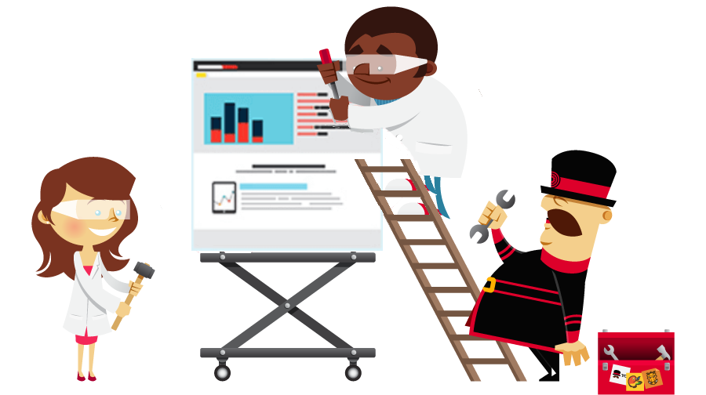

643-1-1 Projet de technologies WEB de présentation
<!-- .element style="font-size:0.7em;margin:4em 0;" -->

# Zero to Hero

<!-- .element style="position:absolute; top:0; left:0;width:40%;" class="nopdf" -->

<!-- .element style="position:absolute; top:0; right:0;width:10%;" class="nopdf" -->

[Boris.Fritscher@he-arc.ch](mailto:Boris.Fritscher@he-arc.ch)
<!-- .element style="position:absolute; bottom:20px; left:0;" class="nopdf" -->

#### Project: Become a Hero

### Project

### Livrables

* Doit être deployé (gh-pages, autre sur accord)
* Code dans un repository github
* Documentation démarrage rapide, configuration en format markdown dans readme.md
* Autre documentation fichiers .md et/ou wiki github du projet
* Images de croquis papier
* Description du projet project idée à la réalisation
  * Ce qui a fonctionné
  * Ce qui a posé problème
  * Principales leçons apprises
* L'application web devrait être compréhensible sans guide d'utilisateur (infobulle et indication sont intégrées)

### Evaluation

* Présentation Démo
* Qualité du code
* Code commentaire et documentation

