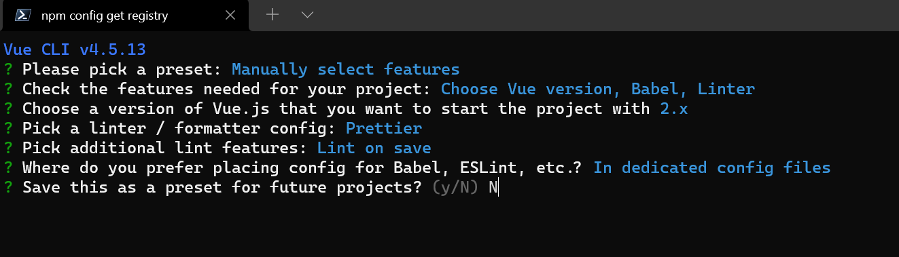
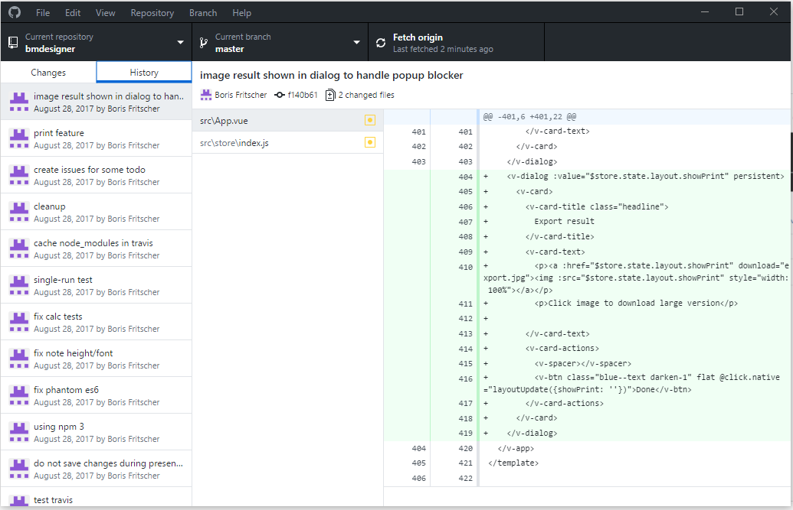
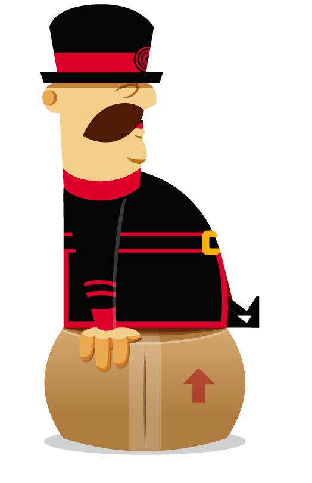

643-1-1 Projet de technologies WEB de présentation
<!-- .element style="font-size:0.7em;margin:4em 0;" -->

# Zero to Hero


<!-- .element style="position:absolute; top:0; left:0;width:40%;" class="nopdf" -->


<!-- .element style="position:absolute; top:0; right:0;width:10%;" class="nopdf" -->

[Boris.Fritscher@he-arc.ch](mailto:Boris.Fritscher@he-arc.ch)
<!-- .element style="position:absolute; bottom:20px; left:0;" class="nopdf" -->

#### Part 1: From blank page to deployed website

#### *Tools and git*


# CSS Frameworks

<br/>

* don't reinvent the wheel
* use best practices
* get reusable components
* design oriented


### [Bootstrap](http://getbootstrap.com/)


<!-- .element: class="top right" -->

One framework, every device

**CSS**

Global CSS settings, fundamental HTML elements styled and enhanced with extensible classes, and an advanced grid system.
<!-- .element: class="smaller" -->

**Components**

Over a dozen reusable components built to provide iconography, dropdowns, input groups, navigation, alerts, and much more.
<!-- .element: class="smaller" -->

**Javascript**

Bring Bootstrap's components to life with over a dozen custom jQuery plugins. Easily include them all, or one by one.
<!-- .element: class="smaller" -->

Note:

Alternatives: Bootstrap, Foundation, Angular Material,


#### Grid system

```html
<!DOCTYPE html>
<html>
  <head>
    <meta charset="utf-8">
    <link href="//maxcdn.bootstrapcdn.com/bootstrap/3.3.2/css/bootstrap.min.css" rel="stylesheet" type="text/css" />
    <title>Jumbotron Template for Bootstrap</title>
  </head>
  <body>
    <div class="container">
      <div class="row">
        <div class="col-xs-4">col-xs-4</div>
        <div class="col-xs-4">col-xs-4</div>
        <div class="col-xs-4">col-xs-4</div>
      </div>
      <div class="row">
        <div class="col-xs-offset-2 col-xs-8">col-xs-offset-2 col-xs-8</div>
      </div>
      <div class="row">
        <div class="col-md-4">col-md-4</div>
        <div class="col-md-4">col-md-4</div>
        <div class="col-md-4">col-md-4</div>
      </div>
    </div>
  </body>
</html>
```
<!-- .element: class="jsbin-embed" data-href="//jsbin.com/kexeda/1/edit?html,output" data-height="600px" -->
[http://getbootstrap.com/css/#grid](http://getbootstrap.com/css/#grid)

<!-- .element: class="credits" -->


```html
<!DOCTYPE html>
<html>
  <head>
    <meta charset="utf-8">
    <!-- Bootstrap core CSS -->
    <link href="//maxcdn.bootstrapcdn.com/bootstrap/3.3.2/css/bootstrap.min.css" rel="stylesheet" type="text/css" />
    <title>Jumbotron Template for Bootstrap</title>
  </head>
  <body>
    <nav class="navbar navbar-inverse navbar-fixed-top">
      <div class="container">
        <div class="navbar-header">
          <button type="button" class="navbar-toggle collapsed" data-toggle="collapse" data-target="#navbar" aria-expanded="false" aria-controls="navbar">
            <span class="sr-only">Toggle navigation</span>
            <span class="icon-bar"></span>
            <span class="icon-bar"></span>
            <span class="icon-bar"></span>
          </button>
          <a class="navbar-brand" href="#">Project name</a>
        </div>
        <div id="navbar" class="navbar-collapse collapse">
          <form class="navbar-form navbar-right">
            <div class="form-group">
              <input type="text" placeholder="Email" class="form-control">
            </div>
            <div class="form-group">
              <input type="password" placeholder="Password" class="form-control">
            </div>
            <button type="submit" class="btn btn-success">Sign in</button>
          </form>
        </div><!--/.navbar-collapse -->
      </div>
    </nav>

    <!-- Main jumbotron for a primary marketing message or call to action -->
    <div class="jumbotron">
      <div class="container">
        <h1>Hello, world!</h1>
        <p>This is a template for a simple marketing or informational website. It includes a large callout called a jumbotron and three supporting pieces of content. Use it as a starting point to create something more unique.</p>
        <p><a class="btn btn-primary btn-lg" href="#" role="button">Learn more &raquo;</a></p>
      </div>
    </div>

    <div class="container">
      <!-- Example row of columns -->
      <div class="row">
        <div class="col-md-4">
          <h2>Heading</h2>
          <p>Donec id elit non mi porta gravida at eget metus. Fusce dapibus, tellus ac cursus commodo, tortor mauris condimentum nibh, ut fermentum massa justo sit amet risus. Etiam porta sem malesuada magna mollis euismod. Donec sed odio dui. </p>
          <p><a class="btn btn-default" href="#" role="button">View details &raquo;</a></p>
        </div>
        <div class="col-md-4">
          <h2>Heading</h2>
          <p>Donec id elit non mi porta gravida at eget metus. Fusce dapibus, tellus ac cursus commodo, tortor mauris condimentum nibh, ut fermentum massa justo sit amet risus. Etiam porta sem malesuada magna mollis euismod. Donec sed odio dui. </p>
          <p><a class="btn btn-default" href="#" role="button">View details &raquo;</a></p>
       </div>
        <div class="col-md-4">
          <h2>Heading</h2>
          <p>Donec sed odio dui. Cras justo odio, dapibus ac facilisis in, egestas eget quam. Vestibulum id ligula porta felis euismod semper. Fusce dapibus, tellus ac cursus commodo, tortor mauris condimentum nibh, ut fermentum massa justo sit amet risus.</p>
          <p><a class="btn btn-default" href="#" role="button">View details &raquo;</a></p>
        </div>
      </div>
    </div>
    <hr>

    <footer>
      <p>&copy; Company 2014</p>
    </footer>

    <!-- JavaScript part to make navbar-toggle work -->
    <script src="//code.jquery.com/jquery.min.js"></script>
    <script src="//maxcdn.bootstrapcdn.com/bootstrap/3.3.2/js/bootstrap.min.js"></script>
  </body>
</html>
```
<!-- .element: class="jsbin-embed" data-href="//jsbin.com/lelopa/1/edit?html,output" data-height="600px" -->


# Design


<!-- .element: class="center" -->


### Why Writing Web Design On Paper Will Help

- Easier and more accessible (draw everywhere)
- Chaos can be helpful (break the rules)
- It saves time & energy (more iterations)
- Easier to make notes and alterations on paper
- Focus on the big picture, not getting lost in details

http://gohunters.com/blog/10-reasons-writing-web-design-paper-will-help/

<!-- .element: class="credits" -->


<!-- .element: class="center w-80" -->

https://www.smashingmagazine.com/2014/03/building-clickthrough-prototypes-to-support-participatory-design/

<!-- .element: class="credits" -->


<!-- .element: class="center" -->

http://designbeep.com/2012/05/17/33-great-examples-of-web-design-sketches/

<!-- .element: class="credits" -->


### Typography

Ty­pog­ra­phy mat­ters be­cause it helps con­serve reader at­ten­tion.

Good ty­pog­ra­phy can help your reader de­vote less at­ten­tion to the me­chan­ics of read­ing and more at­ten­tion to your mes­sage

http://practicaltypography.com/

<!-- .element: class="credits" -->


### Which is more readable?


<!-- .element: class="float-left w-50" -->


<!-- .element: class="float-right w-50" -->

A high­way sign has a spe­cial pur­pose: it’s meant to be read quickly, from long dis­tances, at odd an­gles, and un­der vari­able light­ing and weather con­di­tions.

http://practicaltypography.com/

<!-- .element: class="credits" -->


### Same font different balance


<!-- .element: class="w-80" -->

<!-- .element: class="center" -->

http://practicaltypography.com/

<!-- .element: class="credits" -->


### **Underlining** *Absolutely not*

<u>Un­der­lin­ing is an­other dreary type­writer habit. Type­writ­ers had no bold or italic styling. So the only way to em­pha­size text was to back up the car­riage and type un­der­scores be­neath the text. It was a workaround for short­com­ings in type­writer technology.</u>

Nei­ther your word proces­sor nor your web browser suf­fers from these short­com­ings. If you feel the urge to un­der­line, use **bold** or *italic* in­stead. In spe­cial sit­u­a­tions, like head­ings, you can also con­sider us­ing ALL CAPS, <span style="font-variant: small-caps">small caps</span>, or a change in <span style="font-size: 130%">point size</span>.

http://practicaltypography.com/

<!-- .element: class="credits" -->


<!-- .slide: data-background="images/typography-terminology.jpg" -->
<a href="https://www.supremo.tv/typeterms" target="_blank" style="width:100%;height:80vh;display:block;"></a>


### What is typography?


<!-- .element: class="w-80" -->

<!-- .element: class="center" -->

- https://www.gcflearnfree.org/beginning-graphic-design/typography/1/

<!-- .element: class="smaller" -->


# Design Principles

## Visual Perception And The Principles Of Gestalt

https://www.smashingmagazine.com/2014/03/design-principles-visual-perception-and-the-principles-of-gestalt/

<!-- .element: class="credits" -->


### The Key Ideas Behind Gestalt Theory

> The whole is other than the sum of the parts.
> — Kurt Koffka


### Similarity

> Elements that share similar characteristics are perceived as more related than elements that don’t share those characteristics.


<!-- .element: class="left fragment current-visible w-80" -->

<!-- .element: class="left fragment fade-in w-80" -->


### Common regions / Enclosure

> Elements are perceived as part of a group if they are located within the same closed region.


<!-- .element: class="left fragment current-visible w-80" -->

<!-- .element: class="left fragment current-visible w-80" -->

<!-- .element: class="left fragment fade-in w-80" -->


### Proximity

> Objects that are closer together are perceived as more related than objects that are further apart.


<!-- .element: class="left fragment current-visible w-80" -->

<!-- .element: class="left fragment fade-in w-80" -->


### Closure

> When seeing a complex arrangement of elements, we tend to look for a single, recognizable pattern.


<!-- .element: class="left w-80" -->


### Continuation

> Elements arranged on a line or curve are perceived as more related than elements not on the line or curve.


<!-- .element: class="left w-80" -->


### Connection

> Elements that are visually connected are perceived as more related than elements with no connection.


<!-- .element: class="left fragment current-visible w-50" -->

<!-- .element: class="left fragment fade-in w-50" -->


### Concepts applied to web composition


<!-- .element: class="w-80" -->

<!-- .element: class="center" -->

- https://www.gcflearnfree.org/beginning-graphic-design/layout-and-composition/1/

<!-- .element: class="smaller" -->


### Beyond Frameworks, Design Guidelines

- Google:  [Material Design](https://material.io/guidelines/)
- Microsoft: [Fluent Design System](http://fluent.microsoft.com/)


# Tooling


<!-- .element: class="w-40" -->


### Editors

Exists in all form: from notepad.exe to full IDE: [WebStorm](https://www.jetbrains.com/webstorm/)


<!-- .element: class="w-40 float-left" -->


<!-- .element: class="w-60 float-left" -->

In between: [Notepad++](https://notepad-plus-plus.org/), [Visual Studio Code](https://code.visualstudio.com/),  [Atom](https://atom.io/)
<br/>Online editors: [Cloud9](https://c9.io/), [Eclipse Che](http://www.eclipse.org/che/)
<br/>Browser integrated (F12): [Chrome DevTools](https://developer.chrome.com/devtools)


<!-- .element: class="w-100" -->

https://github.com/kamranahmedse/developer-roadmap

<!-- .element: class="credits" -->


<!-- .element: class="w-80" -->

<!-- .element: class="center" -->

https://github.com/kamranahmedse/developer-roadmap

<!-- .element: class="credits" -->


### Preprocessors

A preprocessor is a program that processes its input data to produce output, that is used as input to another program

**CSS preprocessor:** Less, Sass, Stylus, ...

**JS preprocessor:** CoffeeScript, TypeScript, ECMAScript 2015 (ES6) (Traceur and Babel), ...

**HTML preprocessor:** Jade, Haml, Handlebars, ...

**Script loader:** Require, Webpack, ...

**Test framework:** Jasmine, Mocha, Qunit, ...


```

```
<!-- .element: class="nopdf jsbin-embed" data-href="//jsbin.com/mumavu/9/edit?html,css,js" data-height="600px" -->


## Node.js & npm

 <!-- .element: class="float-right w-15" -->
**Node.js** is a platform built on Chrome's JavaScript runtime for easily building fast, scalable network applications.
https://nodejs.org/

*It allows to run JavaScript outside of the browser*

 <!-- .element: class="float-right w-15" -->
**npm** is a package manager for JavaScript bundled with Node.js and can run some tasks.
https://www.npmjs.com/


## WebPack

Webpack is an open-source JavaScript module bundler. Webpack takes modules with dependencies and generates static assets representing those modules.


<!-- .element: class="float-right w-60" -->

It takes the dependencies and generates a dependency graph allowing web developers to use a modular approach for their web application development purposes.

<!-- .element: class="smaller" -->

WebPack Loader plugins help to pre/postprocess files without needing a tasks pipeline.

<!-- .element: class="smaller" -->


## Lab 1a: MonCV

Creating a Curriculum vitae webpage, using Boostrap CSS and development tools.


<!-- .element: class="w-30" -->


### Step 0: Install development environment

Download and install [Node.js](https://nodejs.org/) to get `npm`.

Use `npm` to install `vue-cli` globally (--global or -g)

```sh
$ npm install -g vue-cli
```
*We are using the -g (--global flag) to install in the global shared space accessible to all projects.*
<!-- .element: class="small" -->


### Step 1: Create a new project

Use vue-cli to create a new project using the `webpack` template

```sh
$ vue init webpack moncv
```


<!-- .element: class="w-80" -->

<!-- .element: class="center" -->


### Step 2: Review the generated app

```sh
$ code .
```

Install dependencies

```sh
$ npm install
```


### Step 3: Preview your app in the browser


Start the development server
```sh
npm run dev
```

edit a file and watch livereload in action

Stop the server `ctrl+c`


### Step 4a: Cleanup and Configure

 Delete `src/components` and `src/App.vue`

Add/Remove dependencies

```sh
$ npm uninstall vue --save
$ npm install jquery bootstrap@3 --save
```

check package.json (before and after)

<!-- .element: class="small" -->


### Step 4b: Configuring code linting

Adapt ESLint to our coding style

`.eslintrc.js`
```js
{
  ...,
  "rules": {
    // enforce semi
    "semi":  ["error", "always"],
    // use 4 spaces indent
    "indent": ["error", 4],
    ...
  },
  ...
}
```


### Step 4c: Fix webpack config to support jquery

Inside `build/webpack.dev.conf` and `build/webpack.prod.conf` add this plugin lines.

```js
{
  ...,
  plugins: [
    new webpack.ProvidePlugin({
      jQuery: 'jquery',
      $: 'jquery',
      jquery: 'jquery'
    }),
    ...,
  ]
}
```

Fix debugging by changing:
```js
devtool: 'source-map',
```


### Step 5: Setup boostrap and jQuery

Inside `src/main.js`

```es6
import $ from 'jquery';
import 'bootstrap';
import 'bootstrap/dist/css/bootstrap.min.css';

$(document).ready(() => {
  console.log('it works!');
});
```


### Step 6: Use npm to install other packages

```sh
npm install bootswatch --save
```

https://bootswatch.com/

try different CSS files from bootswatch in index.html

```es6
import 'bootswatch/darkly/bootstrap.min.css';
```


# Assignment 2a

Use lab1 to recreate/improve your CV with Boostrap and a development workflow

Add a progress bar for your skills.


# New problems

* Editing code and making backups
* Commenting out code

-> Need for a version control system


<!-- .element: class="bottom right" -->


# Git

Git is a free and open source distributed version control system designed to handle everything from small to very large projects with speed and efficiency.


### Centralized VCS


<!-- .element: class="w-75" -->

<!-- .element: class="center" -->


### Distributed VCS like Git


<!-- .element: class="w-50" -->

<!-- .element: class="center" -->


### Distributed VCS Advantages

* FAST
* OFFLINE (fix/commit multiple operations)
* Geography
* Flexible Workflows
* Easier Merging
* Implicit Backup
* Scale out, not just up

*Disadvantages: no Locks, Disk space*

http://ericsink.com/vcbe/html/dvcs_advantages.html

<!-- .element: class="credits" -->


### Git basics

* **`git init`** create a new local git repository
* **`git add .`** add all modified and new files to stage
* **`git commit -m 'msg'`** commit staged files with msg
* **`git push`** send commits to remote server
* **`git pull`** download remote commits
* **`git clone`** copy a remote repository
* **`.gitignore`** ignore files or folders


### Git lifecycle


http://git-scm.com/book/en/v2/Git-Basics-Recording-Changes-to-the-Repository

<!-- .element: class="credits" -->


### Exercice

https://try.github.io/levels/1/challenges/1


<!-- .element: class="top right" -->

### Quiz

- What is the main branch called in Git?
- What is the default name for a remote server?
- What new commands have you learned?
- What do they do?
- How to check the state of your git repository?
- How to revert changes to a file?


### Ressources

* http://git-scm.com/book/en/v2/Getting-Started-About-Version-Control
* http://marklodato.github.io/visual-git-guide/index-fr.html
* http://rogerdudler.github.io/git-guide/
* http://onlywei.github.io/explain-git-with-d3/#freeplay
* http://pcottle.github.io/learnGitBranching/


# GitHub

[GitHub]((https://github.com/) is a web-based Git repository hosting service, adding
its own features:

Wikis, bug tracking, **Markdown** rendering and static page hosting.

Unlike Git, which is strictly a command-line tool, GitHub provides
a web-based **graphical interface and desktop integration** (https://desktop.github.com/).


### Github Desktop




### Github

Browse commits, issues, fork, pull requests, wiki, Readme.md


# Do Your Commit Messages Suck?

https://www.youtube.com/watch?v=8YjSty6bfog

<!-- .element: class="center" -->


<iframe width="640" height="480" src="https://www.youtube.com/embed/8YjSty6bfog?rel=0&amp;showinfo=0" frameborder="0" allowfullscreen></iframe>


# Markdown
## From text to HTML


### Markdown Basics

[Markdown](http://daringfireball.net/projects/markdown/syntax) allows you to write using an easy-to-**read**, easy-to-**write** plain **text format**, which then converts to valid HTML.

```markdown
# The largest heading (an <h1> tag)
## The second largest heading (an <h2> tag)

> Blockquotes

Text styling *italic* and **bold**

Links (<a href="url">title</a>)
[title](url)

Images ()

```


### Markdown List and Table

```markdown
Unordered lists
* Item
* Item

- Item
- Item

Ordered lists
1. Item 1
2. Item 2
3. Item 3

some: `c0de`

| Name | Description          |
| ------------- | ----------- |
| Help      | Display the help window.|
| Close     | Closes a window     |
```
<!-- .element: class="float-left w-50" -->

* Item
* Item

<br/>

1. Item 1
2. Item 2

&nbsp;&nbsp;some: `c0de`

| Name | Description          |
| ------------- | ----------- |
| Help      | Display the help window.|
| Close     | Closes a window     |


### Visual Studio Code

Can preview markdown in realtime.

<!-- .element: class="smaller" -->


<!-- .element: class="w-60" -->

Warning: markdown on github is a speical variant!

<!-- .element: class="red" -->


# Lab 1b: deploy


<!-- .element: class="w-30" -->


### Step 0: Install

Create a [github.com](https://github.com) account and install [Github Desktop](https://desktop.github.com/) to have a version of `git`.


### Step 1: Git Master

- Commit your code to a git repository
- Commit & push your code to Github
- Change something and create a new commit.
- Clone the project from your neighbour


### Step 2: Production version

Create a built, mimified version of your page with your toolchain
```sh
npm run build
```
*Notice that you have a dist folder with this new content*


### Step 3: Deploy static site on Github

Github offers to serve static web pages https://pages.github.com/

There are two options:

- User site: http://usernameABC.github.io by creating a special repository with the name: usernameABC.github.io
- Projet site: http://usernameABC.github.io/repositoryYXZ by creating a special branch gh-pages inside the repositoryXYZ

**Deploy and test your site!**

*Try to deploy a new version with a changed CSS template.*

Note:

A special CNAME file can be put at the root of gh-pages to use a custom domain name.


### Deploying dist to gh-pages

Install a plugin which creates a commit and pushes to the right branch.

```sh
$ npm install push-dir --save-dev
```

#### Add new deploy task to npm package.json

```es6on
{
...,
  "scripts": {
    ...,
    "deploy": "push-dir --dir=dist --branch=gh-pages --cleanup --verbose"
  },
...
}
```


### Try to deploy

After a successful ```npm run build``` commit all changes and deploy:
```sh
git add . --all
git commit -m
npm run deploy
```

The site can be accessed at: https://heg-web.github.io/moncv-xyz/

<!-- .element: class="small" -->


# Adding interactions to the web


###  <!-- .element: class="w-40" -->

<!-- .element: class="pdf-w-30" -->

jQuery is a **fast, small**, and feature-rich JavaScript
library. It makes things like HTML **document traversal**
and **manipulation, event handling, animation**,
and **Ajax** much simpler with an easy-touse
API that works **across a multitude of browsers**.


### jQuery Selecting Elements

**Selecting Elements by ID**

```javascript
$('#myId'); // IDs must be unique per page.
```

**Selecting Elements by Class Name**

```javascript
$('.myClass');
```

**Selecting Elements by Attributes**

```javascript
$('input[name="first_name"]'); // this can be very slow in older browsers
```

**Selecting Elements by Compound CSS Selector**

```javascript
$('#myId ul.people li');
```

http://api.jquery.com/

<!-- .element: class="credits" -->


```html

```
<!-- .element: class="nopdf jsbin-embed" data-href="//jsbin.com/falune/1/edit?html,css,js,output" data-height="600px" -->


# Lab 1c: better interactions

We want to improve our page with some interactions and behaviors.


### Step 1: Use bower to install a jquery plugin

```sh
$ npm install jquery-smooth-scroll --save
```

Use the plugin:

```javascript
import 'jquery-smooth-scroll';

$(document).ready(() => {
  $('a').smoothScroll();
});
```


### Step 2: DevTools

**F12** opens the browser's developer tools, explore your webpage DOM structure.

- Can you edit the page?
- Can you test different CSS?
- Can you interact with the JavaScript?

https://developer.chrome.com/devtools/docs/dom-and-styles
