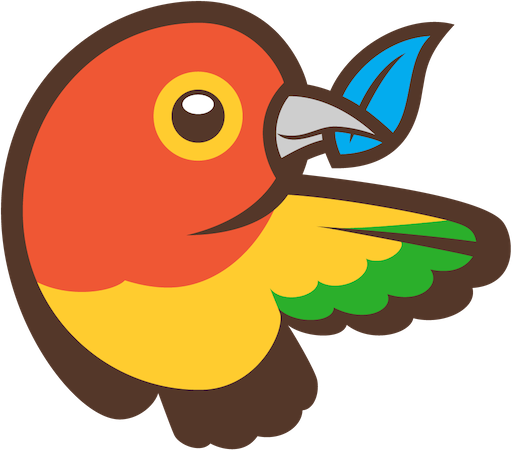

# CSS Frameworks

<br/>

* don't reinvent the wheel
* use best practices
* get reusable components
* design oriented


### [Bootstrap](http://getbootstrap.com/)


<!-- .element: class="top right" -->

One framework, every device

**CSS**

Global CSS settings, fundamental HTML elements styled and enhanced with extensible classes, and an advanced grid system.
<!-- .element: class="smaller" -->

**Components**

Over a dozen reusable components built to provide iconography, dropdowns, input groups, navigation, alerts, and much more.
<!-- .element: class="smaller" -->

**Javascript**

Bring Bootstrap's components to life with over a dozen custom jQuery plugins. Easily include them all, or one by one.
<!-- .element: class="smaller" -->

Note:

Alternatives: Bootstrap, Foundation, Angular Material,


```xml
<!DOCTYPE html>
<html>
  <head>
    <meta charset="utf-8">
    <!-- Bootstrap core CSS -->    
    <link href="//maxcdn.bootstrapcdn.com/bootstrap/3.3.2/css/bootstrap.min.css" rel="stylesheet" type="text/css" />
    <title>Jumbotron Template for Bootstrap</title>
  </head>
  <body>
    <nav class="navbar navbar-inverse navbar-fixed-top">
      <div class="container">
        <div class="navbar-header">
          <button type="button" class="navbar-toggle collapsed" data-toggle="collapse" data-target="#navbar" aria-expanded="false" aria-controls="navbar">
            <span class="sr-only">Toggle navigation</span>
            <span class="icon-bar"></span>
            <span class="icon-bar"></span>
            <span class="icon-bar"></span>
          </button>
          <a class="navbar-brand" href="#">Project name</a>
        </div>
        <div id="navbar" class="navbar-collapse collapse">
          <form class="navbar-form navbar-right">
            <div class="form-group">
              <input type="text" placeholder="Email" class="form-control">
            </div>
            <div class="form-group">
              <input type="password" placeholder="Password" class="form-control">
            </div>
            <button type="submit" class="btn btn-success">Sign in</button>
          </form>
        </div><!--/.navbar-collapse -->
      </div>
    </nav>

    <!-- Main jumbotron for a primary marketing message or call to action -->
    <div class="jumbotron">
      <div class="container">
        <h1>Hello, world!</h1>
        <p>This is a template for a simple marketing or informational website. It includes a large callout called a jumbotron and three supporting pieces of content. Use it as a starting point to create something more unique.</p>
        <p><a class="btn btn-primary btn-lg" href="#" role="button">Learn more &raquo;</a></p>
      </div>
    </div>
    
    <div class="container">
      <!-- Example row of columns -->
      <div class="row">
        <div class="col-md-4">
          <h2>Heading</h2>
          <p>Donec id elit non mi porta gravida at eget metus. Fusce dapibus, tellus ac cursus commodo, tortor mauris condimentum nibh, ut fermentum massa justo sit amet risus. Etiam porta sem malesuada magna mollis euismod. Donec sed odio dui. </p>
          <p><a class="btn btn-default" href="#" role="button">View details &raquo;</a></p>
        </div>
        <div class="col-md-4">
          <h2>Heading</h2>
          <p>Donec id elit non mi porta gravida at eget metus. Fusce dapibus, tellus ac cursus commodo, tortor mauris condimentum nibh, ut fermentum massa justo sit amet risus. Etiam porta sem malesuada magna mollis euismod. Donec sed odio dui. </p>
          <p><a class="btn btn-default" href="#" role="button">View details &raquo;</a></p>
       </div>
        <div class="col-md-4">
          <h2>Heading</h2>
          <p>Donec sed odio dui. Cras justo odio, dapibus ac facilisis in, egestas eget quam. Vestibulum id ligula porta felis euismod semper. Fusce dapibus, tellus ac cursus commodo, tortor mauris condimentum nibh, ut fermentum massa justo sit amet risus.</p>
          <p><a class="btn btn-default" href="#" role="button">View details &raquo;</a></p>
        </div>
      </div>
    </div>
    <hr>

    <footer>
      <p>&copy; Company 2014</p>
    </footer>
        
    <!-- JavaScript part to make navbar-toggle work -->
    <script src="//code.jquery.com/jquery.min.js"></script>
    <script src="//maxcdn.bootstrapcdn.com/bootstrap/3.3.2/js/bootstrap.min.js"></script>
  </body>
</html>
```
<!-- .element: class="jsbin-embed" data-href="http://jsbin.com/lelopa/1/edit?html,output" data-height="600px" -->


# Tooling


### Editors

Exists in all form: from notepad.exe to full IDE: [WebStorm](https://www.jetbrains.com/webstorm/)


<!-- .element: class="w-40 float-left" -->


<!-- .element: class="w-60 float-left" -->

In between: [Notepad++](https://notepad-plus-plus.org/)
<br/>Online editors: [Cloud9](https://c9.io/)
<br/>Browser integrated (F12): [Chrome DevTools](https://developer.chrome.com/devtools)


### Preprocessors

A preprocessor is a program that processes its input data to produce output, that is used as input to another program

**CSS preprocessor:** Less, Sass, Stylus, ...

**JS preprocessor:** CoffeeScript, TypeScript, ECMAScript 6 (Traceur and Babel), ...

**HTML preprocessor:** Jade, Haml, Handlebars, ...

**Script loader:** Require, Webpack, ...

**Test framework:** Jasmine, Mocha, Qunit, ...


```

```
<!-- .element: class="nopdf jsbin-embed" data-href="http://jsbin.com/mumavu/9/edit?html,css,js" data-height="600px" -->


### Yeoman

Yeoman is a combination of tools, which allows you to setup a complete,
automated, efficient and reliable development workflow.


<!-- .element: class="center" -->

It is composed of three tools: yo, bower and grunt (or gulp).


 <!-- .element: class="float-right w-15" -->
**Yo** is a tool for generating project skeletons (scaffolding). You can create and
share your skeletons. Yo *generators* are npm modules and you can find one
for most popular web frameworks.
http://yeoman.io/

<!-- .element: class="pdf-w-30 pdf-float-left" -->

 <!-- .element: class="float-right w-15 pdf-w-30" -->
**Bower** is a tool for managing *web dependencies*. Not only JavaScript
modules, but also CSS files, images, etc.
http://bower.io/

<!-- .element: class="pdf-w-30 pdf-float-left" -->

 <!-- .element: class="float-right w-15 pdf-w-30" -->
**Grunt** is a task runner. It is the tool that drives your *automated process*, by
executing a series of tasks. There are lots of grunt plugins provided by the
community for all aspects of your project.
http://gruntjs.com/

<!-- .element: class="pdf-w-30 pdf-float-left" -->


## Node.js & npm

 <!-- .element: class="float-right w-15" -->
**Node.js** is a platform built on Chrome's JavaScript runtime for easily building fast, scalable network applications.
https://nodejs.org/

*It allows to run JavaScript outside of the browser*

 <!-- .element: class="float-right w-15" -->
**npm** is a package manager for JavaScript bundled with Node.js
https://www.npmjs.com/


## Lab 1a: MonCV

Creating a Curriculum vitae webpage, using Boostrap CSS and development tools.


<!-- .element: class="w-30" -->


### Step 0: Install development environment

Download and install [Node.js](https://nodejs.org/) to get npm.

Use npm to install yeoman, bower and grunt

```sh
$ npm install -g yo bower grunt-cli
```

Use npm to install the desired yeoman generator

```sh
$ npm install -g generator-webapp
```

https://github.com/yeoman/generator-webapp

<!-- .element: class="credits" -->

*We are using the -g (--global flag) to install in the global shared space accessible to all projects.*
<!-- .element: class="small" -->


### Step 1: Create a new project

Create project folder

```sh
$ mkdir monCV
$ cd monCV
```

Use yeoman generator to scaffold a new application

```sh
$ yo webapp
```


<!-- .element: class="w-66" -->

<!-- .element: class="center" -->


### Step 2: Review the Yeoman-generated app

package.json <-- npm dependencies

bower.json <-- bower dependencies

```sh
$ npm install && bower install
```


### Step 3: Preview your app in the browser


Start the server
```sh
grunt serve
```

edit a file and watch livereload in action

Stop the server (ctrl+c)


### Step 4: Use Bower to install packages

```sh
bower install bootswatch --save
```

https://bootswatch.com/

try different CSS files from bootswatch in index.html
```xml
<link rel="stylesheet" href="bower_components/bootswatch/???/bootstrap.css" />
```


# Assignment 2a

Use lab1 to recreate/improve your CV with Boostrap and a development workflow


# New problems

* Editing code and making backups
* Commenting out code

-> Need for a version control system


<!-- .element: class="bottom right" -->


# GitHub

[GitHub]((https://github.com/) is a web-based Git repository hosting service, adding
its own features:

Wikis, bug tracking, **Markdown** rendering and static page hosting.

Unlike Git, which is strictly a command-line tool, GitHub provides
a web-based **graphical interface and desktop integration** (https://windows.github.com/).


Deploy to our special repo/page

### Step 6: Production version

Create a built, mimified version of your page with your toolchain
```sh
grunt build
```
*Notice that you have a dist folder with this new content*

```sh
grunt serve:dist
```
Helps to test the minified version.


# Git

Git is a free and open source distributed version control system designed to handle everything from small to very large projects with speed and efficiency.


### Centralized VCS


<!-- .element: class="w-75" -->

<!-- .element: class="center" -->


### Distributed VCS like Git 


<!-- .element: class="w-50" -->

<!-- .element: class="center" -->


### Git basics

* `git init` create a new local git repository
* `git add .` add all modified and new files to stage 
* `git commit -m 'msg'` commit staged files with msg
* `git push` send commits to remote server
* `git pull` download remote commits
* `git clone` copy a remote repository
* `.gitignore` ignore files or folders


### Git lifecycle


http://git-scm.com/book/en/v2/Git-Basics-Recording-Changes-to-the-Repository

<!-- .element: class="credits" -->


### Exercice 

https://try.github.io/levels/1/challenges/1


<!-- .element: class="top right" -->

### Quiz

What is the main branch called in Git?

What is the default name for a remote server?

How do you get a file of a version?


### Ressources

* http://git-scm.com/book/en/v2/Getting-Started-About-Version-Control
* http://marklodato.github.io/visual-git-guide/index-fr.html
* http://rogerdudler.github.io/git-guide/
* http://onlywei.github.io/explain-git-with-d3/#freeplay
* http://pcottle.github.io/learnGitBranching/


# Markdown
## From text to HTML


### Markdown Basics

[Markdown](http://daringfireball.net/projects/markdown/syntax) allows you to write using an easy-to-**read**, easy-to-**write** plain **text format**, which then converts to valid HTML.

```markdown
# The largest heading (an <h1> tag)
## The second largest heading (an <h2> tag)

> Blockquotes

Text styling *italic* and **bold**

Links (<a href="url">title</a>)
[title](url)

Images ()

```


### Markdown List and Table

```markdown
Unordered lists
* Item
* Item

- Item
- Item

Ordered lists
1. Item 1
2. Item 2
3. Item 3

some: `c0de`

| Name | Description          |
| ------------- | ----------- |
| Help      | Display the help window.|
| Close     | Closes a window     |
```
<!-- .element: class="float-left w-50" -->

* Item
* Item

<br/>

1. Item 1
2. Item 2

&nbsp;&nbsp;some: `c0de`

| Name | Description          |
| ------------- | ----------- |
| Help      | Display the help window.|
| Close     | Closes a window     |


<iframe data-src="http://dillinger.io/" class="nopdf" style="width:100%;height:100%"></iframe>

http://dillinger.io/

<!-- .element: class="credits" -->


# Lab 1b: deploy


<!-- .element: class="w-30" -->


### Step 5: Git Master

Create a git repository for your project on Github

Commit & push your code to Github

Change something and create a new commit.

Clone the project from your neighbour

Can you push a commit?


# Pull requests


### Step 7: Deploy on Github Pages

Create a new git repository inside your dist folder and commit your files.

Add your github repository as origin
```sh
git remote add origin git@github.com:XXX/test-lab.git
```

Push the master branch to the special gh-pages page
```sh
git push origin master:gh-pages --set-upstream
```

Test your site: http://XXX.github.io/test-lab/

Try to deploy a new version with a changed CSS template.

https://pages.github.com/

<!-- .element: class="credits" -->

Note:

A special CNAME file can be put at the root of gh-pages to use a custom domain name. 


# Assignment 2


Publish your final CV site on Github and 
provide the link in the REAMDE.md file of ...
Create A Pull request.


# Adding interactions to the web