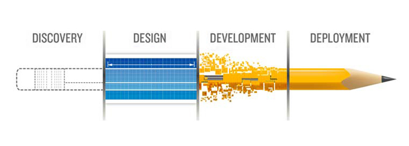
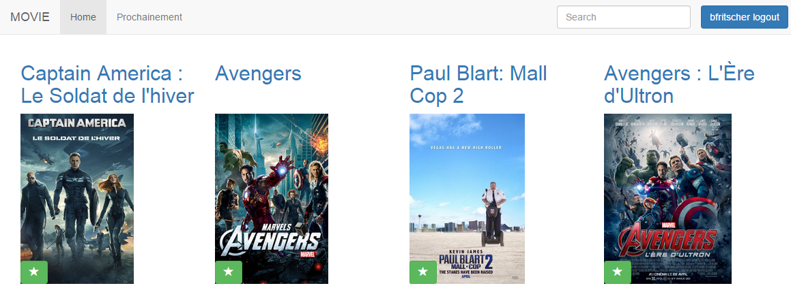
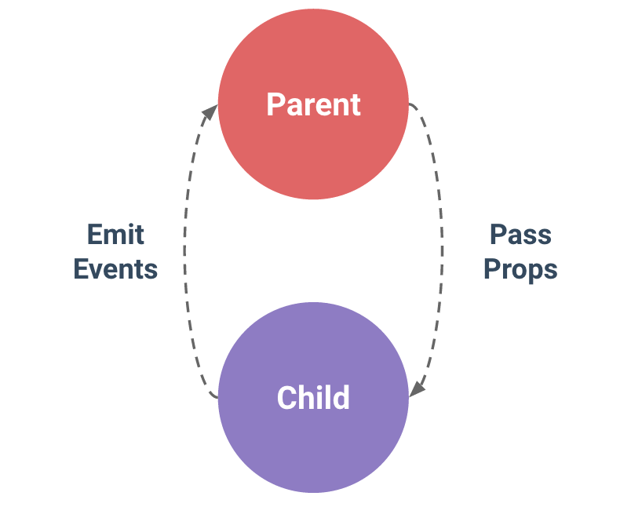

643-1-1 Projet de technologies WEB de présentation
<!-- .element style="font-size:0.7em;margin:4em 0;" -->

# Zero to Hero


<!-- .element style="position:absolute; top:0; left:0;width:40%;" class="nopdf" -->


<!-- .element style="position:absolute; top:0; right:0;width:10%;" class="nopdf" -->

[Boris.Fritscher@he-arc.ch](mailto:Boris.Fritscher@he-arc.ch)
<!-- .element style="position:absolute; bottom:20px; left:0;" class="nopdf" -->

#### Part 2: Build and deploy a Single Page Application

#### Vue.js


# Multi Page App<br/>vs<br/>Single Page Application (SPA)


There is a big trend towards “single-page applications”, where some of the
responsibilities are moved from the server to the client side.

* The client initially fetches a single “shell” page, which provides a rendering
context and loads application modules (scripts, markup partials, stylesheets, etc.).
* When the user clicks on hyperlinks, the browser does not (immediately) send an
HTTP request to fetch a new page. Instead, the event is caught and processed by
a JavaScript router on the client side.
* Routing is done on the client side. The JavaScript router (typically provided by
an application framework) looks at the target URL and decides which JavaScript
function needs to be invoked. This function can update the DOM, sometimes in
drastic manners (giving the impression that we move from an “Customers List”
page to a “Customer Details” page).

<!--- .element: class="small" -->


http://www.websiteoptimization.com/secrets/ajax/8-1-ajax-pattern.html
<!--- .element: class="credits" -->


# Paper to WWW




<!-- .element class="center" -->


Note:

Mobile application developement can also be done wiht HTML/CSS/JavaScript, with this kind of application and then be packaged into a native app with a webview.


## Who is guilty?


<!-- .element class="w-40" -->

<!-- .element class="center" -->

http://www.usabilitypost.com/2010/11/17/the-design-of-everyday-things/

<!-- .element class="credits" -->

note:
The user of the device often assumes blame by default. They believe that because they were the ones that made the error, or they were the ones who couldn’t figure how the thing works, then they’re the ones to blame.

Norman argues that in most cases this isn’t so. The designer is to blame because they produced something that’s not easy to understand or something that lets errors and misuse happen. If we have trouble using something then it’s probably because that thing is badly designed, rather than us being stupid.


### Interaction Design: Natural Mapping

Controls arrangement:


<!-- .element class="w-50 float-left" -->


<!-- .element class="w-50 float-right" -->

Completely detached
<!-- .element class="w-50 float-left small clear" -->

Natural Mapping
<!-- .element class="w-50 float-right small" -->

http://www.usabilitypost.com/2010/11/17/the-design-of-everyday-things/

<!-- .element class="credits" -->

note:
The mappings are not great because the controls don’t represent the alignment of the burners, so you always have to refer to the labels when you want to turn them on or off. We can improve this by using a natural mapping, using a spacial analogy to show the relationship between the controls and the burners they operate.


### Interaction Design: Perceived Affordances

<iframe width="560" height="315" src="https://www.youtube.com/embed/yY96hTb8WgI?rel=0&amp;showinfo=0" frameborder="0" allowfullscreen></iframe>

> It's not you. Bad doors are everywhere.


### Affordances for Web Design


<!-- .element class="center" -->

> Use Visual Affordance to Ensure Buttons Look Clickable

http://www.usefulusability.com/15-user-experience-details-you-missed/

<!-- .element class="credits" -->


### When Design Fails


<!-- .element class="fragment current-visible left" -->


<!-- .element class="fragment current-visible left w-40" -->


<!-- .element class="fragment current-visible left" -->


<!-- .element class="fragment current-visible left w-70" -->


### UX: User Experience Design


https://onepotprojects.com/an-introduction-user-experience-design-2a7f8167bf03

<!-- .element class="credits" -->

note:
While focusing on user needs it is also important for a UX Designer to be aware of balancing business goals with technology constraints (or opportunities). While it is true that a product cannot succeed without a healthy business, a business cannot succeed without a happy customer — and it is the UX Designer’s job to be the customer advocate.


<!-- .element class="w-60" -->

<!-- .element class="center" -->


### Initial Strategy and Scope Phases

Fundamental business questions (what to build)

- Do users need the product you are making?
- Do they want it enough that they will either pay for it or if it is free, spend time looking for it and learning to use it?
- Are you missing a key feature they will need?
- Are you spending time building features they will never use?


### Structure and Skeleton Phases

Critical implementation questions (how to build?)

- How should the content be organised so that users can easily find it?
- Will users find your app easy to use? Where do they get confused or lost?
- What content is needed and how should it be written to be most engaging?


### The Surface of the Product

User’s first impression is critical

- What should the visual tone of the product be?
- How do users feel when they see your product? Do they trust it?
- It the product visually appealing and does it spark joy?
- Is the visual design usable and accessible?


# Objectifs

* Learn SPA with Vue.js
* Learn by Example: Shopping List App
* Only focus on frontent-app
* With Api's and some cloud functions ("serverless")

TODO PIC

<!-- .element: class="w-40" -->

<!-- .element: class="w-40" -->


## Why Vue.Js?

<!-- https://codepen.io/jotavejv/pen/KgrXEa -->
<style>
  .reveal div.w{width:220px;height:220px;margin:auto;position:absolute;top:0;right:0;left:0;bottom:0;}:root{--outer:#2FB982;--inner:#34475F}.w svg{width:100%;height:auto}#outer,#inner{stroke-width:.5;stroke:var(--outer)}#outer{stroke-dasharray:285.5394592285156 285.5394592285156;stroke-dashoffset:285.5394592285156;animation:outer 4s 1s ease infinite}#inner{stroke-dasharray:165.98031616210938 165.98031616210938;stroke-dashoffset:165.98031616210938;animation:inner 4s 1s ease infinite}@keyframes outer{25%{stroke-dashoffset:0;stroke-width:.5;fill:#fff}50%,75%{stroke-dashoffset:0;fill:var(--outer);stroke-width:0}}@keyframes inner{25%{stroke-dashoffset:0;stroke-width:.5;fill:#fff}50%,75%{stroke-dashoffset:0;fill:var(--inner);stroke-width:0}}
</style>
<div style="position:relative;width:100%;height:220px;">
  <div class="w">
    <svg width="82px" height="70px" viewBox="-4 1 82 70" version="1.1" xmlns="http://www.w3.org/2000/svg" xmlns:xlink="http://www.w3.org/1999/xlink">
      <g id="vue" stroke="none" fill="none" transform="translate(-3.000000, 2.000000)">
        <path d="M15,0 L31,0 C31,0 33.7431643,4.8767365 35.1147464,7.31510474 L40,16 L50,0 L65,0 L40,42 L15,0 Z" id="inner">
        </path>
        <path d="M0,0 L40,68 L80,0 L65,0 C65,0 50.2018448,24.8609007 42.8027673,37.291351 C41.8685115,38.8609007 40,42 40,42 L15,0 L0,0 Z" id="outer">
        </path>
      </g>
    </svg>
  </div>
</div>


Note:
- address many of the challenges encountered in developing SPA
- large acceptation
- decouple DOM manipulation from application logic
- decouple the client side of an application from the server side
- declarative programming for user interface
- imperative programming for application business logic
- best of anagularjs and react


THE DZONE GUIDE TO THE JAVA ECOSYSTEM, 2015


<!-- .element: class="w-50"-->


# TODO VUE INTRO

https://speakerdeck.com/bhawkes/introduction-to-vue-js

MODULE AS A SERVICE
FETCH
PROMISE

mvvm.png
vue-format.png

<div id="app">
{{message}}
</div>


DATA

new Vue({
  el: '#app',
  data: function () {
    return {
      message: 'Hello Vue.js!'
    };
  }
});

vue constructor and text interpolation


{{message.toUpperCase()}
{{message.slice(0,5)}}
{{ ok ? 'YES' : 'NO' }}

FILTERS

capitalize

used inside mustache interpolations and v-bind expressions
primarily designed for text transformation

filters: {
  reverse: function(input) {
    return input.split(' ').reverse().join(' ')
  }
}

{{message | reverse}}

Filters can be chained
{{ message | filterA | filterB }}

Filters are JavaScript functions, therefore they can take arguments:
{{ message | filterA('arg1', arg2) }}

GLOBAL vs local registrations

Vue.filter

DIRECTIVES
v-bind:attributes=  :attributes=
v-if
v-else
v-else-if

<div v-if="type === 'A'">
  A
</div>
<div v-else-if="type === 'B'">
  B
</div>
<div v-else-if="type === 'C'">
  C
</div>
<div v-else>
  Not A/B/C
</div>

v-for

<div v-for="item in items">
  {{ item.text }}
</div>
<div v-for="(item, index) in items"></div>
<div v-for="(val, key) in object"></div>
<div v-for="(val, key, index) in object"></div>

v-model

.number - cast input string to numbers
.trim - trim input

v-on:click @click

<form v-on:submit.prevent="onSubmit"></form>

.stop - call event.stopPropagation().
.prevent - call event.preventDefault().
.{keyCode | keyAlias} - only trigger handler on certain keys.
.left - (2.2.0+) only trigger handler for left button mouse events.
.right - (2.2.0+) only trigger handler for right button mouse events.
.middle - (2.2.0+) only trigger handler for middle button mouse events.

<!-- chain modifiers -->
<button @click.stop.prevent="doThis"></button>

<!-- key modifier using keyAlias -->
<input @keyup.enter="onEnter">

<div v-bind:class="{ active: isActive }"></div>

- GOTCHAS new attributes/ arrays

Tracked mutate
push()
pop()
shift()
unshift()
splice()
sort()
reverse()

or replace
filter(), concat() and slice()

do note [] or .length

// Vue.set
Vue.set(example1.items, indexOfItem, newValue)


METHODS
function (event)

can be called with ($event) or without

COMPUTED


show with now()


Computed properties are by default getter-only, but you can also provide a setter when you need it:
// ...
computed: {
  fullName: {
    // getter
    get: function () {
      return this.firstName + ' ' + this.lastName
    },
    // setter
    set: function (newValue) {
      var names = newValue.split(' ')
      this.firstName = names[0]
      this.lastName = names[names.length - 1]
    }
  }
}
// ...

COMPONENTS props + events
props: ['myprop']
v-bind:myprop
v-bind:key=



prop validation

click.native - listen for a native event on the root element of component.

 By default, v-model on a component uses value as the prop and input as the event

components.png


SLOTS

<div class="container">
  <header>
    <slot name="header"></slot>
  </header>
  <main>
    <slot></slot>
  </main>
  <footer>
    <slot name="footer"></slot>
  </footer>
</div>

<app-layout>
  <h1 slot="header">Here might be a page title</h1>
  <p>A paragraph for the main content.</p>
  <p>And another one.</p>
  <p slot="footer">Here's some contact info</p>
</app-layout>

LIFECYCLE HOOKS

https://vuejs.org/v2/guide/instance.html

created: function () {
this.fetchData()

ref is used to register a reference to an element or a child component. The reference will be registered under the parent component’s $refs object.

TRANSITIONS

  <transition name="fade">
    <p v-if="show">hello</p>
  </transition>

.fade-enter-active, .fade-leave-active {
  transition: opacity .5s
}
.fade-enter, .fade-leave-to /* .fade-leave-active in <2.1.8 */ {
  opacity: 0
}

  <transition-group name="flip-list" tag="ul">
  </transition-group>


.flip-list-move {
  transition: transform 1s;
}

ROUTER

const router = new VueRouter({
  routes: [
    // dynamic segments start with a colon
    { path: '/user/:id', name: 'user', component: User }
  ]
})

{{ $route.params.id }}

<router-link :to="{ name: 'user', params: { userId: 123 }}">User</router-link>

router.push({ name: 'user', params: { userId: 123 }})

 <router-view></router-view>

watch: {
    '$route' (to, from) {
      // react to route changes...
    }
  }

  beforeRouteUpdate (to, from, next) {
    // react to route changes...
    // don't forget to call next()
  }


WATCH

vm.$watch('a', function (newVal, oldVal) {
  // this callback will be called when `vm.a` changes
})

! no arrow functions!

data.png

EVENTBUS
https://alligator.io/vuejs/global-event-bus/

import Vue from 'vue';
export const EventBus = new Vue();

import { EventBus } from './event-bus.js';

EventBus.$emit('i-got-clicked', this.clickCount);
const clickHandler = clickCount => {
  console.log(`Oh, that's nice. It's gotten ${clickCount} clicks! :)`)
}
EventBus.$on('i-got-clicked', clickHandler);

// Stop listening.
EventBus.$off('i-got-clicked', clickHandler);

MIXINS
CUSTOM DIRECTIVE
Vue.nextTick
PLUGINS


Vue.component('my-component', {

  // Props
  props: [ 'myprop' ],

  // Local state
  data() {
    return {
      firstName: 'John',
      lastName: 'Smith'
    }
  },

  // Computed property
  computed: {
    fullName() {
      return this.firstName + ' ' + this.lastName;
    }
  },

  // Template
  template: `
    <div>
      <p>Vue components typically have string templates.</p>
      <p>Here's some local state: {{ firstName }}</p>
      <p>Here's a computed value: {{ fullName }}</p>
      <p>Here's a prop passed down from the parent: {{ myprop }}</p>
    </div>
  `,

  // Lifecycle hook
  created() {
    setTimeout(() => {
      this.message = 'Goodbye World'
    }, 2000);
  }
});


new Vue({
  el: '#app',
  data: function () {
    return {
      dataLoaded: false,
      apiReply: {}
    };
  },
  methods: {
    loadData: function() {
      fetch('/api').then(response => {
        return response.json();
      }).then(reply => {
        this.apiReply = reply;
        this.dataLoaded = true;
      });
    }
  },
  created: function () {
    this.loadData();
  }
});


### Resources


## Exercice setup:

```sh
npm install -g vue-cli
```


Explore folder

Launch server
```sh
npm run dev
```

Let's use Chrome DevTools as IDE

* add folder to workspace
* map to file system resource
* Explore files
* What happens if identation is wrong in a js file? (lint)


| Vue.js Concepts     | Description                                                              |
|----------------------|--------------------------------------------------------------------------|
| ViewModel            | the data shown to the user in the view and with which the user interacts |
| View                 | what the user sees (the DOM)                                             |
| Template             | HTML with additional markup                                              |
| Directives           | extend HTML with custom attributes and elements                          |
| Components           | a special kind of directive used for component-based application structure |
| Expressions          | access variables and functions from the scope                            |
| Filter               | formats the value of an expression for display to the user               |

https://

<!-- .element: class="credits" -->


### Vue.js Expressions

Vue.js expressions are JavaScript-like code snippets that are usually placed in bindings such as `{{ expression }}`.

For example, these are valid expressions in Angular:

 - `1 + 2`
 - `a + b`
 - `user.name`
 - `items[index]`

https://

<!-- .element: class="credits" -->


### Some Directives

| Directive         | Description |
|-------------------|-------------|
| v-model          | binds an input, select, textarea (or custom form control) to a property on the scope. |
| v-bind           | replace the text content of the specified HTML element with the value of a given expression, and to update the text content on changes. |
| v-if             | shows the given HTML element based on the expression provided to the directive's attribute. |
| v-for         | instantiates a template once per item from a collection. Each template instance gets its own scope, where the given loop variable is set to the current collection item, and *$index* is set to the item index or key. |
| v-on:click          | allows to specify custom behavior when an element is clicked. |


https://

<!-- .element: class="credits" -->


### VM


### Filters TODO

A filter formats the value of an expression for display to the user.

```
{{ expression | filter1:argument1:argument2:... | filter2 | ... }}
```

| Filter | Description |
|--------|-------------|
| uppercase | Converts string to uppercase. |
| limitTo:*limit* | Creates a new array or string containing only a specified number of elements. |
| orderBy:*expression* | Orders a specified array by the expression predicate (string, array or function). |
| filter:*expression* | Selects a subset of items from array and returns it as a new array (string, object or function(value, index, array)). |

https://docs.angularjs.org/api/ng/filter

<!-- .element: class="credits" -->


### Exercice: Step 1


- Create a form to add a new movie to a list of movies
- Display the list of movies
- Be able to delete a movie from the list


### JSON

JavaScript Object Notation is a lightweight data-interchange format. It is easy for *humans* to **read and write**. It is easy for *machines* to **parse and generate**. It is based on a subset of the JavaScript Programming Language

```json
{
  "key_string": "hello",
  "key_number": 3,
  "key_array": ["some text", 34]
  "key_object": {
    "other_key": "value"
    "key_boolean": true,
    "null possible": null
  }

}
```
http://json.org/


### JSON API in JavaScript

|                                   |                                                              |
|-----------------------------------|--------------------------------------------------------------|
| JSON.stringify( *object* )        | create a JSON_string                                         |
| JSON.parse( *JSON_string* )       | create an object from a string                               |
| angular.toJson( *object* )        | create a JSON_string (removing angular's internal variables) |
| angular.fromJson( *JSON_string* ) | create an object from a string                               |

```es6
//optional formatter and indentation spacing for pretty-print
JSON.stringify( {hello: {text: 'world'}}, null, 2 )
//results in the following string
'{
  "hello": {
    "text": "world"
  }
}'
```


### localStorage

Interface of the Web Storage API provides access to storage for a particular domain.

|                                    |                                                                                        |
|------------------------------------|----------------------------------------------------------------------------------------|
| localStorage.length                | Returns an integer representing the number of data items stored in the Storage object. |
| localStorage.key( number )         | will return the name of the nth key in the storage.                                    |
| localStorage.getItem( key )        | will return that key's value.                                                          |
| localStorage.setItem( key, value ) | will add that key to the storage, or update that key's value if it already exists.     |
| localStorage.removeItem( key )     | will remove that key from the storage.                                                 |
| localStorage.clear()               | will empty all keys out of the storage.                                                |

*localStorage content can be viewed in chrome developer tools resource tab*

<!-- .element: class="small" -->

https://developer.mozilla.org/en-US/docs/Web/API/Storage

<!-- .element: class="credits" -->


### Component Based Applications

Components provide a way to write small parts with a consistent API that can easily be orchestrated as part of a larger screen, application or system.

<!-- .element: class="small" -->

An encapsulated set of behaviors or process and logic, with a well-known interface or API to access that component’s functionality.

<!-- .element: class="small" -->


<!-- .element: class="w-60" -->

https://derickbailey.com/2015/08/26/building-a-component-based-web-ui-with-modern-javascript-frameworks/

<!-- .element: class="credits" -->


### Advantages of Components

A component is a small, potentially re-usable set of logic, behaviors and interface elements

* Reusable
* Data flow boundaries in/out
* Isolated scope
* Simple or with state easier to predict
* Testable

<!-- .element: class="float-left w-50" -->


<!-- .element: class="w-40 float-right" -->

http://busypeoples.github.io/post/thinking-in-components-angular-js/

<!-- .element: class="clear credits" -->


### Components in vue.js

```es6

```

Warning: changing an attribute of a bound object mutates it's state outside the scope of the component.

https://

<!-- .element: class="credits" -->


USING code plugin


### Multiples Views and Router TODO

A SPA has to support multiple virtual views to simulate pages. This can be achieved with routes with http fragment.


<!-- .element: class="credits" -->


### Exercice: localStorage and routes

Transform your app to use a service as storage for the movies and helps persiste the into local storage.
A movie is now more than a title it is an object which has two properties a title and a comment.

- create a moviedb service
- create a controller and a view to display a movie
- modify the frontpage


# Asynchronous programming techniques


We have already seen that JavaScript relies on asynchronous
programming:

* The JS engine is single-threaded. For this reason, IO operations have to be non-blocking.
* An event loop is used both in the browser and on the server (node.js):
  * As the program executes, events are added to a queue. Every event has an associate callback function.
  * A dispatcher takes the next event in the queue and invokes the callback function (on the single thread).
  * When the callback function returns, the dispatcher takes the next event in the queue, and continues forever (it’s an event loop).


### Callback

```es6
setTimeout( function() {
    console.log("the callback has been invoked");
}, 2000);
```

An event will be added to the queue in 2000 ms. In other
words, the function passed as the first argument will be invoked
in 2 seconds or more (the thread might be busy when the event
is posted...).

<!-- .element: class="small" -->

```es6
$(document).mousemove( function(event) {
    $("span").text(event.pageX + ", " + event.pageY);
});
```

An event will be added to the queue whenever the mouse
moves. In each case, the callback function has access to the
event attributes (coordinates, key states, etc.).

<!-- .element: class="small" -->


```es6
$.get( "ajax/test.html", function( data ) {
    $( ".result" ).html( data );
    alert( "Load was performed." );
});
```

An event will be added when the AJAX request has been
processed, i.e. when a response has been received. The
callback function has access to the payload.


## Beyond simple callbacks...

* The principle of passing a callback function when invoking
an asynchronous operation is pretty straightforward.

* Things get more tricky as soon as you want to coordinate
multiple tasks. Consider this simple example...

Do this first...

... when done, do this.


### A first attempt...

```es6
var milkAvailable = false;

function milkCow() {
  console.log("Starting to milk cow...");
  setTimeout(function() {
    console.log("Milk is available.");
    milkAvailable = true;
  },  2000);
}

milkCow();
console.log("Can I drink my milk? (" + milkAvailable + ")");
```

FAIL
<!-- .element: class="fragment error" -->


### Fixing the issue with a callback...

```es6
var milkAvailable = false;

function milkCow(done) {
  console.log("Starting to milk cow...");
  setTimeout(function() {
    console.log("Milk is available.");
    milkAvailable = true;
    done();
  }, 2000);
}

milkCow( function() {
  console.log("Can I drink my milk? (" + milkAvailable + ")");   
});
```

SUCCESS
<!-- .element: class="fragment success" -->


### Beyond simple callbacks...

* Ok... but what happens when I have more than 2 tasks that I want to execute in sequence?

* Let’s say we want to have the sequence B, C, D, X, Y, Z, E, F, where X, Y and Z are asynchronous tasks.

```js
function f() {
  syncB();
  syncC();
  syncD();
  asyncX();
  asyncY();
  asyncZ();
  syncE();
  syncF();
}
```

<!-- .element: class="float-left w-40" -->

```
B  result  available
C  result  available
D  result  available
E  result  available
Z  result  available
Y  result  available
F  result  available
X  result  available
```
<!-- .element: class="fragment float-right w-40" -->


### Sequence with callbacks

```es6
function f() {
  syncB();
  syncC();
  syncD();
  asyncX(function() {
    asyncY(function() {
      asyncZ(function() {
        syncE();
        syncF();
      });
    });
  });
}
```
<!-- .element: class="float-left w-40" -->


```
B  result  available
C  result  available
D  result  available
X  result  available
Y  result  available
Z  result  available
E  result  available
F  result  available
```
<!-- .element: class="fragment float-right w-40" -->


But welcome to the **"callback hell"** aka **"callback pyramid"**

<!-- .element: class="clear fragment" -->


### Callback parallel tasks
* Now, let's imagine that we have 3 asynchronous tasks. We want to invoke them in parallel and wait until all of them complete.
* Typical use case: you want to send several AJAX requests (to get different data models) and update your DOM once you have received all responses.

<!-- .element: class="small" -->

```es6
function f( done ) {
 async1( function( r1 ) {
    reportResult( r1 );
  });
  async2( function( r2 ) {
    reportResult(r2);
  });
  async3( function( r3 ) {
    reportResult( r3 );
  })
  done();
}
```

<!-- .element: class="" -->

Double fail: not only is done() invoked to early, but also there is no result to send back...

<!-- .element: class="fragment error" -->


### Callback parallel tasks with counter

```es6
function f( done ) {
  <span class="fragment highlight-current-red" data-fragment-index="1">var numberOfPendingTasks = 3;</span>
  var results = [];
  <span class="fragment highlight-current-red" data-fragment-index="2">
  function reportResult( result ) {
    result.push( result );
    numberOfPendingTasks ‐= 1;
    if ( numberOfPendingTasks === 0 ) {
      done( null, results );
    }
  }
  </span><span class="fragment highlight-current-red" data-fragment-index="3">
  async1( function( r1 ) {
    reportResult( r1 );
  });
  async2( function( r2 ) {
    reportResult( r2 );
  });
  async3( function( r3 ) {
    reportResult( r3 );
  });</span>
}
```

<!-- .element: class="parse-fragment float-left w-50" -->

When this reaches 0, I know that all the tasks have completed. I can
invoke the "done" callback function that I received from the client. I
can pass the array of results to the function.

<!-- .element: class="smaller float-right w-40" -->

When a task completes, it invokes this function and passes its result.
The result is added to the array and the number of pending tasks is
decremented.

<!-- .element: class="smaller float-right w-40"  -->

The three tasks are asynchronous, so they pass their own callback
functions and receive a result when the operation completes.

<!-- .element: class="smaller float-right w-40"  -->


# Async libs to the rescue: Promise


A **promise** must be in **one of three states**: *pending*, *fulfilled*, or *rejected*.

When *pending*, a promise:
  - may transition to either the *fulfilled* or *rejected* state.

When *fulfilled*, a promise:
  - **must not transition** to any other state.
  - must have a **value**, which must not change.

When *rejected*, a promise:
  - **must not transition** to any other state.
  - must have a **reason**, which must not change.

https://github.com/promises-aplus/promises-spec

<!-- .element: class="credits" -->


**A promise must provide a then method to access its current or eventual value or reason.**
A promise's `then` method accepts two arguments:
- `promise.then( onFullfilled,  onRejected )`
- If `onFulfilled` is a function:
  - it must be called after promise is *fulfilled*, with promise's value as its first argument.
  - it must not be called before promise is *fulfilled*.
  - it must not be called more than once.

- If `onRejected` is a function,
  - it must be called after promise is *rejected*, with promise's reason as its first argument.
  - it must not be called before promise is *rejected*.
  - it must not be called more than once

<!-- .element: class="small" -->

https://github.com/promises-aplus/promises-spec

<!-- .element: class="credits" -->


**then must return a promise.**

`promise2  = promise1.then(onFulfilled, onRejected);`

- If either onFulfilled or onRejected returns a value x, run the Promise Resolution Procedure Resolve(promise2, x).
- If either onFulfilled or onRejected throws an exception e, promise2 must be rejected with e as the reason.
- If onFulfilled is not a function and promise1 is fulfilled, promise2 must be fulfilled with the same value as promise1.
- If onRejected is not a function and promise1 is rejected, promise2 must be rejected with the same reason as promise1.

<!-- .element: class="small" -->

https://github.com/promises-aplus/promises-spec

<!-- .element: class="credits" -->


### Deferred objects in JQuery

"a **promise** represents a value that is not yet known, a **deferred** represents work that is not yet finished"

http://blog.mediumequalsmessage.com/promise-deferred-objects-in-javascript-pt1-theory-and-semantics

<!-- .element: class="credits" -->

```es6
var d1 = new $.Deferred();
var d2 = new $.Deferred();
$.when( d1, d2 ).done(function ( v1, v2 ) {
  console.log( v1 ); // "Fish"
  console.log( v2 ); // "Pizza"
});
d1.resolve( "Fish" );
d2.resolve( "Pizza" );
```


### Promise in ECMAScript 2015

```es6
const promise = new Promise(function(resolve, reject) {
  // do a thing, possibly async, then…

  if (/* everything turned out fine */) {
    resolve("Stuff worked!");
  }
  else {
    reject(Error("It broke"));
  }
});

promise.then(function(result) {
  console.log(result); // "Stuff worked!"
}, function(err) {
  console.log(err); // Error: "It broke"
});
```

https://developers.google.com/web/fundamentals/getting-started/primers/promises

<!-- .element: class="credits" -->


Chaining Transforming values
```es6
const promise = new Promise(function(resolve, reject) {
  resolve(1);
});

promise.then(function(val) {
  console.log(val); // 1
  return val + 2;
}).then(function(val) {
  console.log(val); // 3
})
```


Wait for all
```es6
Promise.all(arrayOfPromises).then(function(arrayOfResults) {
  //...
})
```

https://developers.google.com/web/fundamentals/getting-started/primers/promises

<!-- .element: class="credits" -->


### Getting JSON content

```
fetch('./api/some.json')
  .then( response => {
      return response.json();
    }
  )
  .then(data => {
      console.log(data);
  })
  .catch(function(err) {
    console.log('Fetch Error :-S', err);
  });
```


### Async / Await

```
async function myFirstAsyncFunction() {
  try {
    const fulfilledValue = await promise;
  }
  catch (rejectedValue) {
    // …
  }
}
```


```
function logFetch(url) {
  return fetch(url)
    .then(response => response.text())
    .then(text => {
      console.log(text);
    }).catch(err => {
      console.error('fetch failed', err);
    });
}

async function logFetch(url) {
  try {
    const response = await fetch(url);
    console.log(await response.text());
  }
  catch (err) {
    console.log('fetch failed', err);
  }
}
```

```
// map some URLs to json-promises
const jsonPromises = urls.map(async url => {
  const response = await fetch(url);
  return response.json();
});
```

https://developers.google.com/web/fundamentals/getting-started/primers/async-functions

<!-- .element: class="credits" -->


## API and remote data


[POSTMAN](https://chrome.google.com/webstore/detail/postman-rest-client-packa/fhbjgbiflinjbdggehcddcbncdddomop) a tool to test apis

https://www.getpostman.com/docs/introduction


## Exercice real data

For now we leave the first page as is and extend the app to display movies from an external web service

Add the following to the moviedb service or even better make them constants.

```es6
var apiUrl = 'http://api.themoviedb.org/3/'; //proxy
var baseUrl = 'http://image.tmdb.org/t/p/';
```

- `getMovie()` returns a promise http of a movie (http://apiUrlEndpoint/movie/id?api_key=apiKey&append_to_response=similar,releases,credits&language=fr)
- `getMovieResults()` retrieve movie results array
- `searchMovies()`  http://apiUrlEndpoint/search/movie?api_key=apiKey&language=fr&query=movie_name updates internal movieResults array
- `upcomingMovies()` http://apiUrlEndpoint/movie/upcoming?api_key=apiKey&language=fr updates internal movieResults array

<!-- .element: class="smaller" -->


### Install Firebase


```sh
bower install angularfire --save
```
Add firebase to dependencies:
```es6
var app = angular.module("sampleApp", ["firebase"]);
```


### Documentation

https://firebase.google.com/

https://github.com/firebase/angularfire

https://firebase.google.com/docs/auth/web/github-auth

```es6
<script>
  // Initialize Firebase
  var config = {
    apiKey: "",
    authDomain: "",
    databaseURL: "",
    storageBucket: "",
    messagingSenderId: ""
  };
  firebase.initializeApp(config);
</script>
```
copy from google console (Authentication>Web Setup)


### Setup user security

```es6
{
    "rules": {
       "users": {
      "$uid": {
        // grants write access to the owner of this user account whose uid must exactly match the key ($uid)
        ".write": "auth !== null && auth.uid === $uid",
        ".read": "auth !== null && auth.uid === $uid"
        }
      }
    }
}
```

https://firebase.google.com/docs/database/security/quickstart


## Possible next steps after deploy

- Analytics & SPA
  - Virutal page views
  - Events
- A/B testing your site!


